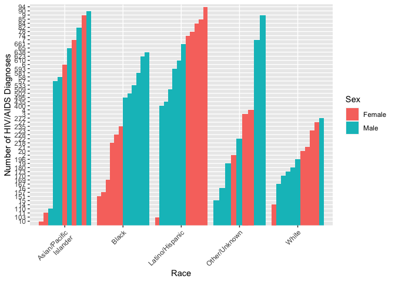
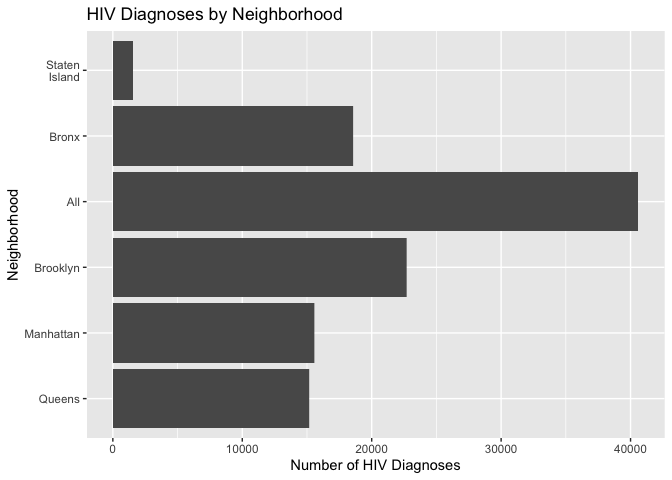

Data Processing and Exploratory analyses
================
Jake W. Coldiron,Zixuan Qiu,Tianyuan Deng,Aung Nay Win,Yuqi Cheng

**Date:** 2023-11-10

``` r
library(tidyverse)
library(rvest)
library(httr)
library(plotly)
```

# Data processing

``` r
#input the New York HIV data from NYC opendata 
nyc_HIV1=
  GET("https://data.cityofnewyork.us/resource/ykvb-493p.csv",
  query = list("$limit" = 10000)) |>
  content("parsed")|>
  filter(year >= 2017)
```

    ## Warning: One or more parsing issues, call `problems()` on your data frame for
    ## details, e.g.:
    ##   dat <- vroom(...)
    ##   problems(dat)

``` r
nyc_HIV2=
  GET("https://data.cityofnewyork.us/resource/dxnu-p2qd.csv",
  query = list("$limit" = 22000)) |>
  content("parsed")|>
  filter(year >= 2017)
```

``` r
#HIV service resource 
HIV_service=
  GET("https://data.cityofnewyork.us/resource/pwts-g83w.csv",
  query = list("$limit" = 1000)) |>
  content("parsed")|>
  select(unique_id,facilityname,service_type, address,borough,state,zipcode,latitude,longitude)
```

**A short clear description of where and how data were obtained. explain
the variables means in the data** **Calculate the sum, mean, median,
standard deviation of HIV/AIDS indicators**

# Visualizations

**Shows the number of HIV/AIDS diagnoses by race, sex, and age group.**

``` r
#work
#work
colnames(nyc_HIV1)
```

    ##  [1] "year"                          "borough"                      
    ##  [3] "neighborhood"                  "sex"                          
    ##  [5] "race"                          "hiv_diagnoses_num"            
    ##  [7] "hiv_diagnoses_num_per_100k"    "hiv_aids_concurrent_num"      
    ##  [9] "concurrent_hiv_aids_among_all" "aids_diagnoses_num"           
    ## [11] "aids_diagnoses_num_per_100k"

``` r
colnames(nyc_HIV2)
```

    ##  [1] "year"                          "neighborhood"                 
    ##  [3] "race"                          "age"                          
    ##  [5] "hiv_diagnoses_num"             "hiv_diagnoses_num_per_100k"   
    ##  [7] "hiv_aids_concurrent_num"       "concurrent_hiv_aids_among_all"
    ##  [9] "aids_diagnoses_num"            "aids_diagnoses_num_per_100k"  
    ## [11] "borough"

``` r
head(nyc_HIV1)
```

    ## # A tibble: 6 × 11
    ##    year borough neighborhood sex    race                      hiv_diagnoses_num
    ##   <dbl> <chr>   <chr>        <chr>  <chr>                     <chr>            
    ## 1  2021 All     All          All    "All"                     1592             
    ## 2  2021 All     All          Female "All"                     286              
    ## 3  2021 All     All          Male   "All"                     1306             
    ## 4  2021 All     All          All    "Asian/Pacific\nIslander" 91               
    ## 5  2021 All     All          Female "Asian/Pacific\nIslander" 9                
    ## 6  2021 All     All          Male   "Asian/Pacific\nIslander" 82               
    ## # ℹ 5 more variables: hiv_diagnoses_num_per_100k <chr>,
    ## #   hiv_aids_concurrent_num <dbl>, concurrent_hiv_aids_among_all <dbl>,
    ## #   aids_diagnoses_num <dbl>, aids_diagnoses_num_per_100k <dbl>

``` r
library(ggplot2)
All <- nyc_HIV1 %>% 
  filter(sex == "All" & race == "All" & borough == "All")

Female <- nyc_HIV1 %>% 
  filter(sex == "Female" & borough == "All" & race !="All")

Male <- nyc_HIV1 %>% 
  filter(sex == "Male"  & borough == "All" & race !="All")

graph1 = bind_rows(Female, Male)

nyc_HIV1$hiv_diagnoses_num <- as.integer(nyc_HIV1$hiv_diagnoses_num)
nyc_HIV2$hiv_diagnoses_num <- as.integer(nyc_HIV2$hiv_diagnoses_num)

ggplot(graph1, aes(x=race, y=hiv_diagnoses_num, fill=sex)) +
  geom_bar(stat="identity", position=position_dodge()) +
  theme(axis.text.x = element_text(angle = 45, hjust = 1)) +
  labs(x = "Race", y = "Number of HIV/AIDS Diagnoses", fill = "Sex")
```

<!-- -->

``` r
# Graph Age 
age_summary <- nyc_HIV2 %>%
  filter(age != "All" & race == "All" & borough == "All") %>%
  group_by(age) %>%
  summarise(total_hiv_diagnoses = sum(hiv_diagnoses_num))

ggplot(age_summary, aes(x = age, y = total_hiv_diagnoses)) +
  geom_bar(stat = "identity", color = "yellow", width = 0.7) +
  labs(title = "Total HIV Diagnoses by Age Group",
       x = "Age Group",
       y = "Total HIV Diagnoses") +
  theme_minimal() +
  theme(axis.text.x = element_text(angle = 45, hjust = 1))
```

<!-- -->
summary:

**Show the map of NYC HIV service resources location.**

``` r
if (!require(leaflet)) install.packages('leaflet')
library(leaflet)
filtered_data = HIV_service[HIV_service$longitude != 0 & HIV_service$latitude != 0,]
# Create the map
m <- leaflet(filtered_data) %>%
  addProviderTiles(providers$OpenStreetMap) %>%
  addCircleMarkers(
    ~longitude, ~latitude,
    radius = 4,
    popup = ~paste("<strong>Facility Name:</strong>", facilityname,
                   "<br><strong>Service Type:</strong>", service_type,
                   "<br><strong>Address:</strong>", address,
                   "<br><strong>Borough:</strong>", borough,
                   "<br><strong>Zip:</strong>", zipcode)
  )

# Print the map
print(m)
```

summary:

**Show the distribution of the HIV/AIDS diagnoses by neighborhood.**

``` r
#work
# I'll see if I can find the log&lat for the neighborhoods
diagnoses <- nyc_HIV1 %>% 
  select(borough, hiv_diagnoses_num)

# Plot bar chart
ggplot(diagnoses, aes(x = reorder(borough, hiv_diagnoses_num), y = hiv_diagnoses_num)) +
  geom_col() +
  labs(x = "Neighborhood",
       y = "Number of HIV Diagnoses",
       title = "HIV Diagnoses by Neighborhood") +
  coord_flip()
```

    ## Warning: Removed 5 rows containing missing values (`position_stack()`).

<!-- -->
summary:

**Trend analysis:analyze the trend of the number of HIV/AIDS diagnoses
over time.**

``` r
#work
#work
All <- nyc_HIV1 %>% 
  filter(sex == "All" & race == "All" & borough == "All")

# Plot diagnoses over time
ggplot(All, aes(x = year, y = hiv_diagnoses_num)) +
  geom_point() +
  geom_smooth(method = "lm", se = FALSE) + 
  labs(
    title = "HIV Diagnoses Trend (All Sex)",
    x = "Year",
    y = "Number of Diagnoses"
  )
```

    ## `geom_smooth()` using formula = 'y ~ x'

<!-- -->
summary:

# Exploratory statistical analyses.

**Correlation analysis:After the Visualizations is there any association
between different variables such as neighborhood, age, gender, and
race.**

``` r
#work
```

T-test /ANOVA: Compare differences in HIV between two or more groups (
gender or racial). Chi-square test: Analyze associations between
categorical variables (gender, race).
