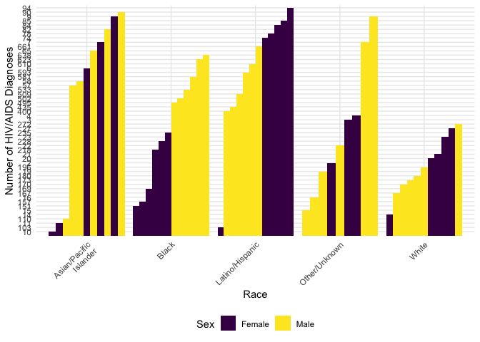
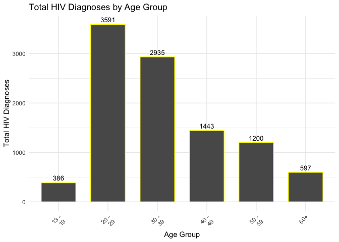
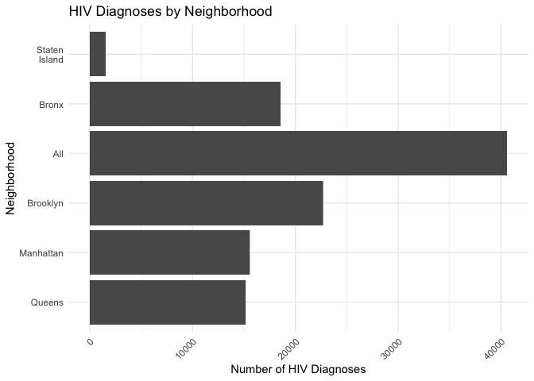
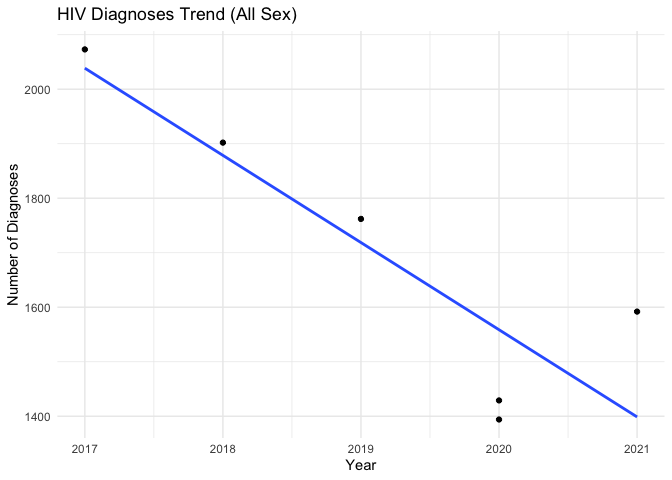
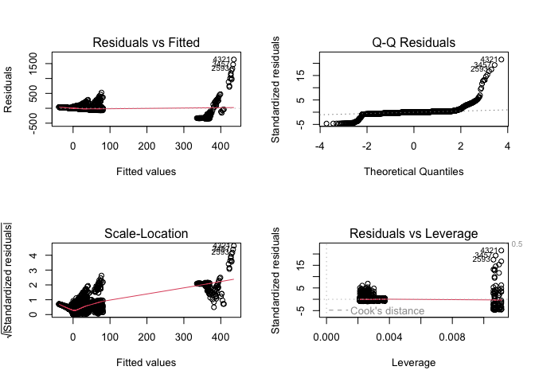
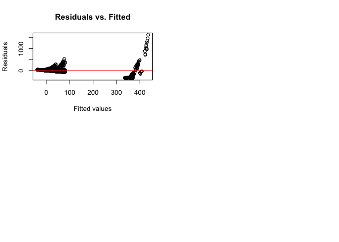

Data Processing and Exploratory analyses
================
Jake W. Coldiron,Zixuan Qiu,Tianyuan Deng,Aung Nay Win,Yuqi Cheng

**Date:** 2023-11-10

``` r
library(tidyverse)
library(rvest)
library(httr)
library(plotly)
library(broom)
library(modelr)
library(maps)
```

# Data processing

``` r
#input the New York HIV data from NYC opendata 
nyc_HIV1=
  GET("https://data.cityofnewyork.us/resource/ykvb-493p.csv",
  query = list("$limit" = 10000)) |>
  content("parsed")|>
  filter(year >= 2017)
```

    ## Warning: One or more parsing issues, call `problems()` on your data frame for
    ## details, e.g.:
    ##   dat <- vroom(...)
    ##   problems(dat)

``` r
nyc_HIV2=
  GET("https://data.cityofnewyork.us/resource/dxnu-p2qd.csv",
  query = list("$limit" = 22000)) |>
  content("parsed")|>
  filter(year >= 2017)
```

``` r
#HIV service resource 
HIV_service=
  GET("https://data.cityofnewyork.us/resource/pwts-g83w.csv",
  query = list("$limit" = 1000)) |>
  content("parsed")|>
  select(unique_id,facilityname,service_type, address,borough,state,zipcode,latitude,longitude)
```

**A short clear description of where and how data were obtained. explain
the variables means in the data** **Calculate the sum, mean, median,
standard deviation of HIV/AIDS indicators**

# Visualizations

**Shows the number of HIV/AIDS diagnoses by race, sex, and age group.**

``` r
#work
#work
colnames(nyc_HIV1)
```

    ##  [1] "year"                          "borough"                      
    ##  [3] "neighborhood"                  "sex"                          
    ##  [5] "race"                          "hiv_diagnoses_num"            
    ##  [7] "hiv_diagnoses_num_per_100k"    "hiv_aids_concurrent_num"      
    ##  [9] "concurrent_hiv_aids_among_all" "aids_diagnoses_num"           
    ## [11] "aids_diagnoses_num_per_100k"

``` r
colnames(nyc_HIV2)
```

    ##  [1] "year"                          "neighborhood"                 
    ##  [3] "race"                          "age"                          
    ##  [5] "hiv_diagnoses_num"             "hiv_diagnoses_num_per_100k"   
    ##  [7] "hiv_aids_concurrent_num"       "concurrent_hiv_aids_among_all"
    ##  [9] "aids_diagnoses_num"            "aids_diagnoses_num_per_100k"  
    ## [11] "borough"

``` r
head(nyc_HIV1)
```

    ## # A tibble: 6 × 11
    ##    year borough neighborhood sex    race                      hiv_diagnoses_num
    ##   <dbl> <chr>   <chr>        <chr>  <chr>                     <chr>            
    ## 1  2021 All     All          All    "All"                     1592             
    ## 2  2021 All     All          Female "All"                     286              
    ## 3  2021 All     All          Male   "All"                     1306             
    ## 4  2021 All     All          All    "Asian/Pacific\nIslander" 91               
    ## 5  2021 All     All          Female "Asian/Pacific\nIslander" 9                
    ## 6  2021 All     All          Male   "Asian/Pacific\nIslander" 82               
    ## # ℹ 5 more variables: hiv_diagnoses_num_per_100k <chr>,
    ## #   hiv_aids_concurrent_num <dbl>, concurrent_hiv_aids_among_all <dbl>,
    ## #   aids_diagnoses_num <dbl>, aids_diagnoses_num_per_100k <dbl>

``` r
library(ggplot2)
All <- nyc_HIV1 %>% 
  filter(sex == "All" & race == "All" & borough == "All")

Female <- nyc_HIV1 %>% 
  filter(sex == "Female" & borough == "All" & race !="All")

Male <- nyc_HIV1 %>% 
  filter(sex == "Male"  & borough == "All" & race !="All")

graph1 = bind_rows(Female, Male)

nyc_HIV1$hiv_diagnoses_num <- as.integer(nyc_HIV1$hiv_diagnoses_num)
nyc_HIV2$hiv_diagnoses_num <- as.integer(nyc_HIV2$hiv_diagnoses_num)

ggplot(graph1, aes(x=race, y=hiv_diagnoses_num, fill=sex)) +
  geom_bar(stat="identity", position=position_dodge()) +
  theme(axis.text.x = element_text(angle = 45, hjust = 1)) +
  labs(x = "Race", y = "Number of HIV/AIDS Diagnoses", fill = "Sex")
```

<!-- -->

``` r
# Graph Age 
age_summary <- nyc_HIV2 %>%
  filter(age != "All" & race == "All" & borough == "All") %>%
  group_by(age) %>%
  summarise(total_hiv_diagnoses = sum(hiv_diagnoses_num))

ggplot(age_summary, aes(x = age, y = total_hiv_diagnoses)) +
  geom_bar(stat = "identity", color = "yellow", width = 0.7) +
  labs(title = "Total HIV Diagnoses by Age Group",
       x = "Age Group",
       y = "Total HIV Diagnoses") +
  theme_minimal() +
  theme(axis.text.x = element_text(angle = 45, hjust = 1))+
  geom_text(aes(label=total_hiv_diagnoses), vjust=-0.5, color="black", size=3.5)
```

<!-- -->
summary: Both the nyc_HIV1 dataset and the nyc_HIV1 data have 11
variables, nyc_HIV1 is the data related to the number of patients with
HIV by gender and nyc_HIV2 is the data related to the number of patients
with HIV by age. When analyzing the number of HIV patients by race, the
results show that Latino/Hispanic races are used for high prevalence and
there are more males than females. When analyzing the number of HIV
patients by age group, the results showed that 20-29 year olds had the
highest number of total diagnoses and 13-19 year olds had the lowest
number of diagnoses.

**Show the map of NYC HIV service resources location.**

``` r
if (!require(leaflet)) install.packages('leaflet')
library(leaflet)
filtered_data = HIV_service[HIV_service$longitude != 0 & HIV_service$latitude != 0,]
# Create the map
m <- leaflet(filtered_data) %>%
  addProviderTiles(providers$OpenStreetMap) %>%
  addCircleMarkers(
    ~longitude, ~latitude,
    radius = 4,
    popup = ~paste("<strong>Facility Name:</strong>", facilityname,
                   "<br><strong>Service Type:</strong>", service_type,
                   "<br><strong>Address:</strong>", address,
                   "<br><strong>Borough:</strong>", borough,
                   "<br><strong>Zip:</strong>", zipcode)
  )

# Print the map
print(m)
```

summary: Here, an interactive map was created using the leaflet package
to visualize the distribution of HIV service facilities and detailed
information to help better understand the allocation of resources for
HIV prevention and treatment.

**Show the distribution of the HIV/AIDS diagnoses by neighborhood.**

``` r
#work
# I'll see if I can find the log&lat for the neighborhoods
diagnoses <- nyc_HIV1 %>% 
  select(borough, hiv_diagnoses_num)

# Plot bar chart
ggplot(diagnoses, aes(x = reorder(borough, hiv_diagnoses_num), y = hiv_diagnoses_num)) +
  geom_col() +
  labs(x = "Neighborhood",
       y = "Number of HIV Diagnoses",
       title = "HIV Diagnoses by Neighborhood") +
  theme_minimal() +
  theme(axis.text.x = element_text(angle = 45, hjust = 1)) +
  coord_flip()
```

    ## Warning: Removed 5 rows containing missing values (`position_stack()`).

<!-- -->

``` r
filtered_data = HIV_service[HIV_service$longitude != 0 & HIV_service$latitude != 0,]
# Create the map
m <- leaflet(filtered_data) %>%
  addTiles("https://server.arcgisonline.com/ArcGIS/rest/services/World_Street_Map/MapServer/tile/{z}/{y}/{x}") %>%
  addCircleMarkers(
    ~longitude, ~latitude,
    radius = 4,
    popup = ~paste("<strong>Facility Name:</strong>", facilityname,
                   "<br><strong>Service Type:</strong>", service_type,
                   "<br><strong>Address:</strong>", address,
                   "<br><strong>Borough:</strong>", borough,
                   "<br><strong>Zip:</strong>", zipcode)
  )
m <- m %>% addCircleMarkers(
  radius = sqrt(nyc_HIV1$hiv_diagnoses_num),
  fillOpacity = 0.4,
  color = "orange",
  stroke = TRUE,
  label = sprintf("HIV Diagnoses: %s", nyc_HIV1$hiv_diagnoses_num),
  labelOptions = labelOptions(
    textOnly = TRUE,
    direction = "auto"
  )
)
```

    ## Assuming "longitude" and "latitude" are longitude and latitude, respectively

``` r
m
```

<div class="leaflet html-widget html-fill-item-overflow-hidden html-fill-item" id="htmlwidget-b20b88d57d508f43faa2" style="width:672px;height:480px;"></div>
<script type="application/json" data-for="htmlwidget-b20b88d57d508f43faa2">{"x":{"options":{"crs":{"crsClass":"L.CRS.EPSG3857","code":null,"proj4def":null,"projectedBounds":null,"options":{}}},"calls":[{"method":"addTiles","args":["https://server.arcgisonline.com/ArcGIS/rest/services/World_Street_Map/MapServer/tile/{z}/{y}/{x}",null,null,{"minZoom":0,"maxZoom":18,"tileSize":256,"subdomains":"abc","errorTileUrl":"","tms":false,"noWrap":false,"zoomOffset":0,"zoomReverse":false,"opacity":1,"zIndex":1,"detectRetina":false}]},{"method":"addCircleMarkers","args":[[40.812995652745,40.812995652745,40.692099498968,40.692099498968,40.704241467553,40.704241467553,40.704241467553,40.704241467553,40.704241467553,40.704241467553,40.704241467553,40.704241467553,40.749981824279,40.749981824279,40.749981824279,40.749981824279,40.718695056809,40.820431122912,40.815783058945,40.820431122912,40.710504009675,40.692210017117,40.692210017117,40.692210017117,40.713942707565,40.745736372192,40.745736372192,40.820431122912,40.650441192176,40.825713139945,40.831713940554,40.851056840974,40.690785963931,40.686811992445,40.64933150274,40.64933150274,40.64933150274,40.640616897327,40.742898400573,40.704876808679,40.684310938797,40.754939423312,40.754939423312,40.754939423312,40.754939423312,40.754939423312,40.725611827473,40.651180767754,40.808040365309,40.808040365309,40.808040365309,40.808040365309,40.703568235835,40.703568235835,40.703568235835,40.703568235835,40.703568235835,40.703568235835,40.703568235835,40.822045578553,40.692210017117,40.692210017117,40.692210017117,40.692210017117,40.692210017117,40.677780690895,40.593305155465,40.816844910934,40.816844910934,40.706797802749,40.706797802749,40.743375576208,40.806515672405,40.708489788781,40.854649025463,40.745736372192,40.755784814414,40.755784814414,40.805511537162,40.805511537162,40.725556816186,40.725556816186,40.638021577661,40.638021577661,40.638021577661,40.638021577661,40.638021577661,40.751741613774,40.820720383685,40.745736372192,40.745736372192,40.646933783885,40.680487748092,40.680487748092,40.680487748092,40.75042554469,40.807340294602,40.807340294602,40.707263039205,40.841146178793,40.861293283489,40.861293283489,40.842362201727,40.704628796527],[-73.953848960606,-73.953848960606,-73.926656947232,-73.926656947232,-73.797920623078,-73.797920623078,-73.797920623078,-73.797920623078,-73.797920623078,-73.797920623078,-73.797920623078,-73.797920623078,-73.98620934121701,-73.98620934121701,-73.98620934121701,-73.98620934121701,-74.002463905081,-73.90473572366299,-73.925364032708,-73.90473572366299,-74.012523606424,-73.98666487882601,-73.98666487882601,-73.98666487882601,-73.983536664737,-73.994435007741,-73.994435007741,-73.90473572366299,-73.95766291167899,-73.90953020919299,-73.903754667953,-73.908002741372,-73.991825291648,-73.97570089792301,-73.96330702829199,-73.96330702829199,-73.96330702829199,-74.07570402076399,-74.002269928956,-74.015927292538,-73.90905575328701,-73.99217472339799,-73.99217472339799,-73.99217472339799,-73.99217472339799,-73.99217472339799,-74.00397585109801,-73.941711975605,-73.945273111172,-73.945273111172,-73.945273111172,-73.945273111172,-74.009853375369,-74.009853375369,-74.009853375369,-74.009853375369,-74.009853375369,-74.009853375369,-74.009853375369,-73.895877692433,-73.98666487882601,-73.98666487882601,-73.98666487882601,-73.98666487882601,-73.98666487882601,-73.937041465348,-73.791661188223,-73.920723980445,-73.920723980445,-73.941006713943,-73.941006713943,-73.990003579606,-73.94249293456301,-74.007477145324,-73.91062938531,-73.994435007741,-73.992250423011,-73.992250423011,-73.93806524980501,-73.93806524980501,-73.993487835491,-73.993487835491,-74.13188418811001,-74.13188418811001,-74.13188418811001,-74.13188418811001,-74.13188418811001,-73.990056458411,-73.89953977241299,-73.994435007741,-73.994435007741,-74.020929590199,-73.94957127177,-73.94957127177,-73.94957127177,-73.935323140695,-73.939483174823,-73.939483174823,-74.004313796717,-73.94269057404099,-73.906256825892,-73.906256825892,-73.890041350435,-73.91769846401399],4,null,null,{"interactive":true,"className":"","stroke":true,"color":"#03F","weight":5,"opacity":0.5,"fill":true,"fillColor":"#03F","fillOpacity":0.2},null,null,["<strong>Facility Name:<\/strong> African Services Committee, Inc. <br><strong>Service Type:<\/strong> Legal Services <br><strong>Address:<\/strong> 429 West 127th Street <br><strong>Borough:<\/strong> MANHATTAN <br><strong>Zip:<\/strong> 10027","<strong>Facility Name:<\/strong> African Services Committee, Inc. <br><strong>Service Type:<\/strong> Supportive Counseling Services <br><strong>Address:<\/strong> 429 West 127th Street <br><strong>Borough:<\/strong> MANHATTAN <br><strong>Zip:<\/strong> 10027","<strong>Facility Name:<\/strong> After Hours Project <br><strong>Service Type:<\/strong> Supportive Counseling Services <br><strong>Address:<\/strong> 1204 Broadway <br><strong>Borough:<\/strong> BROOKLYN <br><strong>Zip:<\/strong> 11221","<strong>Facility Name:<\/strong> After Hours Project <br><strong>Service Type:<\/strong> Transitional & Short-term Housing Services <br><strong>Address:<\/strong> 1204 Broadway <br><strong>Borough:<\/strong> BROOKLYN <br><strong>Zip:<\/strong> 11221","<strong>Facility Name:<\/strong> AIDS Center of Queens County, Inc. <br><strong>Service Type:<\/strong> Care Coordination <br><strong>Address:<\/strong> 161-21 Jamaica Avenue <br><strong>Borough:<\/strong> QUEENS <br><strong>Zip:<\/strong> 11432","<strong>Facility Name:<\/strong> AIDS Center of Queens County, Inc. <br><strong>Service Type:<\/strong> Food and Nutrition <br><strong>Address:<\/strong> 161-21 Jamaica Avenue <br><strong>Borough:<\/strong> QUEENS <br><strong>Zip:<\/strong> 11432","<strong>Facility Name:<\/strong> AIDS Center of Queens County, Inc. <br><strong>Service Type:<\/strong> Harm Reduction Services <br><strong>Address:<\/strong> 161-21 Jamaica Avenue <br><strong>Borough:<\/strong> QUEENS <br><strong>Zip:<\/strong> 11432","<strong>Facility Name:<\/strong> AIDS Center of Queens County, Inc. <br><strong>Service Type:<\/strong> Housing Placement Services <br><strong>Address:<\/strong> 161-21 Jamaica Avenue <br><strong>Borough:<\/strong> QUEENS <br><strong>Zip:<\/strong> 11432","<strong>Facility Name:<\/strong> AIDS Center of Queens County, Inc. <br><strong>Service Type:<\/strong> Legal Services <br><strong>Address:<\/strong> 161-21 Jamaica Avenue <br><strong>Borough:<\/strong> QUEENS <br><strong>Zip:<\/strong> 11432","<strong>Facility Name:<\/strong> AIDS Center of Queens County, Inc. <br><strong>Service Type:<\/strong> Mental Health Services <br><strong>Address:<\/strong> 161-21 Jamaica Avenue <br><strong>Borough:<\/strong> QUEENS <br><strong>Zip:<\/strong> 11432","<strong>Facility Name:<\/strong> AIDS Center of Queens County, Inc. <br><strong>Service Type:<\/strong> Non-Medical Case Management <br><strong>Address:<\/strong> 161-21 Jamaica Avenue <br><strong>Borough:<\/strong> QUEENS <br><strong>Zip:<\/strong> 11432","<strong>Facility Name:<\/strong> AIDS Center of Queens County, Inc. <br><strong>Service Type:<\/strong> Supportive Counseling Services <br><strong>Address:<\/strong> 161-21 Jamaica Avenue <br><strong>Borough:<\/strong> QUEENS <br><strong>Zip:<\/strong> 11432","<strong>Facility Name:<\/strong> AIDS Service Center of Lower Manhattan, Inc. d/b/a Alliance for Positive Change <br><strong>Service Type:<\/strong> Harm Reduction Services <br><strong>Address:<\/strong> 64 West 35th Street <br><strong>Borough:<\/strong> MANHATTAN <br><strong>Zip:<\/strong> 10001","<strong>Facility Name:<\/strong> AIDS Service Center of Lower Manhattan, Inc. d/b/a Alliance for Positive Change <br><strong>Service Type:<\/strong> Supportive Counseling Services <br><strong>Address:<\/strong> 64 West 35th Street <br><strong>Borough:<\/strong> MANHATTAN <br><strong>Zip:<\/strong> 10001","<strong>Facility Name:<\/strong> AIDS Service Center of Lower Manhattan, Inc. d/b/a Alliance for Positive Change <br><strong>Service Type:<\/strong> The Positive Life Workshop <br><strong>Address:<\/strong> 64 West 35th Street <br><strong>Borough:<\/strong> MANHATTAN <br><strong>Zip:<\/strong> 10001","<strong>Facility Name:<\/strong> AIDS Service Center of Lower Manhattan, Inc. d/b/a Alliance for Positive Change <br><strong>Service Type:<\/strong> Transitional & Short-term Housing Services <br><strong>Address:<\/strong> 64 West 35th Street <br><strong>Borough:<\/strong> MANHATTAN <br><strong>Zip:<\/strong> 10001","<strong>Facility Name:<\/strong> APICHA Community Health Center <br><strong>Service Type:<\/strong> Care Coordination <br><strong>Address:<\/strong> 400 Broadway <br><strong>Borough:<\/strong> MANHATTAN <br><strong>Zip:<\/strong> 10013","<strong>Facility Name:<\/strong> Argus Community, Inc. <br><strong>Service Type:<\/strong> Care Coordination <br><strong>Address:<\/strong> 760 East 160th Street <br><strong>Borough:<\/strong> BRONX <br><strong>Zip:<\/strong> 10456","<strong>Facility Name:<\/strong> Argus Community, Inc. <br><strong>Service Type:<\/strong> Food and Nutrition <br><strong>Address:<\/strong> 226 East 144th Street <br><strong>Borough:<\/strong> BRONX <br><strong>Zip:<\/strong> 10451","<strong>Facility Name:<\/strong> Argus Community, Inc. <br><strong>Service Type:<\/strong> Non-Medical Case Management <br><strong>Address:<\/strong> 760 East 160th Street <br><strong>Borough:<\/strong> BRONX <br><strong>Zip:<\/strong> 10456","<strong>Facility Name:<\/strong> Assessment and Referral Team <br><strong>Service Type:<\/strong> Mental Health Services <br><strong>Address:<\/strong> 150 Greenwich Street <br><strong>Borough:<\/strong> MANHATTAN <br><strong>Zip:<\/strong> 10007","<strong>Facility Name:<\/strong> Bailey House, Inc. <br><strong>Service Type:<\/strong> Housing Placement Services <br><strong>Address:<\/strong> 57 Willoughby Street <br><strong>Borough:<\/strong> BROOKLYN <br><strong>Zip:<\/strong> 11201","<strong>Facility Name:<\/strong> Bailey House, Inc. <br><strong>Service Type:<\/strong> Mental Health Services <br><strong>Address:<\/strong> 57 Willoughby Street <br><strong>Borough:<\/strong> BROOKLYN <br><strong>Zip:<\/strong> 11201","<strong>Facility Name:<\/strong> Bailey House, Inc. <br><strong>Service Type:<\/strong> Transitional & Short-term Housing Services <br><strong>Address:<\/strong> 57 Willoughby Street <br><strong>Borough:<\/strong> BROOKLYN <br><strong>Zip:<\/strong> 11201","<strong>Facility Name:<\/strong> Betances Health Center <br><strong>Service Type:<\/strong> Care Coordination <br><strong>Address:<\/strong> 280 Henry Street <br><strong>Borough:<\/strong> MANHATTAN <br><strong>Zip:<\/strong> 10002","<strong>Facility Name:<\/strong> Beth Israel Medical Center <br><strong>Service Type:<\/strong> Care Coordination <br><strong>Address:<\/strong> 275 Seventh Avenue <br><strong>Borough:<\/strong> MANHATTAN <br><strong>Zip:<\/strong> 10011","<strong>Facility Name:<\/strong> Beth Israel Medical Center <br><strong>Service Type:<\/strong> Harm Reduction Services <br><strong>Address:<\/strong> 275 Seventh Avenue <br><strong>Borough:<\/strong> MANHATTAN <br><strong>Zip:<\/strong> 10011","<strong>Facility Name:<\/strong> BOOM! Health <br><strong>Service Type:<\/strong> Supportive Counseling Services <br><strong>Address:<\/strong> 760 East 160th Street <br><strong>Borough:<\/strong> BRONX <br><strong>Zip:<\/strong> 10456","<strong>Facility Name:<\/strong> Bridging Access to Care, Inc. <br><strong>Service Type:<\/strong> Harm Reduction Services <br><strong>Address:<\/strong> 2261 Church Avenue <br><strong>Borough:<\/strong> BROOKLYN <br><strong>Zip:<\/strong> 11226","<strong>Facility Name:<\/strong> Bronx Parent Housing Network, Inc. <br><strong>Service Type:<\/strong> Food and Nutrition <br><strong>Address:<\/strong> 488 East 164th Street <br><strong>Borough:<\/strong> BRONX <br><strong>Zip:<\/strong> 10456","<strong>Facility Name:<\/strong> BronxCare Health System <br><strong>Service Type:<\/strong> Care Coordination <br><strong>Address:<\/strong> 1276 Fulton Avenue <br><strong>Borough:<\/strong> BRONX <br><strong>Zip:<\/strong> 10456","<strong>Facility Name:<\/strong> BronxWorks, Inc. <br><strong>Service Type:<\/strong> Harm Reduction Services <br><strong>Address:<\/strong> 60 East Tremont Avenue <br><strong>Borough:<\/strong> BRONX <br><strong>Zip:<\/strong> 10453","<strong>Facility Name:<\/strong> Brooklyn Legal Services, Inc. <br><strong>Service Type:<\/strong> Legal Services <br><strong>Address:<\/strong> 105 Court Street <br><strong>Borough:<\/strong> BROOKLYN <br><strong>Zip:<\/strong> 11201","<strong>Facility Name:<\/strong> Brooklyn Plaza Medical Center, Inc <br><strong>Service Type:<\/strong> Care Coordination <br><strong>Address:<\/strong> 650 Fulton Street <br><strong>Borough:<\/strong> BROOKLYN <br><strong>Zip:<\/strong> 11217","<strong>Facility Name:<\/strong> CAMBA, Inc. <br><strong>Service Type:<\/strong> Food and Nutrition <br><strong>Address:<\/strong> 1720 Church Avenue <br><strong>Borough:<\/strong> BROOKLYN <br><strong>Zip:<\/strong> 11226","<strong>Facility Name:<\/strong> CAMBA, Inc. <br><strong>Service Type:<\/strong> Supportive Counseling Services <br><strong>Address:<\/strong> 1720 Church Avenue <br><strong>Borough:<\/strong> BROOKLYN <br><strong>Zip:<\/strong> 11226","<strong>Facility Name:<\/strong> CAMBA, Inc. <br><strong>Service Type:<\/strong> Transitional & Short-term Housing Services <br><strong>Address:<\/strong> 1720 Church Avenue <br><strong>Borough:<\/strong> BROOKLYN <br><strong>Zip:<\/strong> 11226","<strong>Facility Name:<\/strong> Community Health Action Of Staten Island, Inc. <br><strong>Service Type:<\/strong> Care Coordination <br><strong>Address:<\/strong> 56 Bay Street <br><strong>Borough:<\/strong> STATEN ISLAND <br><strong>Zip:<\/strong> 10301","<strong>Facility Name:<\/strong> Community Health Project, Inc. <br><strong>Service Type:<\/strong> Care Coordination <br><strong>Address:<\/strong> 356 West 18th Street <br><strong>Borough:<\/strong> MANHATTAN <br><strong>Zip:<\/strong> 10011","<strong>Facility Name:<\/strong> Exponents, Inc. <br><strong>Service Type:<\/strong> Harm Reduction Services <br><strong>Address:<\/strong> 17 Battery Place <br><strong>Borough:<\/strong> MANHATTAN <br><strong>Zip:<\/strong> 10004","<strong>Facility Name:<\/strong> Family Services Network of New York <br><strong>Service Type:<\/strong> Supportive Counseling Services <br><strong>Address:<\/strong> 1420 Bushwick Avenue <br><strong>Borough:<\/strong> BROOKLYN <br><strong>Zip:<\/strong> 11207","<strong>Facility Name:<\/strong> Gay Men's Health Crisis, Inc. <br><strong>Service Type:<\/strong> Food and Nutrition <br><strong>Address:<\/strong> 307 West 38th Street <br><strong>Borough:<\/strong> MANHATTAN <br><strong>Zip:<\/strong> 10018","<strong>Facility Name:<\/strong> Gay Men's Health Crisis, Inc. <br><strong>Service Type:<\/strong> Harm Reduction Services <br><strong>Address:<\/strong> 307 West 38th Street <br><strong>Borough:<\/strong> MANHATTAN <br><strong>Zip:<\/strong> 10018","<strong>Facility Name:<\/strong> Gay Men's Health Crisis, Inc. <br><strong>Service Type:<\/strong> Legal Services <br><strong>Address:<\/strong> 307 West 38th Street <br><strong>Borough:<\/strong> MANHATTAN <br><strong>Zip:<\/strong> 10018","<strong>Facility Name:<\/strong> Gay Men's Health Crisis, Inc. <br><strong>Service Type:<\/strong> Mental Health Services <br><strong>Address:<\/strong> 307 West 38th Street <br><strong>Borough:<\/strong> MANHATTAN <br><strong>Zip:<\/strong> 10018","<strong>Facility Name:<\/strong> Gay Men's Health Crisis, Inc. <br><strong>Service Type:<\/strong> Supportive Counseling Services <br><strong>Address:<\/strong> 307 West 38th Street <br><strong>Borough:<\/strong> MANHATTAN <br><strong>Zip:<\/strong> 10018","<strong>Facility Name:<\/strong> God's Love We Deliver, Inc. <br><strong>Service Type:<\/strong> Food and Nutrition <br><strong>Address:<\/strong> 166 Avenue of the Americas <br><strong>Borough:<\/strong> MANHATTAN <br><strong>Zip:<\/strong> 10013","<strong>Facility Name:<\/strong> Haitian Centers Council, Inc. <br><strong>Service Type:<\/strong> Supportive Counseling Services <br><strong>Address:<\/strong> 3807-3809 Church Avenue <br><strong>Borough:<\/strong> BROOKLYN <br><strong>Zip:<\/strong> 11203","<strong>Facility Name:<\/strong> Harlem United: Community AIDS Center, Inc. <br><strong>Service Type:<\/strong> Food and Nutrition <br><strong>Address:<\/strong> 306 Lenox Avenue <br><strong>Borough:<\/strong> MANHATTAN <br><strong>Zip:<\/strong> 10027","<strong>Facility Name:<\/strong> Harlem United: Community AIDS Center, Inc. <br><strong>Service Type:<\/strong> Harm Reduction Services <br><strong>Address:<\/strong> 306 Lenox Avenue <br><strong>Borough:<\/strong> MANHATTAN <br><strong>Zip:<\/strong> 10027","<strong>Facility Name:<\/strong> Harlem United: Community AIDS Center, Inc. <br><strong>Service Type:<\/strong> Supportive Counseling Services <br><strong>Address:<\/strong> 306 Lenox Avenue <br><strong>Borough:<\/strong> MANHATTAN <br><strong>Zip:<\/strong> 10027","<strong>Facility Name:<\/strong> Harlem United: Community AIDS Center, Inc. <br><strong>Service Type:<\/strong> Transitional & Short-term Housing Services <br><strong>Address:<\/strong> 306 Lenox Avenue <br><strong>Borough:<\/strong> MANHATTAN <br><strong>Zip:<\/strong> 10027","<strong>Facility Name:<\/strong> HHC Elmhurst Hospital Center <br><strong>Service Type:<\/strong> Care Coordination <br><strong>Address:<\/strong> 50 Water Street <br><strong>Borough:<\/strong> MANHATTAN <br><strong>Zip:<\/strong> 10038","<strong>Facility Name:<\/strong> HHC Harlem Hospital Center <br><strong>Service Type:<\/strong> Mental Health Services <br><strong>Address:<\/strong> 50 Water Street <br><strong>Borough:<\/strong> MANHATTAN <br><strong>Zip:<\/strong> 10038","<strong>Facility Name:<\/strong> HHC Jacobi Medical Center <br><strong>Service Type:<\/strong> Care Coordination <br><strong>Address:<\/strong> 50 Water Street <br><strong>Borough:<\/strong> MANHATTAN <br><strong>Zip:<\/strong> 10038","<strong>Facility Name:<\/strong> HHC Kings County Hospital Center <br><strong>Service Type:<\/strong> Care Coordination <br><strong>Address:<\/strong> 50 Water Street <br><strong>Borough:<\/strong> MANHATTAN <br><strong>Zip:<\/strong> 10038","<strong>Facility Name:<\/strong> HHC North Central Bronx Hospital <br><strong>Service Type:<\/strong> Harm Reduction Services <br><strong>Address:<\/strong> 50 Water Street <br><strong>Borough:<\/strong> MANHATTAN <br><strong>Zip:<\/strong> 10038","<strong>Facility Name:<\/strong> HHC Queens Hospital Center <br><strong>Service Type:<\/strong> Harm Reduction Services <br><strong>Address:<\/strong> 50 Water Street <br><strong>Borough:<\/strong> MANHATTAN <br><strong>Zip:<\/strong> 10038","<strong>Facility Name:<\/strong> HHC Woodhull Medical and Mental Health Center <br><strong>Service Type:<\/strong> Mental Health Services <br><strong>Address:<\/strong> 50 Water Street <br><strong>Borough:<\/strong> MANHATTAN <br><strong>Zip:<\/strong> 10038","<strong>Facility Name:<\/strong> Hispanic AIDS Forum, Inc. <br><strong>Service Type:<\/strong> Housing Placement Services <br><strong>Address:<\/strong> 975 Kelly Street <br><strong>Borough:<\/strong> BRONX <br><strong>Zip:<\/strong> 10459","<strong>Facility Name:<\/strong> HIV Law Project, Inc. <br><strong>Service Type:<\/strong> Legal Services <br><strong>Address:<\/strong> 57 Willoughby Street <br><strong>Borough:<\/strong> BROOKLYN <br><strong>Zip:<\/strong> 11201","<strong>Facility Name:<\/strong> Housing Works Health Services III <br><strong>Service Type:<\/strong> Care Coordination <br><strong>Address:<\/strong> 57 Willoughby Street <br><strong>Borough:<\/strong> BROOKLYN <br><strong>Zip:<\/strong> 11201","<strong>Facility Name:<\/strong> Housing Works, Inc. <br><strong>Service Type:<\/strong> Harm Reduction Services <br><strong>Address:<\/strong> 57 Willoughby Street <br><strong>Borough:<\/strong> BROOKLYN <br><strong>Zip:<\/strong> 11201","<strong>Facility Name:<\/strong> Housing Works, Inc. <br><strong>Service Type:<\/strong> Mental Health Services <br><strong>Address:<\/strong> 57 Willoughby Street <br><strong>Borough:<\/strong> BROOKLYN <br><strong>Zip:<\/strong> 11201","<strong>Facility Name:<\/strong> Housing Works, Inc. <br><strong>Service Type:<\/strong> Transitional & Short-term Housing Services <br><strong>Address:<\/strong> 57 Willoughby Street <br><strong>Borough:<\/strong> BROOKLYN <br><strong>Zip:<\/strong> 11201","<strong>Facility Name:<\/strong> Interfaith Medical Center <br><strong>Service Type:<\/strong> Harm Reduction Services <br><strong>Address:<\/strong> 1545 Atlantic Avenue <br><strong>Borough:<\/strong> BROOKLYN <br><strong>Zip:<\/strong> 11213","<strong>Facility Name:<\/strong> Joseph P. Addabbo Family Health Center, Inc. <br><strong>Service Type:<\/strong> Care Coordination <br><strong>Address:<\/strong> 6200 Beach Channel Drive <br><strong>Borough:<\/strong> QUEENS <br><strong>Zip:<\/strong> 11692","<strong>Facility Name:<\/strong> La Casa de Salud <br><strong>Service Type:<\/strong> Care Coordination <br><strong>Address:<\/strong> 324 East 149th Street <br><strong>Borough:<\/strong> BRONX <br><strong>Zip:<\/strong> 10451","<strong>Facility Name:<\/strong> La Casa de Salud <br><strong>Service Type:<\/strong> Food and Nutrition <br><strong>Address:<\/strong> 324 East 149th Street <br><strong>Borough:<\/strong> BRONX <br><strong>Zip:<\/strong> 10451","<strong>Facility Name:<\/strong> La Nueva Esperanza, Inc. <br><strong>Service Type:<\/strong> Food and Nutrition <br><strong>Address:<\/strong> 213 Johnson Avenue <br><strong>Borough:<\/strong> BROOKLYN <br><strong>Zip:<\/strong> 11206","<strong>Facility Name:<\/strong> La Nueva Esperanza, Inc. <br><strong>Service Type:<\/strong> Supportive Counseling Services <br><strong>Address:<\/strong> 213 Johnson Avenue <br><strong>Borough:<\/strong> BROOKLYN <br><strong>Zip:<\/strong> 11206","<strong>Facility Name:<\/strong> Latino Commission on AIDS, Inc. <br><strong>Service Type:<\/strong> The Positive Life Workshop <br><strong>Address:<\/strong> 24 West 25th Street <br><strong>Borough:<\/strong> MANHATTAN <br><strong>Zip:<\/strong> 10010","<strong>Facility Name:<\/strong> Manhattan Legal Services <br><strong>Service Type:<\/strong> Legal Services <br><strong>Address:<\/strong> 1 West 125th Street <br><strong>Borough:<\/strong> MANHATTAN <br><strong>Zip:<\/strong> 10027","<strong>Facility Name:<\/strong> Mobilization for Justice, Inc. <br><strong>Service Type:<\/strong> Legal Services <br><strong>Address:<\/strong> 100 William Street <br><strong>Borough:<\/strong> MANHATTAN <br><strong>Zip:<\/strong> 10038","<strong>Facility Name:<\/strong> Morris Heights Health Center <br><strong>Service Type:<\/strong> Care Coordination <br><strong>Address:<\/strong> 85 West Burnside Avenue <br><strong>Borough:<\/strong> BRONX <br><strong>Zip:<\/strong> 10453","<strong>Facility Name:<\/strong> Mount Sinai Hospital <br><strong>Service Type:<\/strong> Care Coordination <br><strong>Address:<\/strong> 275 Seventh Avenue <br><strong>Borough:<\/strong> MANHATTAN <br><strong>Zip:<\/strong> 10011","<strong>Facility Name:<\/strong> New York Council on Adoptable Children, Inc. <br><strong>Service Type:<\/strong> Care Coordination <br><strong>Address:<\/strong> 333 West 39th Street <br><strong>Borough:<\/strong> MANHATTAN <br><strong>Zip:<\/strong> 10018","<strong>Facility Name:<\/strong> New York Council on Adoptable Children, Inc. <br><strong>Service Type:<\/strong> Legal Services <br><strong>Address:<\/strong> 333 West 39th Street <br><strong>Borough:<\/strong> MANHATTAN <br><strong>Zip:<\/strong> 10018","<strong>Facility Name:<\/strong> New York Harm Reduction Educators, Inc. <br><strong>Service Type:<\/strong> Harm Reduction Services <br><strong>Address:<\/strong> 104-106 East 126th Street <br><strong>Borough:<\/strong> MANHATTAN <br><strong>Zip:<\/strong> 10035","<strong>Facility Name:<\/strong> New York Harm Reduction Educators, Inc. <br><strong>Service Type:<\/strong> Supportive Counseling Services <br><strong>Address:<\/strong> 104-106 East 126th Street <br><strong>Borough:<\/strong> MANHATTAN <br><strong>Zip:<\/strong> 10035","<strong>Facility Name:<\/strong> Planned Parenthood of Greater New York, Inc. <br><strong>Service Type:<\/strong> Harm Reduction Services <br><strong>Address:<\/strong> 26 Bleecker Street <br><strong>Borough:<\/strong> MANHATTAN <br><strong>Zip:<\/strong> 10012","<strong>Facility Name:<\/strong> Planned Parenthood of Greater New York, Inc. <br><strong>Service Type:<\/strong> Non-Medical Case Management <br><strong>Address:<\/strong> 26 Bleecker Street <br><strong>Borough:<\/strong> MANHATTAN <br><strong>Zip:<\/strong> 10012","<strong>Facility Name:<\/strong> Project Hospitality, Inc. <br><strong>Service Type:<\/strong> Food and Nutrition <br><strong>Address:<\/strong> 100 Park Avenue <br><strong>Borough:<\/strong> STATEN ISLAND <br><strong>Zip:<\/strong> 10302","<strong>Facility Name:<\/strong> Project Hospitality, Inc. <br><strong>Service Type:<\/strong> Harm Reduction Services <br><strong>Address:<\/strong> 100 Park Avenue <br><strong>Borough:<\/strong> STATEN ISLAND <br><strong>Zip:<\/strong> 10302","<strong>Facility Name:<\/strong> Project Hospitality, Inc. <br><strong>Service Type:<\/strong> Legal Services <br><strong>Address:<\/strong> 100 Park Avenue <br><strong>Borough:<\/strong> STATEN ISLAND <br><strong>Zip:<\/strong> 10302","<strong>Facility Name:<\/strong> Project Hospitality, Inc. <br><strong>Service Type:<\/strong> Non-Medical Case Management <br><strong>Address:<\/strong> 100 Park Avenue <br><strong>Borough:<\/strong> STATEN ISLAND <br><strong>Zip:<\/strong> 10302","<strong>Facility Name:<\/strong> Project Hospitality, Inc. <br><strong>Service Type:<\/strong> Transitional & Short-term Housing Services <br><strong>Address:<\/strong> 100 Park Avenue <br><strong>Borough:<\/strong> STATEN ISLAND <br><strong>Zip:<\/strong> 10302","<strong>Facility Name:<\/strong> Services for the Underserved, Inc. <br><strong>Service Type:<\/strong> Care Coordination <br><strong>Address:<\/strong> 463 Seventh Avenue <br><strong>Borough:<\/strong> MANHATTAN <br><strong>Zip:<\/strong> 10018","<strong>Facility Name:<\/strong> St. Ann's Corner of Harm Reduction <br><strong>Service Type:<\/strong> Supportive Counseling Services <br><strong>Address:<\/strong> 886 Westchester Avenue <br><strong>Borough:<\/strong> BRONX <br><strong>Zip:<\/strong> 10459","<strong>Facility Name:<\/strong> St. Luke's - Roosevelt Hospital <br><strong>Service Type:<\/strong> Care Coordination <br><strong>Address:<\/strong> 275 Seventh Avenue <br><strong>Borough:<\/strong> MANHATTAN <br><strong>Zip:<\/strong> 10001","<strong>Facility Name:<\/strong> St. Luke's - Roosevelt Hospital <br><strong>Service Type:<\/strong> Food and Nutrition <br><strong>Address:<\/strong> 275 Seventh Avenue <br><strong>Borough:<\/strong> MANHATTAN <br><strong>Zip:<\/strong> 10011","<strong>Facility Name:<\/strong> Sunset Park Health Council, Inc. <br><strong>Service Type:<\/strong> Care Coordination <br><strong>Address:<\/strong> 150 55th Street <br><strong>Borough:<\/strong> BROOKLYN <br><strong>Zip:<\/strong> 11220","<strong>Facility Name:<\/strong> The Family Center, Inc. <br><strong>Service Type:<\/strong> Legal Services <br><strong>Address:<\/strong> 493 Nostrand Avenue <br><strong>Borough:<\/strong> BROOKLYN <br><strong>Zip:<\/strong> 11216","<strong>Facility Name:<\/strong> The Family Center, Inc. <br><strong>Service Type:<\/strong> Supportive Counseling Services <br><strong>Address:<\/strong> 493 Nostrand Avenue <br><strong>Borough:<\/strong> BROOKLYN <br><strong>Zip:<\/strong> 11216","<strong>Facility Name:<\/strong> The Family Center, Inc. <br><strong>Service Type:<\/strong> The Positive Life Workshop <br><strong>Address:<\/strong> 493 Nostrand Avenue <br><strong>Borough:<\/strong> BROOKLYN <br><strong>Zip:<\/strong> 11216","<strong>Facility Name:<\/strong> The Fortune Society, Inc. <br><strong>Service Type:<\/strong> Correctional Health Transitional Services <br><strong>Address:<\/strong> 29-76 Northern Boulevard <br><strong>Borough:<\/strong> QUEENS <br><strong>Zip:<\/strong> 11101","<strong>Facility Name:<\/strong> The Institute for Family Health <br><strong>Service Type:<\/strong> Care Coordination <br><strong>Address:<\/strong> 2006 Madison Avenue <br><strong>Borough:<\/strong> MANHATTAN <br><strong>Zip:<\/strong> 10035","<strong>Facility Name:<\/strong> The Institute for Family Health <br><strong>Service Type:<\/strong> Mental Health Services <br><strong>Address:<\/strong> 2006 Madison Avenue <br><strong>Borough:<\/strong> MANHATTAN <br><strong>Zip:<\/strong> 10035","<strong>Facility Name:<\/strong> The Legal Aid Society <br><strong>Service Type:<\/strong> Legal Services <br><strong>Address:<\/strong> 199 Water Street <br><strong>Borough:<\/strong> MANHATTAN <br><strong>Zip:<\/strong> 10038","<strong>Facility Name:<\/strong> The New York and Presbyterian Hospital <br><strong>Service Type:<\/strong> Mental Health Services <br><strong>Address:<\/strong> 177 Fort Washington Avenue <br><strong>Borough:<\/strong> MANHATTAN <br><strong>Zip:<\/strong> 10032","<strong>Facility Name:<\/strong> Tolentine Zeiser Community Life Center <br><strong>Service Type:<\/strong> Harm Reduction Services <br><strong>Address:<\/strong> 2331 University Avenue <br><strong>Borough:<\/strong> BRONX <br><strong>Zip:<\/strong> 10468","<strong>Facility Name:<\/strong> Tolentine Zeiser Community Life Center <br><strong>Service Type:<\/strong> Housing Placement Services <br><strong>Address:<\/strong> 2331 University Avenue <br><strong>Borough:<\/strong> BRONX <br><strong>Zip:<\/strong> 10468","<strong>Facility Name:<\/strong> Vocational Instruction Project Community Services, Inc. <br><strong>Service Type:<\/strong> Mental Health Services <br><strong>Address:<\/strong> 770 East 176 Street <br><strong>Borough:<\/strong> BRONX <br><strong>Zip:<\/strong> 10460","<strong>Facility Name:<\/strong> Wyckoff Heights Medical Center <br><strong>Service Type:<\/strong> Care Coordination <br><strong>Address:<\/strong> 374 Stockholm Street <br><strong>Borough:<\/strong> BROOKLYN <br><strong>Zip:<\/strong> 11237"],null,null,{"interactive":false,"permanent":false,"direction":"auto","opacity":1,"offset":[0,0],"textsize":"10px","textOnly":false,"className":"","sticky":true},null]},{"method":"addCircleMarkers","args":[[40.812995652745,40.812995652745,40.692099498968,40.692099498968,40.704241467553,40.704241467553,40.704241467553,40.704241467553,40.704241467553,40.704241467553,40.704241467553,40.704241467553,40.749981824279,40.749981824279,40.749981824279,40.749981824279,40.718695056809,40.820431122912,40.815783058945,40.820431122912,40.710504009675,40.692210017117,40.692210017117,40.692210017117,40.713942707565,40.745736372192,40.745736372192,40.820431122912,40.650441192176,40.825713139945,40.831713940554,40.851056840974,40.690785963931,40.686811992445,40.64933150274,40.64933150274,40.64933150274,40.640616897327,40.742898400573,40.704876808679,40.684310938797,40.754939423312,40.754939423312,40.754939423312,40.754939423312,40.754939423312,40.725611827473,40.651180767754,40.808040365309,40.808040365309,40.808040365309,40.808040365309,40.703568235835,40.703568235835,40.703568235835,40.703568235835,40.703568235835,40.703568235835,40.703568235835,40.822045578553,40.692210017117,40.692210017117,40.692210017117,40.692210017117,40.692210017117,40.677780690895,40.593305155465,40.816844910934,40.816844910934,40.706797802749,40.706797802749,40.743375576208,40.806515672405,40.708489788781,40.854649025463,40.745736372192,40.755784814414,40.755784814414,40.805511537162,40.805511537162,40.725556816186,40.725556816186,40.638021577661,40.638021577661,40.638021577661,40.638021577661,40.638021577661,40.751741613774,40.820720383685,40.745736372192,40.745736372192,40.646933783885,40.680487748092,40.680487748092,40.680487748092,40.75042554469,40.807340294602,40.807340294602,40.707263039205,40.841146178793,40.861293283489,40.861293283489,40.842362201727,40.704628796527],[-73.953848960606,-73.953848960606,-73.926656947232,-73.926656947232,-73.797920623078,-73.797920623078,-73.797920623078,-73.797920623078,-73.797920623078,-73.797920623078,-73.797920623078,-73.797920623078,-73.98620934121701,-73.98620934121701,-73.98620934121701,-73.98620934121701,-74.002463905081,-73.90473572366299,-73.925364032708,-73.90473572366299,-74.012523606424,-73.98666487882601,-73.98666487882601,-73.98666487882601,-73.983536664737,-73.994435007741,-73.994435007741,-73.90473572366299,-73.95766291167899,-73.90953020919299,-73.903754667953,-73.908002741372,-73.991825291648,-73.97570089792301,-73.96330702829199,-73.96330702829199,-73.96330702829199,-74.07570402076399,-74.002269928956,-74.015927292538,-73.90905575328701,-73.99217472339799,-73.99217472339799,-73.99217472339799,-73.99217472339799,-73.99217472339799,-74.00397585109801,-73.941711975605,-73.945273111172,-73.945273111172,-73.945273111172,-73.945273111172,-74.009853375369,-74.009853375369,-74.009853375369,-74.009853375369,-74.009853375369,-74.009853375369,-74.009853375369,-73.895877692433,-73.98666487882601,-73.98666487882601,-73.98666487882601,-73.98666487882601,-73.98666487882601,-73.937041465348,-73.791661188223,-73.920723980445,-73.920723980445,-73.941006713943,-73.941006713943,-73.990003579606,-73.94249293456301,-74.007477145324,-73.91062938531,-73.994435007741,-73.992250423011,-73.992250423011,-73.93806524980501,-73.93806524980501,-73.993487835491,-73.993487835491,-74.13188418811001,-74.13188418811001,-74.13188418811001,-74.13188418811001,-74.13188418811001,-73.990056458411,-73.89953977241299,-73.994435007741,-73.994435007741,-74.020929590199,-73.94957127177,-73.94957127177,-73.94957127177,-73.935323140695,-73.939483174823,-73.939483174823,-74.004313796717,-73.94269057404099,-73.906256825892,-73.906256825892,-73.890041350435,-73.91769846401399],[39.89987468652001,16.91153452528776,36.1386219991853,9.539392014169456,3,9.055385138137417,26.49528259898354,13,23.08679276123039,24.35159132377184,9.16515138991168,22.56102834535696,4.358898943540674,2,3.872983346207417,13.67479433117734,4.47213595499958,12.92284798332009,19.26136028425822,9.327379053088816,16.85229954635272,2.449489742783178,0,2.449489742783178,12.40967364599086,7.211102550927978,10.09950493836208,13.92838827718412,5.656854249492381,12.72792206135786,1.414213562373095,0,1.414213562373095,3.872983346207417,1.732050807568877,3.464101615137754,8.660254037844387,4.69041575982343,7.280109889280518,1,0,1,5.385164807134504,3.3166247903554,4.242640687119285,6.48074069840786,3.16227766016838,5.656854249492381,0,0,0,1.732050807568877,1,1.414213562373095,8.366600265340756,3.741657386773941,7.483314773547883,1,0,1,4.898979485566356,2.645751311064591,4.123105625617661,6.6332495807108,2.449489742783178,6.164414002968976,0,0,0,1,1,0,8.062257748298549,4,7,0,0,0,4.47213595499958,3,3.3166247903554,6.6332495807108,2.645751311064591,6.082762530298219,0,0,0,1,0,1,6.782329983125268,2.449489742783178,6.324555320336759,1,0,null,4.242640687119285,1.732050807568877,3.872983346207417,4.58257569495584,1.414213562373095,4.358898943540674,null,0,null,2.23606797749979,1,2,3.464101615137754,1.414213562373095,3.16227766016838,0,0,0,1.414213562373095,0,1.414213562373095,3.16227766016838,1.414213562373095,2.82842712474619,0,0,0,0,0,0,7.280109889280518,4.123105625617661,6,1,0,1,6.244997998398398,3.741657386773941,5,3.3166247903554,1.732050807568877,2.82842712474619,1,0,1,1,0,1,7.071067811865476,3.16227766016838,6.324555320336759,1.414213562373095,0,1.414213562373095,4.69041575982343,2.82842712474619,3.741657386773941,4.69041575982343,1.414213562373095,4.47213595499958,0,0,0,2,0,2,20.39607805437114,8.54400374531753,18.52025917745214,5,1.732050807568877,4.69041575982343,15.71623364550171,7,14.07124727947029,9.591663046625438,3.872983346207417,8.774964387392123,2.23606797749979,1,2,6.855654600401044,2.23606797749979,6.48074069840786,10.72380529476361,4.123105625617661,9.899494936611665,1.732050807568877,0,1.732050807568877,9.055385138137417,3,8.54400374531753,4.69041575982343,2.645751311064591,3.872983346207417,1,0,1,2.645751311064591,1,2.449489742783178,2.645751311064591,2,1.732050807568877,1.732050807568877,1,1.414213562373095,1,1,0,1,0,1,0,0,0,1.414213562373095,1.414213562373095,0,3.872983346207417,2,3.3166247903554,1.732050807568877,1,1.414213562373095,2.645751311064591,1.414213562373095,2.23606797749979,1,0,1,0,0,0,2,1,1.732050807568877,5.477225575051661,3.16227766016838,4.47213595499958,1,1,0,4.898979485566356,2.82842712474619,4,2,1,1.732050807568877,0,0,0,1,0,1,5,2.23606797749979,4.47213595499958,2.23606797749979,0,2.23606797749979,2.645751311064591,1.414213562373095,2.23606797749979,2,1.414213562373095,1.414213562373095,0,0,0,3,1,2.82842712474619,4.69041575982343,1.732050807568877,4.358898943540674,1,0,1,3.16227766016838,1.414213562373095,2.82842712474619,2.645751311064591,1,2.449489742783178,0,0,0,2,0,2,8,4.242640687119285,6.782329983125268,1.414213562373095,0,1.414213562373095,6.928203230275509,4,5.656854249492381,3,1,2.82842712474619,1.414213562373095,1,1,1.732050807568877,0,1.732050807568877,7.54983443527075,2.82842712474619,7,1,0,1,6,2.449489742783178,5.477225575051661,4.123105625617661,1.414213562373095,3.872983346207417,0,0,0,1.732050807568877,0,1.732050807568877,3.16227766016838,1,3,1,0,1,1.732050807568877,1,1.414213562373095,1.732050807568877,0,1.732050807568877,0,0,0,1.732050807568877,0,1.732050807568877,2.82842712474619,0,2.82842712474619,1.414213562373095,0,1.414213562373095,1,0,1,2,0,2,0,0,0,1,0,1,7.937253933193772,1.732050807568877,7.745966692414834,1.732050807568877,0,1.732050807568877,5.291502622129181,1.414213562373095,5.099019513592784,4.47213595499958,1,4.358898943540674,1.414213562373095,0,1.414213562373095,3.16227766016838,0,3.16227766016838,17.54992877478425,5.477225575051661,16.67333200053307,3.605551275463989,1,3.464101615137754,11.31370849898476,4.123105625617661,10.53565375285274,9.695359714832659,3,9.219544457292887,2,0,2,8.306623862918075,1.732050807568877,8.124038404635961,7.937253933193772,2.82842712474619,7.416198487095663,1,0,1,6.244997998398398,2.449489742783178,5.744562646538029,3.872983346207417,1,3.741657386773941,1,0,1,2.645751311064591,1,2.449489742783178,7.745966692414834,1.732050807568877,7.54983443527075,1.732050807568877,1,1.414213562373095,3.872983346207417,1,3.741657386773941,4.123105625617661,0,4.123105625617661,1,0,1,4.898979485566356,1,4.795831523312719,5.656854249492381,2.23606797749979,5.196152422706632,1,0,1,4.123105625617661,2,3.605551275463989,3.464101615137754,1,3.3166247903554,0,0,0,1.414213562373095,0,1.414213562373095,5,1.414213562373095,4.795831523312719,1.414213562373095,0,1.414213562373095,3.16227766016838,1,3,2.645751311064591,1,2.449489742783178,0,0,0,2.449489742783178,0,2.449489742783178,2.449489742783178,1,2.23606797749979,0,0,0,1,1,0,1,0,1,0,0,0,2,0,2,2,0,2,0,0,0,1.414213562373095,0,1.414213562373095,0,0,0,0,0,0,1.414213562373095,0,1.414213562373095,4.58257569495584,0,4.58257569495584,1.414213562373095,0,1.414213562373095,2.645751311064591,0,2.645751311064591,2.449489742783178,0,2.449489742783178,1.414213562373095,0,1.414213562373095,2,0,2,4.47213595499958,1.414213562373095,4.242640687119285,1.414213562373095,0,1.414213562373095,2.645751311064591,1,2.449489742783178,2,0,2,0,0,0,2.645751311064591,1,2.449489742783178,4.69041575982343,1.414213562373095,4.47213595499958,0,0,0,3.16227766016838,1,3,2,1,1.732050807568877,0,0,0,2.82842712474619,0,2.82842712474619,7.348469228349535,2.645751311064591,6.855654600401044,1,0,1,4.47213595499958,1.414213562373095,4.242640687119285,5.291502622129181,2.23606797749979,4.795831523312719,0,0,0,2.23606797749979,0,2.23606797749979,17.14642819948225,7.14142842854285,15.5884572681199,6,1.732050807568877,5.744562646538029,9.327379053088816,5,7.874007874011811,12,4.47213595499958,11.13552872566004,2.449489742783178,1.732050807568877,1.732050807568877,4.58257569495584,0,4.58257569495584,0,0,0,0,0,0,0,0,0,0,0,0,0,0,0,0,0,0,3.605551275463989,1,3.464101615137754,2,1,1.732050807568877,1.732050807568877,0,1.732050807568877,2.23606797749979,0,2.23606797749979,0,0,0,1,0,1,2.23606797749979,0,2.23606797749979,0,0,0,2,0,2,1,0,1,0,0,0,0,0,0,7.615773105863909,4.123105625617661,6.403124237432849,2.23606797749979,0,2.23606797749979,5.916079783099616,3.741657386773941,4.58257569495584,3.741657386773941,1.414213562373095,3.464101615137754,1,1,0,1.732050807568877,0,1.732050807568877,6.48074069840786,2.23606797749979,6.082762530298219,2,0,2,3,1.732050807568877,2.449489742783178,4.69041575982343,1.414213562373095,4.47213595499958,0,0,0,2.645751311064591,0,2.645751311064591,5.567764362830022,2.449489742783178,5,0,0,0,2,1,1.732050807568877,4.358898943540674,2.23606797749979,3.741657386773941,1,0,1,2.645751311064591,0,2.645751311064591,3.741657386773941,1.414213562373095,3.464101615137754,1,0,1,3,1,2.82842712474619,2,1,1.732050807568877,0,0,0,0,0,0,4.123105625617661,2.23606797749979,3.464101615137754,1,0,1,3.464101615137754,1.732050807568877,3,0,0,0,1.732050807568877,1.414213562373095,1,1,0,1,5.291502622129181,2.23606797749979,4.795831523312719,2.23606797749979,0,2.23606797749979,2,1.414213562373095,1.414213562373095,4.123105625617661,1.732050807568877,3.741657386773941,1,0,1,1,0,1,9.273618495495704,3.16227766016838,8.717797887081348,4,1.414213562373095,3.741657386773941,2.645751311064591,1,2.449489742783178,7.874007874011811,2.645751311064591,7.416198487095663,0,0,0,1,0,1,6.324555320336759,3.464101615137754,5.291502622129181,1.414213562373095,0,1.414213562373095,4.242640687119285,2.645751311064591,3.3166247903554,3.16227766016838,1,3,0,0,0,3.16227766016838,2,2.449489742783178,3,1.732050807568877,2.449489742783178,0,0,0,2.23606797749979,1,2,1.414213562373095,0,1.414213562373095,0,0,0,1.414213562373095,1.414213562373095,0,3.16227766016838,2,2.449489742783178,0,0,0,1.414213562373095,1.414213562373095,0,1.732050807568877,1,1.414213562373095,0,0,0,2.23606797749979,1,2,4.123105625617661,2,3.605551275463989,0,0,0,3.3166247903554,2,2.645751311064591,2,0,2,0,0,0,1.414213562373095,0,1.414213562373095,2,1,1.732050807568877,1.414213562373095,0,1.414213562373095,0,0,0,1,0,1,0,0,0,1,1,0,37.8021163428716,37.33630940518894,15.87450786638754,15.96871942267131,33.74907406137241,34.30743359681689,8,8,2.645751311064591,2.449489742783178,7.54983443527075,7.615773105863909,25.41653005427767,25.67099530598687,12.28820572744451,12.52996408614167,22.40535650240808,22.24859546128699,21.77154105707724,22.64950330581225,8.602325267042627,8.831760866327848,20.85665361461421,20,3.464101615137754,3.16227766016838,1.732050807568877,1.732050807568877,3,2.645751311064591,13.67479433117734,13.92838827718412,3.741657386773941,3.741657386773941,13.41640786499874,13.15294643796591,17.4928556845359,17.46424919657298,8.48528137423857,8.48528137423857,15.26433752247375,15.29705854077836,2,2,0,0,2,2,11.9582607431014,11.83215956619923,6.6332495807108,6.708203932499369,9.797958971132712,9.899494936611665,11.87434208703792,11.9582607431014,5.291502622129181,5.196152422706632,10.67707825203131,10.72380529476361,0,0,0,0,0,0,4.242640687119285,4.242640687119285,0,0,4.242640687119285,4.242640687119285,7.615773105863909,7.483314773547883,3.464101615137754,3.464101615137754,6.782329983125268,6.6332495807108,1.414213562373095,1.414213562373095,0,0,1.414213562373095,1.414213562373095,5.099019513592784,5,2.449489742783178,2.449489742783178,4.47213595499958,4.358898943540674,5.385164807134504,5.291502622129181,2.449489742783178,2.449489742783178,4.69041575982343,4.795831523312719,0,0,0,0,0,0,1,1,0,0,1,1,7.416198487095663,7.416198487095663,3.464101615137754,3.3166247903554,6.6332495807108,6.557438524302,1,1,0,0,1,1,4.795831523312719,4.898979485566356,2.82842712474619,2.82842712474619,4,3.872983346207417,5.291502622129181,5.196152422706632,2,1.732050807568877,4.898979485566356,4.898979485566356,0,0,0,0,0,0,1.732050807568877,1.732050807568877,0,0,1.732050807568877,1.732050807568877,8.246211251235321,7.745966692414834,4.123105625617661,4.358898943540674,7,6.557438524302,0,0,0,0,0,0,6.164414002968976,5.916079783099616,3.605551275463989,3.605551275463989,4.69041575982343,5,5.099019513592784,4.58257569495584,2,2.449489742783178,4.47213595499958,4.123105625617661,0,0,0,0,0,0,2,2,0,0,2,2,6.324555320336759,6.164414002968976,3.464101615137754,3.16227766016838,5.291502622129181,5.291502622129181,0,0,0,0,0,0,3.872983346207417,4,2,2,3.3166247903554,3.464101615137754,4.69041575982343,4.69041575982343,2.82842712474619,2.449489742783178,4,3.741657386773941,0,0,0,0,0,0,1,1.414213562373095,0,0,1.414213562373095,1,1.732050807568877,2,0,0,2,1.732050807568877,0,0,0,0,0,0,0,0,0,0,0,0,1.414213562373095,1.732050807568877,0,0,1.732050807568877,1.414213562373095,0,0,0,0,0,0,1,1,0,0,1,1,5.385164807134504,5.477225575051661,3.464101615137754,3.3166247903554,4.358898943540674,4.123105625617661,0,0,0,0,0,0,4,3.872983346207417,2.82842712474619,2.645751311064591,2.82842712474619,2.82842712474619,3.741657386773941,3.464101615137754,2,2,3.16227766016838,2.82842712474619,0,0,0,0,0,0,1,1,0,0,1,1,7.54983443527075,7.615773105863909,2.82842712474619,2.82842712474619,7,7.071067811865476,1,1,0,0,1,1,5,5,2.449489742783178,2.449489742783178,4.358898943540674,4.358898943540674,4.898979485566356,5.099019513592784,1.414213562373095,1.414213562373095,4.898979485566356,4.69041575982343,0,0,0,0,0,0,2.449489742783178,2.645751311064591,0,0,2.449489742783178,2.645751311064591,20.24845673131659,20.32240143290158,9.433981132056603,9.380831519646859,18.02775637731995,17.91647286716892,2.82842712474619,2.82842712474619,1,1,2.645751311064591,2.645751311064591,16.18641405623865,16.1245154965971,8,8.062257748298549,14.0356688476182,14,9.433981132056603,9.16515138991168,4.123105625617661,4.123105625617661,8.18535277187245,8.48528137423857,1.732050807568877,1.732050807568877,1.414213562373095,1.414213562373095,1,1,7.280109889280518,7.280109889280518,2,2,7,7,10.09950493836208,10,4.123105625617661,4,9.110433579144299,9.273618495495704,0,0,0,0,0,0,9,9,3.741657386773941,3.605551275463989,8.18535277187245,8.246211251235321,3.605551275463989,3.16227766016838,1.414213562373095,1.414213562373095,3.3166247903554,2.82842712474619,1.414213562373095,1.414213562373095,1,1,1,1,2.449489742783178,2.645751311064591,0,0,2.645751311064591,2.449489742783178,2.23606797749979,2.23606797749979,0,0,2.23606797749979,2.23606797749979,0,0,0,0,0,0,0,0,0,0,0,0,1.414213562373095,1.414213562373095,0,0,1.414213562373095,1.414213562373095,0,0,0,0,0,0,1.732050807568877,1.732050807568877,0,0,1.732050807568877,1.732050807568877,3.741657386773941,3.605551275463989,0,0,3.741657386773941,3.605551275463989,1.732050807568877,1.732050807568877,0,0,1.732050807568877,1.732050807568877,1,1,0,0,1,1,2.23606797749979,2.449489742783178,0,0,2.23606797749979,2.449489742783178,0,0,0,0,0,0,2,2,0,0,2,2,5.099019513592784,5.291502622129181,3.16227766016838,3.16227766016838,4.242640687119285,4,0,0,0,0,0,0,4.69041575982343,4.795831523312719,2.645751311064591,2.645751311064591,3.872983346207417,4,1.414213562373095,1.732050807568877,1.414213562373095,1.414213562373095,0,1,0,0,0,0,0,0,1.414213562373095,1.414213562373095,1,1,1,1,4.242640687119285,4.242640687119285,1.414213562373095,1.414213562373095,4,4,0,0,0,0,0,0,1.732050807568877,2,0,0,2,1.732050807568877,2.645751311064591,2.23606797749979,1,1,2,2.449489742783178,0,0,0,0,0,0,3,2.82842712474619,1,1,2.82842712474619,2.645751311064591,5.385164807134504,5.656854249492381,2.645751311064591,2.82842712474619,4.69041575982343,4.898979485566356,1,1,0,0,1,1,3.464101615137754,3.605551275463989,2.23606797749979,2.449489742783178,2.645751311064591,2.645751311064591,2,2.449489742783178,0,0,2,2.449489742783178,0,0,0,0,0,0,3.464101615137754,3.464101615137754,1.414213562373095,1.414213562373095,3.16227766016838,3.16227766016838,8.717797887081348,8.717797887081348,4.795831523312719,4.795831523312719,7.280109889280518,7.280109889280518,0,0,0,0,0,0,7.874007874011811,7.810249675906654,4.358898943540674,4.358898943540674,6.48074069840786,6.557438524302,3.464101615137754,3.3166247903554,1.732050807568877,1.732050807568877,3,2.82842712474619,1,1,1,1,0,0,1.414213562373095,1.414213562373095,0,0,1.414213562373095,1.414213562373095,7.874007874011811,7.937253933193772,3.741657386773941,3.605551275463989,7,7,1,1,1,1,0,0,6.855654600401044,6.708203932499369,3.3166247903554,3.3166247903554,6,5.830951894845301,3.741657386773941,4.123105625617661,1,1.414213562373095,3.605551275463989,3.872983346207417,0,0,0,0,0,0,0,0,0,0,0,0,3.3166247903554,3.16227766016838,1.414213562373095,1.414213562373095,3,2.82842712474619,0,0,0,0,0,0,2,2.23606797749979,0,0,2,2.23606797749979,1.732050807568877,2,1.414213562373095,1.414213562373095,1.414213562373095,1,0,0,0,0,0,0,1.414213562373095,1.732050807568877,0,0,1.414213562373095,1.732050807568877,3,2.82842712474619,2.23606797749979,1.732050807568877,2.23606797749979,2,1,1,0,0,1,1,1,1.414213562373095,0,1,1,1,2.449489742783178,2.449489742783178,2,1.732050807568877,1.414213562373095,1.732050807568877,0,0,0,0,0,0,0,0,0,0,0,0,7.615773105863909,7.745966692414834,3.16227766016838,3.16227766016838,7.071067811865476,6.928203230275509,1.414213562373095,1.414213562373095,0,0,1.414213562373095,1.414213562373095,5.099019513592784,5.291502622129181,2.82842712474619,2.82842712474619,4.242640687119285,4.47213595499958,4.123105625617661,4.242640687119285,1.414213562373095,1.414213562373095,3.872983346207417,4,0,0,0,0,0,0,3.464101615137754,3.605551275463989,0,0,3.464101615137754,3.605551275463989,16.76305461424021,16.79285562374666,5.830951894845301,5.567764362830022,15.8113883008419,15.74801574802362,2.82842712474619,2.82842712474619,1,1,2.645751311064591,2.645751311064591,10.67707825203131,10.58300524425836,3.605551275463989,4,9.949874371066199,9.899494936611665,9.848857801796104,9.899494936611665,3.872983346207417,3.872983346207417,9.055385138137417,9.110433579144299,1.732050807568877,2,1,1,1.732050807568877,1.414213562373095,7.681145747868608,7.745966692414834,1,1,7.615773105863909,7.681145747868608,7.483314773547883,7.416198487095663,3,3,6.782329983125268,6.855654600401044,1,1,0,0,1,1,6.244997998398398,6.082762530298219,2.645751311064591,2.645751311064591,5.477225575051661,5.656854249492381,3.464101615137754,3.464101615137754,1,1,3.3166247903554,3.3166247903554,0,0,0,0,0,0,2,2.23606797749979,1,1,2,1.732050807568877,7.211102550927978,7.14142842854285,1,1,7.14142842854285,7.071067811865476,1,1,0,0,1,1,4.242640687119285,4,1,1,4.123105625617661,3.872983346207417,4.47213595499958,4.47213595499958,0,0,4.47213595499958,4.47213595499958,0,0,0,0,0,0,3.605551275463989,3.741657386773941,0,0,3.605551275463989,3.741657386773941,5.656854249492381,5.656854249492381,2.82842712474619,3,4.898979485566356,4.795831523312719,0,0,0,0,0,0,3.872983346207417,4,2,2.23606797749979,3.464101615137754,3.16227766016838,4,4.123105625617661,2,2,3.605551275463989,3.464101615137754,0,0,0,0,0,0,0,0,0,0,0,0,3.872983346207417,3.872983346207417,1,1,3.741657386773941,3.741657386773941,1,1,0,0,1,1,1.414213562373095,1.414213562373095,0,0,1.414213562373095,1.414213562373095,2.23606797749979,2.23606797749979,1,1,2,2,0,0,0,0,0,0,2.645751311064591,2.645751311064591,0,0,2.645751311064591,2.645751311064591,3.741657386773941,3.741657386773941,0,1,3.605551275463989,3.741657386773941,0,0,0,0,0,0,2.23606797749979,2.23606797749979,1,0,2.23606797749979,2,1,1,0,0,1,1,0,0,0,0,0,0,2.82842712474619,2.82842712474619,0,0,2.82842712474619,2.82842712474619,2.449489742783178,2.449489742783178,1,1,2.23606797749979,2.23606797749979,1,1,0,0,1,1,1.414213562373095,1.414213562373095,0,0,1.414213562373095,1.414213562373095,1,1,1,1,0,0,0,0,0,0,0,0,1.414213562373095,1.414213562373095,0,0,1.414213562373095,1.414213562373095,4.47213595499958,4.58257569495584,1.732050807568877,1.732050807568877,4.123105625617661,4.242640687119285,1.732050807568877,1.732050807568877,1,1,1.414213562373095,1.414213562373095,2.449489742783178,2.82842712474619,0,0,2.82842712474619,2.449489742783178,2.645751311064591,2.645751311064591,1.414213562373095,1.414213562373095,2.23606797749979,2.23606797749979,0,0,0,0,0,0,2,1.732050807568877,0,0,1.732050807568877,2,2.82842712474619,2.82842712474619,1,1,2.645751311064591,2.645751311064591,0,0,0,0,0,0,1,1,0,0,1,1,1.414213562373095,1.414213562373095,1,1,1,1,1,0,0,0,1,0,2.23606797749979,2,0,0,2,2.23606797749979,4.358898943540674,4.123105625617661,1,1,4.242640687119285,4,1,1,0,0,1,1,2.449489742783178,2.449489742783178,0,0,2.449489742783178,2.449489742783178,1,1.732050807568877,0,0,1,1.732050807568877,1,1,1,1,0,0,2.82842712474619,2.82842712474619,0,0,2.82842712474619,2.82842712474619,7.483314773547883,7.54983443527075,2.645751311064591,2.449489742783178,7.071067811865476,7.071067811865476,0,0,0,0,0,0,4.242640687119285,4.242640687119285,1,1.414213562373095,4,4.123105625617661,5.385164807134504,5.385164807134504,2.23606797749979,2.23606797749979,4.898979485566356,4.898979485566356,1.414213562373095,1.414213562373095,0,0,1.414213562373095,1.414213562373095,2.645751311064591,2.82842712474619,0,0,2.82842712474619,2.645751311064591,16.79285562374666,16.61324772583615,6.403124237432849,6.403124237432849,15.32970971675589,15.52417469626002,6.082762530298219,6,1.732050807568877,2,5.744562646538029,5.744562646538029,9.327379053088816,9.055385138137417,4.58257569495584,4.58257569495584,7.810249675906654,8.124038404635961,11.13552872566004,10.67707825203131,3.3166247903554,3.464101615137754,10.58300524425836,10.14889156509222,1.414213562373095,1.414213562373095,0,0,1.414213562373095,1.414213562373095,6.164414002968976,6,2.23606797749979,2.23606797749979,5.567764362830022,5.744562646538029,0,0,0,0,0,0,0,0,0,0,0,0,0,0,0,0,0,0,0,0,0,0,0,0,0,0,0,0,0,0,0,0,0,0,0,0,4.123105625617661,4.123105625617661,1,1,4,4,2.449489742783178,2.449489742783178,1,1,2.23606797749979,2.23606797749979,1.414213562373095,1.414213562373095,0,0,1.414213562373095,1.414213562373095,2.82842712474619,2.82842712474619,0,0,2.82842712474619,2.82842712474619,0,0,0,0,0,0,1,1,0,0,1,1,1.732050807568877,2.23606797749979,0,0,2.23606797749979,1.732050807568877,1,1,0,0,1,1,1.414213562373095,0,0,0,0,1.414213562373095,1.414213562373095,1.414213562373095,0,0,1.414213562373095,1.414213562373095,0,0,0,0,0,0,0,0,0,0,0,0,6.782329983125268,6.855654600401044,3.3166247903554,3.3166247903554,6,5.916079783099616,2.645751311064591,2.645751311064591,1.414213562373095,1.414213562373095,2.23606797749979,2.23606797749979,5.099019513592784,5.291502622129181,2.449489742783178,2.23606797749979,4.58257569495584,4.69041575982343,3.3166247903554,3.16227766016838,1.732050807568877,1.414213562373095,2.82842712474619,2.82842712474619,1,1,0,0,1,1,1,1,1,1,0,0,5.830951894845301,5.916079783099616,2,2,5.567764362830022,5.477225575051661,2.449489742783178,2.449489742783178,0,0,2.449489742783178,2.449489742783178,2,2,1.414213562373095,1.414213562373095,1.414213562373095,1.414213562373095,3.464101615137754,3.464101615137754,1,1,3.3166247903554,3.3166247903554,0,0,0,0,0,0,3.605551275463989,3.464101615137754,1,1,3.464101615137754,3.3166247903554,5.291502622129181,5.196152422706632,1.732050807568877,1.732050807568877,4.898979485566356,5,1,1,0,0,1,1,2.23606797749979,2.645751311064591,0,0,2.23606797749979,2.645751311064591,3.3166247903554,3.605551275463989,1,1,3.464101615137754,3.16227766016838,0,0,0,0,0,0,2.82842712474619,3,1.414213562373095,1.414213562373095,2.645751311064591,2.449489742783178,4.47213595499958,4.47213595499958,1.732050807568877,1.732050807568877,4.123105625617661,4.123105625617661,1,1,0,0,1,1,3.464101615137754,3.464101615137754,1.732050807568877,1.732050807568877,3,3,2,2,0,0,2,2,0,0,0,0,0,0,1.732050807568877,1.732050807568877,0,0,1.732050807568877,1.732050807568877,4.795831523312719,4.795831523312719,2.449489742783178,2.23606797749979,4.123105625617661,4.242640687119285,0,0,0,0,0,0,4.242640687119285,4.242640687119285,2.23606797749979,2.449489742783178,3.464101615137754,3.605551275463989,2.23606797749979,2,0,0,2.23606797749979,2,1,0,0,0,1,0,0,0,0,0,0,0,5.567764362830022,5.291502622129181,2.23606797749979,2.449489742783178,5.099019513592784,4.69041575982343,2.645751311064591,2.645751311064591,0,0,2.645751311064591,2.645751311064591,3.3166247903554,3.3166247903554,2,1.732050807568877,2.645751311064591,2.82842712474619,3,3.3166247903554,1.414213562373095,1.414213562373095,2.645751311064591,3,0,1,0,0,0,1,1,1,0,0,1,1,8.944271909999159,8.602325267042627,2.82842712474619,2.82842712474619,8.124038404635961,8.48528137423857,2.82842712474619,2.645751311064591,0,1,2.645751311064591,2.645751311064591,1.732050807568877,2,1,1.414213562373095,1.414213562373095,1.414213562373095,7.615773105863909,7.348469228349535,2.23606797749979,2.23606797749979,7.280109889280518,7,0,0,0,0,0,0,3,3.3166247903554,1,1,2.82842712474619,3.16227766016838,5,5.196152422706632,2,2.23606797749979,4.58257569495584,4.69041575982343,1.732050807568877,1.732050807568877,1,1,1.414213562373095,1.414213562373095,3.3166247903554,3.3166247903554,1,1,3.16227766016838,3.16227766016838,2.645751311064591,2.449489742783178,1.732050807568877,1.414213562373095,2,2,1.414213562373095,1,0,0,1.414213562373095,1,2,2,0,0,2,2,2.82842712474619,2.449489742783178,1.414213562373095,1,2.23606797749979,2.449489742783178,1.414213562373095,1.414213562373095,0,0,1.414213562373095,1.414213562373095,2,1.732050807568877,1,1,1.414213562373095,1.732050807568877,1.414213562373095,1,0,1,1,1,0,0,0,0,0,0,0,0,0,0,0,0,2.23606797749979,2.449489742783178,0,0,2.23606797749979,2.449489742783178,0,0,0,0,0,0,0,0,0,0,0,0,1.414213562373095,1.414213562373095,0,0,1.414213562373095,1.414213562373095,1.414213562373095,1,0,0,1,1.414213562373095,1.414213562373095,1.414213562373095,0,0,1.414213562373095,1.414213562373095,3.3166247903554,3.3166247903554,1.414213562373095,1.414213562373095,3,3,0,0,0,0,0,0,2.449489742783178,2.449489742783178,0,0,2.449489742783178,2.449489742783178,1.732050807568877,1.732050807568877,1.414213562373095,1.414213562373095,1,1,0,0,0,0,0,0,1.414213562373095,1.414213562373095,0,0,1.414213562373095,1.414213562373095,1.414213562373095,1.732050807568877,1,1,1,1.414213562373095,1,1,1,1,0,0,1.414213562373095,1,0,0,1.414213562373095,1,0,0,0,0,0,0,0,0,0,0,0,0,0,0,0,0,0,0,41.97618372363071,18.27566688249707,37.78888725538237,8.48528137423857,2.645751311064591,8.062257748298549,28.26658805020514,14.7648230602334,24.1039415863879,26.03843313258307,9.219544457292887,24.35159132377184,4.69041575982343,1.732050807568877,4.358898943540674,13.82027496108525,4.58257569495584,13.0384048104053,21.51743479135001,9.746794344808963,19.18332609325088,1.732050807568877,0,1.732050807568877,14.86606874731851,7.810249675906654,12.64911064067352,15.0996688705415,5.567764362830022,14.0356688476182,1.414213562373095,1,1,3,1.414213562373095,2.645751311064591,9.797958971132712,4.69041575982343,8.602325267042627,0,0,0,7.211102550927978,3.605551275463989,6.244997998398398,6.403124237432849,2.449489742783178,5.916079783099616,1,1,0,1.414213562373095,1.414213562373095,0,9,4,8.062257748298549,0,0,0,6.082762530298219,3.3166247903554,5.099019513592784,6.48074069840786,2.23606797749979,6.082762530298219,0,0,0,1.414213562373095,0,1.414213562373095,10.53565375285274,4.47213595499958,9.539392014169456,0,0,0,7,3.872983346207417,5.830951894845301,7.810249675906654,2.23606797749979,7.483314773547883,0,0,0,1,0,1,6.928203230275509,3,6.244997998398398,0,0,0,4.47213595499958,2,4,5.291502622129181,2.23606797749979,4.795831523312719,0,0,0,0,0,0,3.872983346207417,1.414213562373095,3.605551275463989,1,0,1,2,0,2,2.82842712474619,1.414213562373095,2.449489742783178,0,0,0,1.414213562373095,0,1.414213562373095,6.557438524302,3,5.830951894845301,0,0,0,5.477225575051661,2.645751311064591,4.795831523312719,3.605551275463989,1.414213562373095,3.3166247903554,0,0,0,0,0,0,8.306623862918075,4.123105625617661,7.211102550927978,1.414213562373095,0,1.414213562373095,5.385164807134504,3.3166247903554,4.242640687119285,5.916079783099616,2.449489742783178,5.385164807134504,1,0,1,1.414213562373095,0,1.414213562373095,21.35415650406262,9.949874371066199,18.89444362769119,3.464101615137754,1.414213562373095,3.16227766016838,16.24807680927192,8.48528137423857,13.85640646055102,10.2469507659596,3.872983346207417,9.486832980505138,3,1.414213562373095,2.645751311064591,8.124038404635961,2.82842712474619,7.615773105863909,10.53565375285274,5.744562646538029,8.831760866327848,1.414213562373095,0,1.414213562373095,9.055385138137417,5.196152422706632,7.416198487095663,4.242640687119285,2.23606797749979,3.605551275463989,0,0,0,3,1,2.82842712474619,4.358898943540674,1.732050807568877,4,0,0,0,1,0,1,2.645751311064591,1,2.449489742783178,0,0,0,3.3166247903554,1.414213562373095,3,3.464101615137754,1.414213562373095,3.16227766016838,2,1,1.732050807568877,1.732050807568877,0,1.732050807568877,1,0,1,1,1,0,1.732050807568877,0,1.732050807568877,5.477225575051661,3,4.58257569495584,0,0,0,4.898979485566356,2.645751311064591,4.123105625617661,2.23606797749979,1.414213562373095,1.732050807568877,0,0,0,1,0,1,4.69041575982343,2.645751311064591,3.872983346207417,0,0,0,2.82842712474619,1.732050807568877,2.23606797749979,2.449489742783178,1,2.23606797749979,0,0,0,2.82842712474619,1.732050807568877,2.23606797749979,5.385164807134504,3.3166247903554,4.242640687119285,1,0,1,4.242640687119285,2.82842712474619,3.16227766016838,2,1,1.732050807568877,1,1,0,2.23606797749979,1,2,9.380831519646859,4.242640687119285,8.366600265340756,0,0,0,7.810249675906654,4,6.708203932499369,3.872983346207417,1,3.741657386773941,1.732050807568877,0,1.732050807568877,3,1,2.82842712474619,8.062257748298549,3,7.483314773547883,1,0,1,6.557438524302,2.82842712474619,5.916079783099616,4,1,3.872983346207417,1.414213562373095,0,1.414213562373095,1.732050807568877,0,1.732050807568877,3.605551275463989,0,3.605551275463989,1,0,1,0,0,0,2.23606797749979,0,2.23606797749979,1,0,1,2.449489742783178,0,2.449489742783178,3.605551275463989,1.414213562373095,3.3166247903554,1.414213562373095,1,1,0,0,0,3,1,2.82842712474619,1,0,1,1,0,1,7.348469228349535,2.23606797749979,7,1,0,1,4.898979485566356,1.732050807568877,4.58257569495584,4.358898943540674,1.414213562373095,4.123105625617661,0,0,0,3.16227766016838,0,3.16227766016838,18.11077027627483,6,17.08800749063506,3.741657386773941,0,3.741657386773941,11.48912529307606,4.58257569495584,10.53565375285274,11,3.605551275463989,10.39230484541326,2,0,2,7.54983443527075,1.414213562373095,7.416198487095663,8.660254037844387,3.16227766016838,8.062257748298549,1,0,1,6.855654600401044,3,6.164414002968976,4.47213595499958,1,4.358898943540674,1,0,1,2.449489742783178,0,2.449489742783178,6.928203230275509,1.732050807568877,6.708203932499369,2.23606797749979,0,2.23606797749979,3,1,2.82842712474619,4.69041575982343,1,4.58257569495584,0,0,0,3.464101615137754,1,3.3166247903554,5.744562646538029,2,5.385164807134504,1,0,1,3.741657386773941,1.414213562373095,3.464101615137754,3.3166247903554,1,3.16227766016838,1,0,1,2.449489742783178,1,2.23606797749979,4.242640687119285,1.732050807568877,3.872983346207417,0,0,0,2,1,1.732050807568877,3.16227766016838,1.414213562373095,2.82842712474619,0,0,0,2,0,2,3.605551275463989,0,3.605551275463989,1,0,1,1,0,1,2.23606797749979,0,2.23606797749979,1,0,1,2.23606797749979,0,2.23606797749979,2.645751311064591,0,2.645751311064591,0,0,0,2,0,2,0,0,0,0,0,0,1.732050807568877,0,1.732050807568877,5.385164807134504,1.414213562373095,5.196152422706632,1,0,1,4.242640687119285,1.414213562373095,4,2.82842712474619,0,2.82842712474619,0,0,0,1.414213562373095,0,1.414213562373095,2.82842712474619,0,2.82842712474619,1.414213562373095,0,1.414213562373095,1,0,1,1.414213562373095,0,1.414213562373095,0,0,0,1.732050807568877,0,1.732050807568877,4.58257569495584,0,4.58257569495584,1.732050807568877,0,1.732050807568877,2,0,2,3,0,3,1,0,1,2,0,2,8.602325267042627,3.741657386773941,7.745966692414834,0,0,0,5.291502622129181,2.449489742783178,4.69041575982343,5.830951894845301,2.82842712474619,5.099019513592784,0,0,0,3.464101615137754,0,3.464101615137754,17.6351920885484,8,15.71623364550171,5.830951894845301,1.732050807568877,5.567764362830022,10.09950493836208,6.324555320336759,7.874007874011811,12.36931687685298,4.358898943540674,11.57583690279023,2.23606797749979,0,2.23606797749979,4.123105625617661,1.414213562373095,3.872983346207417,1,1,0,0,0,0,0,0,0,1,1,0,0,0,0,0,0,0,4.242640687119285,1,4.123105625617661,3,0,3,1.414213562373095,1,1,2.449489742783178,0,2.449489742783178,0,0,0,1,0,1,2.82842712474619,1.414213562373095,2.449489742783178,1.732050807568877,1,1.414213562373095,1.414213562373095,1,1,1.414213562373095,0,1.414213562373095,0,0,0,1,0,1,7.416198487095663,3.741657386773941,6.403124237432849,1,1,0,6.082762530298219,3.3166247903554,5.099019513592784,3.872983346207417,1.414213562373095,3.605551275463989,1,0,1,1,0,1,5.385164807134504,2,5,0,0,0,2.449489742783178,1,2.23606797749979,4.358898943540674,1.732050807568877,4,1,0,1,1.732050807568877,0,1.732050807568877,4.795831523312719,1,4.69041575982343,1.414213562373095,0,1.414213562373095,1.732050807568877,1,1.414213562373095,3.605551275463989,0,3.605551275463989,1.414213562373095,0,1.414213562373095,1.732050807568877,0,1.732050807568877,4,2.82842712474619,2.82842712474619,1,0,1,3.605551275463989,2.82842712474619,2.23606797749979,1,0,1,0,0,0,1,0,1,5.477225575051661,3.872983346207417,3.872983346207417,1,0,1,4.898979485566356,3.741657386773941,3.16227766016838,2,0,2,0,0,0,1,1,0,5.385164807134504,2,5,2.645751311064591,0,2.645751311064591,2.645751311064591,1,2.449489742783178,3.464101615137754,1.732050807568877,3,1,0,1,1.414213562373095,0,1.414213562373095,10.04987562112089,3.741657386773941,9.327379053088816,3.16227766016838,1,3,2.645751311064591,1.414213562373095,2.23606797749979,8.944271909999159,3.16227766016838,8.366600265340756,0,0,0,2,1,1.732050807568877,5.567764362830022,3,4.69041575982343,0,0,0,3.605551275463989,1.732050807568877,3.16227766016838,2.82842712474619,1.414213562373095,2.449489742783178,1,0,1,3,2,2.23606797749979,3.3166247903554,1.414213562373095,3,0,0,0,2.23606797749979,0,2.23606797749979,1.732050807568877,1,1.414213562373095,1,0,null,1.414213562373095,1,1,2.23606797749979,1.414213562373095,1.732050807568877,0,0,0,0,0,0,1.414213562373095,1,1,0,0,0,1.732050807568877,1,1.414213562373095,3.3166247903554,2,2.645751311064591,0,0,0,2.82842712474619,1.732050807568877,2.23606797749979,1.414213562373095,0,1.414213562373095,0,0,0,1,1,0,2,1,1.732050807568877,0,0,0,0,0,0,1,0,1,0,0,0,1.732050807568877,1,1.414213562373095,43.61192497471305,19.15724406066802,39.17907604831947,10.04987562112089,3.3166247903554,9.486832980505138,29.17190429162964,15.0996688705415,24.95996794869737,26.70205984563738,10.14889156509222,24.69817807045694,4.242640687119285,1.414213562373095,4,14.79864858694874,4.795831523312719,14,20.6155281280883,10.53565375285274,17.72004514666935,1.414213562373095,0,1.414213562373095,14.17744687875783,7.874007874011811,11.7898261225516,14.45683229480096,6.855654600401044,12.72792206135786,1,0,1,3.464101615137754,1.414213562373095,3.16227766016838,9.110433579144299,5.099019513592784,7.54983443527075,0,0,0,5.830951894845301,3.464101615137754,4.69041575982343,7,3.741657386773941,5.916079783099616,0,0,0,0,0,0,9.327379053088816,4.123105625617661,8.366600265340756,1,0,1,6.403124237432849,3.16227766016838,5.567764362830022,6.48074069840786,2.645751311064591,5.916079783099616,0,0,0,1.732050807568877,0,1.732050807568877,10.09950493836208,5.196152422706632,8.660254037844387,0,0,0,7.681145747868608,4.123105625617661,6.48074069840786,6.403124237432849,3,5.656854249492381,0,0,0,1.414213562373095,1,1,6.403124237432849,2.82842712474619,5.744562646538029,0,0,0,3.872983346207417,1.414213562373095,3.605551275463989,4.898979485566356,2.23606797749979,4.358898943540674,1,0,null,1,1,0,2.82842712474619,0,2.82842712474619,0,0,0,1,0,1,2.23606797749979,0,2.23606797749979,0,0,0,1.414213562373095,0,1.414213562373095,6.6332495807108,4.47213595499958,4.898979485566356,0,0,0,5.567764362830022,4,3.872983346207417,3.464101615137754,2,2.82842712474619,0,0,0,1,0,1,7.745966692414834,3.605551275463989,6.855654600401044,1,0,1,4.47213595499958,2.23606797749979,3.872983346207417,6,2.82842712474619,5.291502622129181,0,0,0,1.732050807568877,0,1.732050807568877,23.15167380558045,10.90871211463571,20.42057785666214,4.898979485566356,1.414213562373095,4.69041575982343,17.60681686165901,9.380831519646859,14.89966442575134,11.48912529307606,4.358898943540674,10.63014581273465,2,1,1.732050807568877,8.124038404635961,3,7.54983443527075,11.35781669160055,5.567764362830022,9.899494936611665,0,0,0,9.797958971132712,4.898979485566356,8.48528137423857,4.69041575982343,2.23606797749979,4.123105625617661,1,0,1,3.16227766016838,1.414213562373095,2.82842712474619,4,1.414213562373095,3.741657386773941,1.732050807568877,0,1.732050807568877,0,0,0,2.645751311064591,1,2.449489742783178,1,0,1,2.23606797749979,1,2,4.898979485566356,1.414213562373095,4.69041575982343,2.23606797749979,0,2.23606797749979,2,0,2,3.16227766016838,0,3.16227766016838,0,0,0,2.23606797749979,1.414213562373095,1.732050807568877,6.928203230275509,4.358898943540674,5.385164807134504,1,0,1,6.324555320336759,4,4.898979485566356,2.449489742783178,1.414213562373095,2,1,1,0,0,0,0,4.47213595499958,2,4,1,0,1,2.23606797749979,1,2,2.23606797749979,1,2,0,0,0,3,1.414213562373095,2.645751311064591,6.082762530298219,3.3166247903554,5.099019513592784,1.414213562373095,0,1.414213562373095,4.242640687119285,2.645751311064591,3.3166247903554,2.82842712474619,1.414213562373095,2.449489742783178,0,0,0,3,1.414213562373095,2.645751311064591,9.695359714832659,5,8.306623862918075,1.732050807568877,0,1.732050807568877,8.54400374531753,4.795831523312719,7.071067811865476,3.741657386773941,1.414213562373095,3.464101615137754,0,0,0,2,0,2,7.810249675906654,3.3166247903554,7.071067811865476,0,0,0,6.164414002968976,2.82842712474619,5.477225575051661,4.58257569495584,1.732050807568877,4.242640687119285,0,0,0,1.414213562373095,0,1.414213562373095,3.3166247903554,1,3.16227766016838,0,0,0,1,0,1,2.645751311064591,1,2.449489742783178,0,0,0,1.732050807568877,0,1.732050807568877,4.358898943540674,1.414213562373095,4.123105625617661,2.23606797749979,1,2,0,0,0,3.16227766016838,1,3,0,0,0,2,0,2,8.774964387392123,3.3166247903554,8.124038404635961,2,1,1.732050807568877,5.916079783099616,3,5.099019513592784,4.69041575982343,1,4.58257569495584,1,0,1,3.872983346207417,0,3.872983346207417,19.15724406066802,7.211102550927978,17.74823934929885,4.47213595499958,1.414213562373095,4.242640687119285,11.5325625946708,5.196152422706632,10.295630140987,11.4455231422596,4.123105625617661,10.67707825203131,2.645751311064591,0,2.645751311064591,8.717797887081348,2.449489742783178,8.366600265340756,8.774964387392123,4.242640687119285,7.681145747868608,0,0,0,7.416198487095663,3.741657386773941,6.403124237432849,3.872983346207417,1.732050807568877,3.464101615137754,1.414213562373095,0,1.414213562373095,2.23606797749979,1,2,8.062257748298549,1.414213562373095,7.937253933193772,2.449489742783178,0,2.449489742783178,3.464101615137754,1,3.3166247903554,4.69041575982343,1,4.58257569495584,1,0,1,4.898979485566356,0,4.898979485566356,6.082762530298219,2.645751311064591,5.477225575051661,2.23606797749979,0,2.23606797749979,4.242640687119285,2.23606797749979,3.605551275463989,3.16227766016838,1,3,0,0,0,2,1,1.732050807568877,2.645751311064591,1,2.449489742783178,0,0,0,1.732050807568877,0,1.732050807568877,0,0,0,0,0,0,2,1,1.732050807568877,3.464101615137754,1,3.3166247903554,0,0,0,1.732050807568877,1,1.414213562373095,2,0,2,1,0,1,2,0,2,3.16227766016838,0,3.16227766016838,0,0,0,1,0,1,2.449489742783178,0,2.449489742783178,0,0,0,1.732050807568877,0,1.732050807568877,4.58257569495584,2,4.123105625617661,2.23606797749979,1,2,2.645751311064591,1.414213562373095,2.23606797749979,2.23606797749979,1,2,0,0,0,2,0,2,4,1.732050807568877,3.605551275463989,0,0,0,2,0,2,2,1,1.732050807568877,1,0,1,2.645751311064591,1.414213562373095,2.23606797749979,5.567764362830022,2.23606797749979,5.099019513592784,1.414213562373095,1,1,2.82842712474619,1.732050807568877,2.23606797749979,3.3166247903554,1,3.16227766016838,1,0,1,3,0,3,9.486832980505138,3.3166247903554,8.888194417315589,1.414213562373095,0,1.414213562373095,4.69041575982343,1,4.58257569495584,7.280109889280518,3,6.6332495807108,1,0,1,3.464101615137754,1,3.3166247903554,18.76166303929372,7.280109889280518,17.29161646579058,6.855654600401044,2.645751311064591,6.324555320336759,9.899494936611665,5.099019513592784,8.48528137423857,13.34166406412633,4,12.72792206135786,1.414213562373095,0,1.414213562373095,5.196152422706632,2,4.795831523312719,1,0,1,0,0,0,0,0,0,1,0,1,0,0,0,0,0,0,4.69041575982343,1,4.58257569495584,2.82842712474619,1,2.645751311064591,1,0,1,3.3166247903554,0,3.3166247903554,0,0,0,1.414213562373095,0,1.414213562373095,2.645751311064591,2,1.732050807568877,0,0,0,1.414213562373095,1.414213562373095,0,2,1,1.732050807568877,0,0,0,1,1,0,7.416198487095663,3.741657386773941,6.403124237432849,1.732050807568877,0,1.732050807568877,6.082762530298219,3.16227766016838,5.196152422706632,3.605551275463989,2,3,0,0,0,1.414213562373095,0,1.414213562373095,6.855654600401044,1.732050807568877,6.6332495807108,2.449489742783178,0,2.449489742783178,3.16227766016838,1,3,5.196152422706632,1,5.099019513592784,0,0,0,2,1,1.732050807568877,6,1.732050807568877,5.744562646538029,1.414213562373095,0,1.414213562373095,2.23606797749979,1.414213562373095,1.732050807568877,4.123105625617661,0,4.123105625617661,1,0,1,3.3166247903554,1,3.16227766016838,4.242640687119285,2.23606797749979,3.605551275463989,0,0,0,3.3166247903554,2,2.645751311064591,2.449489742783178,1,2.23606797749979,0,0,0,1,0,1,4.69041575982343,2.23606797749979,4.123105625617661,0,0,0,4.123105625617661,2,3.605551275463989,2.23606797749979,1,2,0,0,0,0,0,0,7.14142842854285,2.645751311064591,6.6332495807108,3.605551275463989,2,3,2.82842712474619,0,2.82842712474619,4.898979485566356,1.732050807568877,4.58257569495584,1,0,1,2.23606797749979,0,2.23606797749979,9.643650760992955,3.3166247903554,9.055385138137417,3.872983346207417,1.414213562373095,3.605551275463989,2.645751311064591,1.732050807568877,2,8.366600265340756,2.23606797749979,8.062257748298549,0,0,0,1,1,0,5.385164807134504,2.449489742783178,4.795831523312719,0,0,0,4.123105625617661,2.449489742783178,3.3166247903554,2.449489742783178,0,2.449489742783178,0,0,0,2.449489742783178,0,2.449489742783178,3.464101615137754,1.732050807568877,3,0,0,0,3.16227766016838,1.732050807568877,2.645751311064591,1,0,1,0,0,0,1,0,1,2.645751311064591,0,2.645751311064591,0,0,0,1,0,1,1.414213562373095,0,1.414213562373095,0,0,0,2,0,2,2.82842712474619,1.732050807568877,2.23606797749979,0,0,0,2.449489742783178,1.732050807568877,1.732050807568877,1.414213562373095,0,1.414213562373095,0,0,0,0,0,0,1.414213562373095,0,1.414213562373095,0,0,0,0,0,0,1,0,1,0,0,0,1,0,1,45.53020975132884,19.23538406167134,41.2674205639267,10.95445115010332,3.16227766016838,10.48808848170152,29.54657340538832,15.32970971675589,25.25866188063018,27.47726332806817,9.695359714832659,25.70992026436488,5.099019513592784,2,4.69041575982343,17.29161646579058,5.196152422706632,16.49242250247064,21.14237451186597,10.63014581273465,18.27566688249707,1.414213562373095,0,1.414213562373095,14.42220510185596,8.660254037844387,11.5325625946708,14.7648230602334,6,13.49073756323204,1,0,1,4.242640687119285,1.414213562373095,4,9.110433579144299,4.69041575982343,7.810249675906654,0,0,0,5.567764362830022,3.3166247903554,4.47213595499958,7,3.16227766016838,6.244997998398398,1,0,1,1.414213562373095,1,1,9.110433579144299,4.123105625617661,8.124038404635961,1,0,1,6.244997998398398,3.741657386773941,5,6.403124237432849,1.732050807568877,6.164414002968976,0,0,0,1.414213562373095,0,1.414213562373095,8.888194417315589,5.477225575051661,7,1,0,1,6,4.123105625617661,4.358898943540674,6.324555320336759,3.605551275463989,5.196152422706632,0,0,0,1.414213562373095,0,1.414213562373095,7.874007874011811,3.605551275463989,7,0,0,0,5.385164807134504,3.464101615137754,4.123105625617661,5.656854249492381,1,5.567764362830022,0,0,0,1,0,1,3.605551275463989,1.732050807568877,3.16227766016838,0,0,0,1.732050807568877,0,1.732050807568877,2.449489742783178,1.732050807568877,1.732050807568877,0,0,0,2,0,2,7.280109889280518,3.741657386773941,6.244997998398398,0,0,0,6.244997998398398,3.464101615137754,5.196152422706632,3.464101615137754,1.414213562373095,3.16227766016838,0,0,0,1.414213562373095,0,1.414213562373095,8.602325267042627,3.741657386773941,7.745966692414834,0,0,0,5.567764362830022,3,4.69041575982343,6.164414002968976,2,5.830951894845301,0,0,0,2.23606797749979,1,2,24.59674775249769,11.26942766958464,21.86321110907545,4.795831523312719,1.732050807568877,4.47213595499958,18.08314132002512,9.273618495495704,15.52417469626002,12.28820572744451,4.58257569495584,11.40175425099138,3.16227766016838,1.414213562373095,2.82842712474619,9.695359714832659,3.872983346207417,8.888194417315589,11.40175425099138,5.385164807134504,10.04987562112089,1.414213562373095,0,1.414213562373095,9.380831519646859,5.099019513592784,7.874007874011811,5,1.414213562373095,4.795831523312719,2,0,2,3.3166247903554,1,3.16227766016838,4.358898943540674,1.414213562373095,4.123105625617661,1,0,1,1.414213562373095,0,1.414213562373095,2.449489742783178,0,2.449489742783178,1,0,1,3,1.414213562373095,2.645751311064591,5.099019513592784,2,4.69041575982343,1.732050807568877,1,1.414213562373095,1.732050807568877,0,1.732050807568877,3,0,3,0,0,0,3.3166247903554,1.732050807568877,2.82842712474619,6.324555320336759,3.605551275463989,5.196152422706632,0,0,0,6,3.464101615137754,4.898979485566356,1.732050807568877,1,1.414213562373095,0,0,0,1,0,1,5.916079783099616,3.16227766016838,5,2,1,1.732050807568877,2.449489742783178,1,2.23606797749979,3,1.414213562373095,2.645751311064591,0,0,0,4,2.449489742783178,3.16227766016838,6.48074069840786,2.449489742783178,6,1,0,1,4.358898943540674,2,3.872983346207417,3,0,3,1,1,0,3.464101615137754,1,3.3166247903554,9.695359714832659,5.196152422706632,8.18535277187245,1.732050807568877,1,1.414213562373095,8.717797887081348,4.795831523312719,7.280109889280518,3.3166247903554,1.414213562373095,3,0,0,0,2,1,1.732050807568877,9.219544457292887,4.47213595499958,8.062257748298549,1.414213562373095,0,1.414213562373095,7.615773105863909,3.605551275463989,6.708203932499369,4.795831523312719,2.645751311064591,4,1,0,1,1,0,1,4.69041575982343,1,4.58257569495584,1,0,1,2,0,2,3.16227766016838,1,3,0,0,0,2.645751311064591,0,2.645751311064591,5.099019513592784,2,4.69041575982343,2,0,2,1.414213562373095,0,1.414213562373095,4,1.732050807568877,3.605551275463989,1.732050807568877,1,1.414213562373095,1,0,1,9.219544457292887,3.3166247903554,8.602325267042627,1.414213562373095,0,1.414213562373095,5.744562646538029,2.645751311064591,5.099019513592784,5.477225575051661,1.732050807568877,5.196152422706632,0,0,0,4.47213595499958,1,4.358898943540674,19.672315572906,5.830951894845301,18.78829422805594,4.58257569495584,0,4.58257569495584,10.81665382639197,4,10.04987562112089,11.5325625946708,3.605551275463989,10.95445115010332,2.82842712474619,0,2.82842712474619,10.39230484541326,2.23606797749979,10.14889156509222,8.602325267042627,2.645751311064591,8.18535277187245,1,0,1,6.928203230275509,2.23606797749979,6.557438524302,3.3166247903554,1,3.16227766016838,1,0,1,3.605551275463989,1,3.464101615137754,8.306623862918075,1.732050807568877,8.124038404635961,2,0,2,3.741657386773941,1.414213562373095,3.464101615137754,4.242640687119285,0,4.242640687119285,1,0,1,5.656854249492381,1,5.567764362830022,6,2,5.656854249492381,1.732050807568877,0,1.732050807568877,4.123105625617661,2,3.605551275463989,3.3166247903554,0,3.3166247903554,1,0,1,2,0,2,4.69041575982343,1,4.58257569495584,1.732050807568877,0,1.732050807568877,1.414213562373095,0,1.414213562373095,2.82842712474619,0,2.82842712474619,0,0,0,3,1,2.82842712474619,3.741657386773941,1,3.605551275463989,0,0,0,2,1,1.732050807568877,1.732050807568877,0,1.732050807568877,1,0,1,2.449489742783178,0,2.449489742783178,3.464101615137754,1,3.3166247903554,1.414213562373095,0,1.414213562373095,1.732050807568877,0,1.732050807568877,2,0,2,1,0,1,1.414213562373095,1,1,5.477225575051661,1,5.385164807134504,1.414213562373095,0,1.414213562373095,2.23606797749979,1,2,3.3166247903554,0,3.3166247903554,1,0,1,3.3166247903554,0,3.3166247903554,3.605551275463989,0,3.605551275463989,1.414213562373095,0,1.414213562373095,1.414213562373095,0,1.414213562373095,1.732050807568877,0,1.732050807568877,0,0,0,2.449489742783178,0,2.449489742783178,4.58257569495584,1,4.47213595499958,1,0,1,2.23606797749979,1,2,2,0,2,0,0,0,3.3166247903554,0,3.3166247903554,9.797958971132712,3.872983346207417,9,1.732050807568877,0,1.732050807568877,4.123105625617661,1.414213562373095,3.872983346207417,7.745966692414834,3.464101615137754,6.928203230275509,1.414213562373095,0,1.414213562373095,3.741657386773941,1,3.605551275463989,19.59591794226542,7.874007874011811,17.94435844492636,7.937253933193772,2.645751311064591,7.483314773547883,10.63014581273465,5.656854249492381,9,13.19090595827292,4.358898943540674,12.44989959798873,2,1.414213562373095,1.414213562373095,5.477225575051661,1.414213562373095,5.291502622129181,2.23606797749979,1,2,1,0,1,1,0,1,1.414213562373095,0,1.414213562373095,0,0,0,1,1,0,4.358898943540674,2.23606797749979,3.741657386773941,2.645751311064591,1,2.449489742783178,1.732050807568877,1.414213562373095,1,3,1.414213562373095,2.645751311064591,0,0,0,0,0,0,2.449489742783178,1.732050807568877,1.732050807568877,1,0,1,1.414213562373095,1,1,1.732050807568877,1.414213562373095,1,0,0,0,0,0,0,8.717797887081348,4.58257569495584,7.416198487095663,2.23606797749979,0,2.23606797749979,7.071067811865476,4,5.830951894845301,4.242640687119285,1.732050807568877,3.872983346207417,1,1,0,1.414213562373095,1,1,6.855654600401044,1.732050807568877,6.6332495807108,2.82842712474619,0,2.82842712474619,2.23606797749979,1,2,5,1.414213562373095,4.795831523312719,1.414213562373095,0,1.414213562373095,2.645751311064591,0,2.645751311064591,4.358898943540674,1.414213562373095,4.123105625617661,2,1,1.732050807568877,1,0,1,3.16227766016838,1,3,0,0,0,2,0,2,4.358898943540674,2,3.872983346207417,1,1,0,3.464101615137754,1.732050807568877,3,1.732050807568877,0,1.732050807568877,0,0,0,1.732050807568877,0,1.732050807568877,5.099019513592784,2.82842712474619,4.242640687119285,1.414213562373095,1,1,4.358898943540674,2.23606797749979,3.741657386773941,1.414213562373095,1,1,1,1,0,1.414213562373095,0,1.414213562373095,6.855654600401044,3.16227766016838,6.082762530298219,3.3166247903554,1.414213562373095,3,3.605551275463989,1.732050807568877,3.16227766016838,4.47213595499958,2.23606797749979,3.872983346207417,0,0,0,1.732050807568877,0,1.732050807568877,10.95445115010332,2.23606797749979,10.72380529476361,4.795831523312719,1,4.69041575982343,2.645751311064591,1,2.449489742783178,9.055385138137417,1.732050807568877,8.888194417315589,0,0,0,2.82842712474619,0,2.82842712474619,6.164414002968976,3.16227766016838,5.291502622129181,0,0,0,4.358898943540674,3,3.16227766016838,2.82842712474619,0,2.82842712474619,1.414213562373095,0,1.414213562373095,3,1,2.82842712474619,3.741657386773941,2,3.16227766016838,0,0,0,2.82842712474619,2,2,2.23606797749979,0,2.23606797749979,0,0,0,1,0,1,2,0,2,0,0,0,0,0,0,1,0,1,0,0,0,1.732050807568877,0,1.732050807568877,4.123105625617661,2.449489742783178,3.3166247903554,0,0,0,3.16227766016838,2.23606797749979,2.23606797749979,1.414213562373095,0,1.414213562373095,1,0,1,2,1,1.732050807568877,1.732050807568877,0,1.732050807568877,0,0,0,1,0,1,0,0,0,1,0,1,1,0,1],null,null,{"interactive":true,"className":"","stroke":true,"color":"orange","weight":5,"opacity":0.5,"fill":true,"fillColor":"orange","fillOpacity":0.4},null,null,null,null,["HIV Diagnoses: 1592","HIV Diagnoses: 286","HIV Diagnoses: 1306","HIV Diagnoses: 91","HIV Diagnoses: 9","HIV Diagnoses: 82","HIV Diagnoses: 702","HIV Diagnoses: 169","HIV Diagnoses: 533","HIV Diagnoses: 593","HIV Diagnoses: 84","HIV Diagnoses: 509","HIV Diagnoses: 19","HIV Diagnoses: 4","HIV Diagnoses: 15","HIV Diagnoses: 187","HIV Diagnoses: 20","HIV Diagnoses: 167","HIV Diagnoses: 371","HIV Diagnoses: 87","HIV Diagnoses: 284","HIV Diagnoses: 6","HIV Diagnoses: 0","HIV Diagnoses: 6","HIV Diagnoses: 154","HIV Diagnoses: 52","HIV Diagnoses: 102","HIV Diagnoses: 194","HIV Diagnoses: 32","HIV Diagnoses: 162","HIV Diagnoses: 2","HIV Diagnoses: 0","HIV Diagnoses: 2","HIV Diagnoses: 15","HIV Diagnoses: 3","HIV Diagnoses: 12","HIV Diagnoses: 75","HIV Diagnoses: 22","HIV Diagnoses: 53","HIV Diagnoses: 1","HIV Diagnoses: 0","HIV Diagnoses: 1","HIV Diagnoses: 29","HIV Diagnoses: 11","HIV Diagnoses: 18","HIV Diagnoses: 42","HIV Diagnoses: 10","HIV Diagnoses: 32","HIV Diagnoses: 0","HIV Diagnoses: 0","HIV Diagnoses: 0","HIV Diagnoses: 3","HIV Diagnoses: 1","HIV Diagnoses: 2","HIV Diagnoses: 70","HIV Diagnoses: 14","HIV Diagnoses: 56","HIV Diagnoses: 1","HIV Diagnoses: 0","HIV Diagnoses: 1","HIV Diagnoses: 24","HIV Diagnoses: 7","HIV Diagnoses: 17","HIV Diagnoses: 44","HIV Diagnoses: 6","HIV Diagnoses: 38","HIV Diagnoses: 0","HIV Diagnoses: 0","HIV Diagnoses: 0","HIV Diagnoses: 1","HIV Diagnoses: 1","HIV Diagnoses: 0","HIV Diagnoses: 65","HIV Diagnoses: 16","HIV Diagnoses: 49","HIV Diagnoses: 0","HIV Diagnoses: 0","HIV Diagnoses: 0","HIV Diagnoses: 20","HIV Diagnoses: 9","HIV Diagnoses: 11","HIV Diagnoses: 44","HIV Diagnoses: 7","HIV Diagnoses: 37","HIV Diagnoses: 0","HIV Diagnoses: 0","HIV Diagnoses: 0","HIV Diagnoses: 1","HIV Diagnoses: 0","HIV Diagnoses: 1","HIV Diagnoses: 46","HIV Diagnoses: 6","HIV Diagnoses: 40","HIV Diagnoses: 1","HIV Diagnoses: 0","HIV Diagnoses: NA","HIV Diagnoses: 18","HIV Diagnoses: 3","HIV Diagnoses: 15","HIV Diagnoses: 21","HIV Diagnoses: 2","HIV Diagnoses: 19","HIV Diagnoses: NA","HIV Diagnoses: 0","HIV Diagnoses: NA","HIV Diagnoses: 5","HIV Diagnoses: 1","HIV Diagnoses: 4","HIV Diagnoses: 12","HIV Diagnoses: 2","HIV Diagnoses: 10","HIV Diagnoses: 0","HIV Diagnoses: 0","HIV Diagnoses: 0","HIV Diagnoses: 2","HIV Diagnoses: 0","HIV Diagnoses: 2","HIV Diagnoses: 10","HIV Diagnoses: 2","HIV Diagnoses: 8","HIV Diagnoses: 0","HIV Diagnoses: 0","HIV Diagnoses: 0","HIV Diagnoses: 0","HIV Diagnoses: 0","HIV Diagnoses: 0","HIV Diagnoses: 53","HIV Diagnoses: 17","HIV Diagnoses: 36","HIV Diagnoses: 1","HIV Diagnoses: 0","HIV Diagnoses: 1","HIV Diagnoses: 39","HIV Diagnoses: 14","HIV Diagnoses: 25","HIV Diagnoses: 11","HIV Diagnoses: 3","HIV Diagnoses: 8","HIV Diagnoses: 1","HIV Diagnoses: 0","HIV Diagnoses: 1","HIV Diagnoses: 1","HIV Diagnoses: 0","HIV Diagnoses: 1","HIV Diagnoses: 50","HIV Diagnoses: 10","HIV Diagnoses: 40","HIV Diagnoses: 2","HIV Diagnoses: 0","HIV Diagnoses: 2","HIV Diagnoses: 22","HIV Diagnoses: 8","HIV Diagnoses: 14","HIV Diagnoses: 22","HIV Diagnoses: 2","HIV Diagnoses: 20","HIV Diagnoses: 0","HIV Diagnoses: 0","HIV Diagnoses: 0","HIV Diagnoses: 4","HIV Diagnoses: 0","HIV Diagnoses: 4","HIV Diagnoses: 416","HIV Diagnoses: 73","HIV Diagnoses: 343","HIV Diagnoses: 25","HIV Diagnoses: 3","HIV Diagnoses: 22","HIV Diagnoses: 247","HIV Diagnoses: 49","HIV Diagnoses: 198","HIV Diagnoses: 92","HIV Diagnoses: 15","HIV Diagnoses: 77","HIV Diagnoses: 5","HIV Diagnoses: 1","HIV Diagnoses: 4","HIV Diagnoses: 47","HIV Diagnoses: 5","HIV Diagnoses: 42","HIV Diagnoses: 115","HIV Diagnoses: 17","HIV Diagnoses: 98","HIV Diagnoses: 3","HIV Diagnoses: 0","HIV Diagnoses: 3","HIV Diagnoses: 82","HIV Diagnoses: 9","HIV Diagnoses: 73","HIV Diagnoses: 22","HIV Diagnoses: 7","HIV Diagnoses: 15","HIV Diagnoses: 1","HIV Diagnoses: 0","HIV Diagnoses: 1","HIV Diagnoses: 7","HIV Diagnoses: 1","HIV Diagnoses: 6","HIV Diagnoses: 7","HIV Diagnoses: 4","HIV Diagnoses: 3","HIV Diagnoses: 3","HIV Diagnoses: 1","HIV Diagnoses: 2","HIV Diagnoses: 1","HIV Diagnoses: 1","HIV Diagnoses: 0","HIV Diagnoses: 1","HIV Diagnoses: 0","HIV Diagnoses: 1","HIV Diagnoses: 0","HIV Diagnoses: 0","HIV Diagnoses: 0","HIV Diagnoses: 2","HIV Diagnoses: 2","HIV Diagnoses: 0","HIV Diagnoses: 15","HIV Diagnoses: 4","HIV Diagnoses: 11","HIV Diagnoses: 3","HIV Diagnoses: 1","HIV Diagnoses: 2","HIV Diagnoses: 7","HIV Diagnoses: 2","HIV Diagnoses: 5","HIV Diagnoses: 1","HIV Diagnoses: 0","HIV Diagnoses: 1","HIV Diagnoses: 0","HIV Diagnoses: 0","HIV Diagnoses: 0","HIV Diagnoses: 4","HIV Diagnoses: 1","HIV Diagnoses: 3","HIV Diagnoses: 30","HIV Diagnoses: 10","HIV Diagnoses: 20","HIV Diagnoses: 1","HIV Diagnoses: 1","HIV Diagnoses: 0","HIV Diagnoses: 24","HIV Diagnoses: 8","HIV Diagnoses: 16","HIV Diagnoses: 4","HIV Diagnoses: 1","HIV Diagnoses: 3","HIV Diagnoses: 0","HIV Diagnoses: 0","HIV Diagnoses: 0","HIV Diagnoses: 1","HIV Diagnoses: 0","HIV Diagnoses: 1","HIV Diagnoses: 25","HIV Diagnoses: 5","HIV Diagnoses: 20","HIV Diagnoses: 5","HIV Diagnoses: 0","HIV Diagnoses: 5","HIV Diagnoses: 7","HIV Diagnoses: 2","HIV Diagnoses: 5","HIV Diagnoses: 4","HIV Diagnoses: 2","HIV Diagnoses: 2","HIV Diagnoses: 0","HIV Diagnoses: 0","HIV Diagnoses: 0","HIV Diagnoses: 9","HIV Diagnoses: 1","HIV Diagnoses: 8","HIV Diagnoses: 22","HIV Diagnoses: 3","HIV Diagnoses: 19","HIV Diagnoses: 1","HIV Diagnoses: 0","HIV Diagnoses: 1","HIV Diagnoses: 10","HIV Diagnoses: 2","HIV Diagnoses: 8","HIV Diagnoses: 7","HIV Diagnoses: 1","HIV Diagnoses: 6","HIV Diagnoses: 0","HIV Diagnoses: 0","HIV Diagnoses: 0","HIV Diagnoses: 4","HIV Diagnoses: 0","HIV Diagnoses: 4","HIV Diagnoses: 64","HIV Diagnoses: 18","HIV Diagnoses: 46","HIV Diagnoses: 2","HIV Diagnoses: 0","HIV Diagnoses: 2","HIV Diagnoses: 48","HIV Diagnoses: 16","HIV Diagnoses: 32","HIV Diagnoses: 9","HIV Diagnoses: 1","HIV Diagnoses: 8","HIV Diagnoses: 2","HIV Diagnoses: 1","HIV Diagnoses: 1","HIV Diagnoses: 3","HIV Diagnoses: 0","HIV Diagnoses: 3","HIV Diagnoses: 57","HIV Diagnoses: 8","HIV Diagnoses: 49","HIV Diagnoses: 1","HIV Diagnoses: 0","HIV Diagnoses: 1","HIV Diagnoses: 36","HIV Diagnoses: 6","HIV Diagnoses: 30","HIV Diagnoses: 17","HIV Diagnoses: 2","HIV Diagnoses: 15","HIV Diagnoses: 0","HIV Diagnoses: 0","HIV Diagnoses: 0","HIV Diagnoses: 3","HIV Diagnoses: 0","HIV Diagnoses: 3","HIV Diagnoses: 10","HIV Diagnoses: 1","HIV Diagnoses: 9","HIV Diagnoses: 1","HIV Diagnoses: 0","HIV Diagnoses: 1","HIV Diagnoses: 3","HIV Diagnoses: 1","HIV Diagnoses: 2","HIV Diagnoses: 3","HIV Diagnoses: 0","HIV Diagnoses: 3","HIV Diagnoses: 0","HIV Diagnoses: 0","HIV Diagnoses: 0","HIV Diagnoses: 3","HIV Diagnoses: 0","HIV Diagnoses: 3","HIV Diagnoses: 8","HIV Diagnoses: 0","HIV Diagnoses: 8","HIV Diagnoses: 2","HIV Diagnoses: 0","HIV Diagnoses: 2","HIV Diagnoses: 1","HIV Diagnoses: 0","HIV Diagnoses: 1","HIV Diagnoses: 4","HIV Diagnoses: 0","HIV Diagnoses: 4","HIV Diagnoses: 0","HIV Diagnoses: 0","HIV Diagnoses: 0","HIV Diagnoses: 1","HIV Diagnoses: 0","HIV Diagnoses: 1","HIV Diagnoses: 63","HIV Diagnoses: 3","HIV Diagnoses: 60","HIV Diagnoses: 3","HIV Diagnoses: 0","HIV Diagnoses: 3","HIV Diagnoses: 28","HIV Diagnoses: 2","HIV Diagnoses: 26","HIV Diagnoses: 20","HIV Diagnoses: 1","HIV Diagnoses: 19","HIV Diagnoses: 2","HIV Diagnoses: 0","HIV Diagnoses: 2","HIV Diagnoses: 10","HIV Diagnoses: 0","HIV Diagnoses: 10","HIV Diagnoses: 308","HIV Diagnoses: 30","HIV Diagnoses: 278","HIV Diagnoses: 13","HIV Diagnoses: 1","HIV Diagnoses: 12","HIV Diagnoses: 128","HIV Diagnoses: 17","HIV Diagnoses: 111","HIV Diagnoses: 94","HIV Diagnoses: 9","HIV Diagnoses: 85","HIV Diagnoses: 4","HIV Diagnoses: 0","HIV Diagnoses: 4","HIV Diagnoses: 69","HIV Diagnoses: 3","HIV Diagnoses: 66","HIV Diagnoses: 63","HIV Diagnoses: 8","HIV Diagnoses: 55","HIV Diagnoses: 1","HIV Diagnoses: 0","HIV Diagnoses: 1","HIV Diagnoses: 39","HIV Diagnoses: 6","HIV Diagnoses: 33","HIV Diagnoses: 15","HIV Diagnoses: 1","HIV Diagnoses: 14","HIV Diagnoses: 1","HIV Diagnoses: 0","HIV Diagnoses: 1","HIV Diagnoses: 7","HIV Diagnoses: 1","HIV Diagnoses: 6","HIV Diagnoses: 60","HIV Diagnoses: 3","HIV Diagnoses: 57","HIV Diagnoses: 3","HIV Diagnoses: 1","HIV Diagnoses: 2","HIV Diagnoses: 15","HIV Diagnoses: 1","HIV Diagnoses: 14","HIV Diagnoses: 17","HIV Diagnoses: 0","HIV Diagnoses: 17","HIV Diagnoses: 1","HIV Diagnoses: 0","HIV Diagnoses: 1","HIV Diagnoses: 24","HIV Diagnoses: 1","HIV Diagnoses: 23","HIV Diagnoses: 32","HIV Diagnoses: 5","HIV Diagnoses: 27","HIV Diagnoses: 1","HIV Diagnoses: 0","HIV Diagnoses: 1","HIV Diagnoses: 17","HIV Diagnoses: 4","HIV Diagnoses: 13","HIV Diagnoses: 12","HIV Diagnoses: 1","HIV Diagnoses: 11","HIV Diagnoses: 0","HIV Diagnoses: 0","HIV Diagnoses: 0","HIV Diagnoses: 2","HIV Diagnoses: 0","HIV Diagnoses: 2","HIV Diagnoses: 25","HIV Diagnoses: 2","HIV Diagnoses: 23","HIV Diagnoses: 2","HIV Diagnoses: 0","HIV Diagnoses: 2","HIV Diagnoses: 10","HIV Diagnoses: 1","HIV Diagnoses: 9","HIV Diagnoses: 7","HIV Diagnoses: 1","HIV Diagnoses: 6","HIV Diagnoses: 0","HIV Diagnoses: 0","HIV Diagnoses: 0","HIV Diagnoses: 6","HIV Diagnoses: 0","HIV Diagnoses: 6","HIV Diagnoses: 6","HIV Diagnoses: 1","HIV Diagnoses: 5","HIV Diagnoses: 0","HIV Diagnoses: 0","HIV Diagnoses: 0","HIV Diagnoses: 1","HIV Diagnoses: 1","HIV Diagnoses: 0","HIV Diagnoses: 1","HIV Diagnoses: 0","HIV Diagnoses: 1","HIV Diagnoses: 0","HIV Diagnoses: 0","HIV Diagnoses: 0","HIV Diagnoses: 4","HIV Diagnoses: 0","HIV Diagnoses: 4","HIV Diagnoses: 4","HIV Diagnoses: 0","HIV Diagnoses: 4","HIV Diagnoses: 0","HIV Diagnoses: 0","HIV Diagnoses: 0","HIV Diagnoses: 2","HIV Diagnoses: 0","HIV Diagnoses: 2","HIV Diagnoses: 0","HIV Diagnoses: 0","HIV Diagnoses: 0","HIV Diagnoses: 0","HIV Diagnoses: 0","HIV Diagnoses: 0","HIV Diagnoses: 2","HIV Diagnoses: 0","HIV Diagnoses: 2","HIV Diagnoses: 21","HIV Diagnoses: 0","HIV Diagnoses: 21","HIV Diagnoses: 2","HIV Diagnoses: 0","HIV Diagnoses: 2","HIV Diagnoses: 7","HIV Diagnoses: 0","HIV Diagnoses: 7","HIV Diagnoses: 6","HIV Diagnoses: 0","HIV Diagnoses: 6","HIV Diagnoses: 2","HIV Diagnoses: 0","HIV Diagnoses: 2","HIV Diagnoses: 4","HIV Diagnoses: 0","HIV Diagnoses: 4","HIV Diagnoses: 20","HIV Diagnoses: 2","HIV Diagnoses: 18","HIV Diagnoses: 2","HIV Diagnoses: 0","HIV Diagnoses: 2","HIV Diagnoses: 7","HIV Diagnoses: 1","HIV Diagnoses: 6","HIV Diagnoses: 4","HIV Diagnoses: 0","HIV Diagnoses: 4","HIV Diagnoses: 0","HIV Diagnoses: 0","HIV Diagnoses: 0","HIV Diagnoses: 7","HIV Diagnoses: 1","HIV Diagnoses: 6","HIV Diagnoses: 22","HIV Diagnoses: 2","HIV Diagnoses: 20","HIV Diagnoses: 0","HIV Diagnoses: 0","HIV Diagnoses: 0","HIV Diagnoses: 10","HIV Diagnoses: 1","HIV Diagnoses: 9","HIV Diagnoses: 4","HIV Diagnoses: 1","HIV Diagnoses: 3","HIV Diagnoses: 0","HIV Diagnoses: 0","HIV Diagnoses: 0","HIV Diagnoses: 8","HIV Diagnoses: 0","HIV Diagnoses: 8","HIV Diagnoses: 54","HIV Diagnoses: 7","HIV Diagnoses: 47","HIV Diagnoses: 1","HIV Diagnoses: 0","HIV Diagnoses: 1","HIV Diagnoses: 20","HIV Diagnoses: 2","HIV Diagnoses: 18","HIV Diagnoses: 28","HIV Diagnoses: 5","HIV Diagnoses: 23","HIV Diagnoses: 0","HIV Diagnoses: 0","HIV Diagnoses: 0","HIV Diagnoses: 5","HIV Diagnoses: 0","HIV Diagnoses: 5","HIV Diagnoses: 294","HIV Diagnoses: 51","HIV Diagnoses: 243","HIV Diagnoses: 36","HIV Diagnoses: 3","HIV Diagnoses: 33","HIV Diagnoses: 87","HIV Diagnoses: 25","HIV Diagnoses: 62","HIV Diagnoses: 144","HIV Diagnoses: 20","HIV Diagnoses: 124","HIV Diagnoses: 6","HIV Diagnoses: 3","HIV Diagnoses: 3","HIV Diagnoses: 21","HIV Diagnoses: 0","HIV Diagnoses: 21","HIV Diagnoses: 0","HIV Diagnoses: 0","HIV Diagnoses: 0","HIV Diagnoses: 0","HIV Diagnoses: 0","HIV Diagnoses: 0","HIV Diagnoses: 0","HIV Diagnoses: 0","HIV Diagnoses: 0","HIV Diagnoses: 0","HIV Diagnoses: 0","HIV Diagnoses: 0","HIV Diagnoses: 0","HIV Diagnoses: 0","HIV Diagnoses: 0","HIV Diagnoses: 0","HIV Diagnoses: 0","HIV Diagnoses: 0","HIV Diagnoses: 13","HIV Diagnoses: 1","HIV Diagnoses: 12","HIV Diagnoses: 4","HIV Diagnoses: 1","HIV Diagnoses: 3","HIV Diagnoses: 3","HIV Diagnoses: 0","HIV Diagnoses: 3","HIV Diagnoses: 5","HIV Diagnoses: 0","HIV Diagnoses: 5","HIV Diagnoses: 0","HIV Diagnoses: 0","HIV Diagnoses: 0","HIV Diagnoses: 1","HIV Diagnoses: 0","HIV Diagnoses: 1","HIV Diagnoses: 5","HIV Diagnoses: 0","HIV Diagnoses: 5","HIV Diagnoses: 0","HIV Diagnoses: 0","HIV Diagnoses: 0","HIV Diagnoses: 4","HIV Diagnoses: 0","HIV Diagnoses: 4","HIV Diagnoses: 1","HIV Diagnoses: 0","HIV Diagnoses: 1","HIV Diagnoses: 0","HIV Diagnoses: 0","HIV Diagnoses: 0","HIV Diagnoses: 0","HIV Diagnoses: 0","HIV Diagnoses: 0","HIV Diagnoses: 58","HIV Diagnoses: 17","HIV Diagnoses: 41","HIV Diagnoses: 5","HIV Diagnoses: 0","HIV Diagnoses: 5","HIV Diagnoses: 35","HIV Diagnoses: 14","HIV Diagnoses: 21","HIV Diagnoses: 14","HIV Diagnoses: 2","HIV Diagnoses: 12","HIV Diagnoses: 1","HIV Diagnoses: 1","HIV Diagnoses: 0","HIV Diagnoses: 3","HIV Diagnoses: 0","HIV Diagnoses: 3","HIV Diagnoses: 42","HIV Diagnoses: 5","HIV Diagnoses: 37","HIV Diagnoses: 4","HIV Diagnoses: 0","HIV Diagnoses: 4","HIV Diagnoses: 9","HIV Diagnoses: 3","HIV Diagnoses: 6","HIV Diagnoses: 22","HIV Diagnoses: 2","HIV Diagnoses: 20","HIV Diagnoses: 0","HIV Diagnoses: 0","HIV Diagnoses: 0","HIV Diagnoses: 7","HIV Diagnoses: 0","HIV Diagnoses: 7","HIV Diagnoses: 31","HIV Diagnoses: 6","HIV Diagnoses: 25","HIV Diagnoses: 0","HIV Diagnoses: 0","HIV Diagnoses: 0","HIV Diagnoses: 4","HIV Diagnoses: 1","HIV Diagnoses: 3","HIV Diagnoses: 19","HIV Diagnoses: 5","HIV Diagnoses: 14","HIV Diagnoses: 1","HIV Diagnoses: 0","HIV Diagnoses: 1","HIV Diagnoses: 7","HIV Diagnoses: 0","HIV Diagnoses: 7","HIV Diagnoses: 14","HIV Diagnoses: 2","HIV Diagnoses: 12","HIV Diagnoses: 1","HIV Diagnoses: 0","HIV Diagnoses: 1","HIV Diagnoses: 9","HIV Diagnoses: 1","HIV Diagnoses: 8","HIV Diagnoses: 4","HIV Diagnoses: 1","HIV Diagnoses: 3","HIV Diagnoses: 0","HIV Diagnoses: 0","HIV Diagnoses: 0","HIV Diagnoses: 0","HIV Diagnoses: 0","HIV Diagnoses: 0","HIV Diagnoses: 17","HIV Diagnoses: 5","HIV Diagnoses: 12","HIV Diagnoses: 1","HIV Diagnoses: 0","HIV Diagnoses: 1","HIV Diagnoses: 12","HIV Diagnoses: 3","HIV Diagnoses: 9","HIV Diagnoses: 0","HIV Diagnoses: 0","HIV Diagnoses: 0","HIV Diagnoses: 3","HIV Diagnoses: 2","HIV Diagnoses: 1","HIV Diagnoses: 1","HIV Diagnoses: 0","HIV Diagnoses: 1","HIV Diagnoses: 28","HIV Diagnoses: 5","HIV Diagnoses: 23","HIV Diagnoses: 5","HIV Diagnoses: 0","HIV Diagnoses: 5","HIV Diagnoses: 4","HIV Diagnoses: 2","HIV Diagnoses: 2","HIV Diagnoses: 17","HIV Diagnoses: 3","HIV Diagnoses: 14","HIV Diagnoses: 1","HIV Diagnoses: 0","HIV Diagnoses: 1","HIV Diagnoses: 1","HIV Diagnoses: 0","HIV Diagnoses: 1","HIV Diagnoses: 86","HIV Diagnoses: 10","HIV Diagnoses: 76","HIV Diagnoses: 16","HIV Diagnoses: 2","HIV Diagnoses: 14","HIV Diagnoses: 7","HIV Diagnoses: 1","HIV Diagnoses: 6","HIV Diagnoses: 62","HIV Diagnoses: 7","HIV Diagnoses: 55","HIV Diagnoses: 0","HIV Diagnoses: 0","HIV Diagnoses: 0","HIV Diagnoses: 1","HIV Diagnoses: 0","HIV Diagnoses: 1","HIV Diagnoses: 40","HIV Diagnoses: 12","HIV Diagnoses: 28","HIV Diagnoses: 2","HIV Diagnoses: 0","HIV Diagnoses: 2","HIV Diagnoses: 18","HIV Diagnoses: 7","HIV Diagnoses: 11","HIV Diagnoses: 10","HIV Diagnoses: 1","HIV Diagnoses: 9","HIV Diagnoses: 0","HIV Diagnoses: 0","HIV Diagnoses: 0","HIV Diagnoses: 10","HIV Diagnoses: 4","HIV Diagnoses: 6","HIV Diagnoses: 9","HIV Diagnoses: 3","HIV Diagnoses: 6","HIV Diagnoses: 0","HIV Diagnoses: 0","HIV Diagnoses: 0","HIV Diagnoses: 5","HIV Diagnoses: 1","HIV Diagnoses: 4","HIV Diagnoses: 2","HIV Diagnoses: 0","HIV Diagnoses: 2","HIV Diagnoses: 0","HIV Diagnoses: 0","HIV Diagnoses: 0","HIV Diagnoses: 2","HIV Diagnoses: 2","HIV Diagnoses: 0","HIV Diagnoses: 10","HIV Diagnoses: 4","HIV Diagnoses: 6","HIV Diagnoses: 0","HIV Diagnoses: 0","HIV Diagnoses: 0","HIV Diagnoses: 2","HIV Diagnoses: 2","HIV Diagnoses: 0","HIV Diagnoses: 3","HIV Diagnoses: 1","HIV Diagnoses: 2","HIV Diagnoses: 0","HIV Diagnoses: 0","HIV Diagnoses: 0","HIV Diagnoses: 5","HIV Diagnoses: 1","HIV Diagnoses: 4","HIV Diagnoses: 17","HIV Diagnoses: 4","HIV Diagnoses: 13","HIV Diagnoses: 0","HIV Diagnoses: 0","HIV Diagnoses: 0","HIV Diagnoses: 11","HIV Diagnoses: 4","HIV Diagnoses: 7","HIV Diagnoses: 4","HIV Diagnoses: 0","HIV Diagnoses: 4","HIV Diagnoses: 0","HIV Diagnoses: 0","HIV Diagnoses: 0","HIV Diagnoses: 2","HIV Diagnoses: 0","HIV Diagnoses: 2","HIV Diagnoses: 4","HIV Diagnoses: 1","HIV Diagnoses: 3","HIV Diagnoses: 2","HIV Diagnoses: 0","HIV Diagnoses: 2","HIV Diagnoses: 0","HIV Diagnoses: 0","HIV Diagnoses: 0","HIV Diagnoses: 1","HIV Diagnoses: 0","HIV Diagnoses: 1","HIV Diagnoses: 0","HIV Diagnoses: 0","HIV Diagnoses: 0","HIV Diagnoses: 1","HIV Diagnoses: 1","HIV Diagnoses: 0","HIV Diagnoses: 1429","HIV Diagnoses: 1394","HIV Diagnoses: 252","HIV Diagnoses: 255","HIV Diagnoses: 1139","HIV Diagnoses: 1177","HIV Diagnoses: 64","HIV Diagnoses: 64","HIV Diagnoses: 7","HIV Diagnoses: 6","HIV Diagnoses: 57","HIV Diagnoses: 58","HIV Diagnoses: 646","HIV Diagnoses: 659","HIV Diagnoses: 151","HIV Diagnoses: 157","HIV Diagnoses: 502","HIV Diagnoses: 495","HIV Diagnoses: 474","HIV Diagnoses: 513","HIV Diagnoses: 74","HIV Diagnoses: 78","HIV Diagnoses: 435","HIV Diagnoses: 400","HIV Diagnoses: 12","HIV Diagnoses: 10","HIV Diagnoses: 3","HIV Diagnoses: 3","HIV Diagnoses: 9","HIV Diagnoses: 7","HIV Diagnoses: 187","HIV Diagnoses: 194","HIV Diagnoses: 14","HIV Diagnoses: 14","HIV Diagnoses: 180","HIV Diagnoses: 173","HIV Diagnoses: 306","HIV Diagnoses: 305","HIV Diagnoses: 72","HIV Diagnoses: 72","HIV Diagnoses: 233","HIV Diagnoses: 234","HIV Diagnoses: 4","HIV Diagnoses: 4","HIV Diagnoses: 0","HIV Diagnoses: 0","HIV Diagnoses: 4","HIV Diagnoses: 4","HIV Diagnoses: 143","HIV Diagnoses: 140","HIV Diagnoses: 44","HIV Diagnoses: 45","HIV Diagnoses: 96","HIV Diagnoses: 98","HIV Diagnoses: 141","HIV Diagnoses: 143","HIV Diagnoses: 28","HIV Diagnoses: 27","HIV Diagnoses: 114","HIV Diagnoses: 115","HIV Diagnoses: 0","HIV Diagnoses: 0","HIV Diagnoses: 0","HIV Diagnoses: 0","HIV Diagnoses: 0","HIV Diagnoses: 0","HIV Diagnoses: 18","HIV Diagnoses: 18","HIV Diagnoses: 0","HIV Diagnoses: 0","HIV Diagnoses: 18","HIV Diagnoses: 18","HIV Diagnoses: 58","HIV Diagnoses: 56","HIV Diagnoses: 12","HIV Diagnoses: 12","HIV Diagnoses: 46","HIV Diagnoses: 44","HIV Diagnoses: 2","HIV Diagnoses: 2","HIV Diagnoses: 0","HIV Diagnoses: 0","HIV Diagnoses: 2","HIV Diagnoses: 2","HIV Diagnoses: 26","HIV Diagnoses: 25","HIV Diagnoses: 6","HIV Diagnoses: 6","HIV Diagnoses: 20","HIV Diagnoses: 19","HIV Diagnoses: 29","HIV Diagnoses: 28","HIV Diagnoses: 6","HIV Diagnoses: 6","HIV Diagnoses: 22","HIV Diagnoses: 23","HIV Diagnoses: 0","HIV Diagnoses: 0","HIV Diagnoses: 0","HIV Diagnoses: 0","HIV Diagnoses: 0","HIV Diagnoses: 0","HIV Diagnoses: 1","HIV Diagnoses: 1","HIV Diagnoses: 0","HIV Diagnoses: 0","HIV Diagnoses: 1","HIV Diagnoses: 1","HIV Diagnoses: 55","HIV Diagnoses: 55","HIV Diagnoses: 12","HIV Diagnoses: 11","HIV Diagnoses: 44","HIV Diagnoses: 43","HIV Diagnoses: 1","HIV Diagnoses: 1","HIV Diagnoses: 0","HIV Diagnoses: 0","HIV Diagnoses: 1","HIV Diagnoses: 1","HIV Diagnoses: 23","HIV Diagnoses: 24","HIV Diagnoses: 8","HIV Diagnoses: 8","HIV Diagnoses: 16","HIV Diagnoses: 15","HIV Diagnoses: 28","HIV Diagnoses: 27","HIV Diagnoses: 4","HIV Diagnoses: 3","HIV Diagnoses: 24","HIV Diagnoses: 24","HIV Diagnoses: 0","HIV Diagnoses: 0","HIV Diagnoses: 0","HIV Diagnoses: 0","HIV Diagnoses: 0","HIV Diagnoses: 0","HIV Diagnoses: 3","HIV Diagnoses: 3","HIV Diagnoses: 0","HIV Diagnoses: 0","HIV Diagnoses: 3","HIV Diagnoses: 3","HIV Diagnoses: 68","HIV Diagnoses: 60","HIV Diagnoses: 17","HIV Diagnoses: 19","HIV Diagnoses: 49","HIV Diagnoses: 43","HIV Diagnoses: 0","HIV Diagnoses: 0","HIV Diagnoses: 0","HIV Diagnoses: 0","HIV Diagnoses: 0","HIV Diagnoses: 0","HIV Diagnoses: 38","HIV Diagnoses: 35","HIV Diagnoses: 13","HIV Diagnoses: 13","HIV Diagnoses: 22","HIV Diagnoses: 25","HIV Diagnoses: 26","HIV Diagnoses: 21","HIV Diagnoses: 4","HIV Diagnoses: 6","HIV Diagnoses: 20","HIV Diagnoses: 17","HIV Diagnoses: 0","HIV Diagnoses: 0","HIV Diagnoses: 0","HIV Diagnoses: 0","HIV Diagnoses: 0","HIV Diagnoses: 0","HIV Diagnoses: 4","HIV Diagnoses: 4","HIV Diagnoses: 0","HIV Diagnoses: 0","HIV Diagnoses: 4","HIV Diagnoses: 4","HIV Diagnoses: 40","HIV Diagnoses: 38","HIV Diagnoses: 12","HIV Diagnoses: 10","HIV Diagnoses: 28","HIV Diagnoses: 28","HIV Diagnoses: 0","HIV Diagnoses: 0","HIV Diagnoses: 0","HIV Diagnoses: 0","HIV Diagnoses: 0","HIV Diagnoses: 0","HIV Diagnoses: 15","HIV Diagnoses: 16","HIV Diagnoses: 4","HIV Diagnoses: 4","HIV Diagnoses: 11","HIV Diagnoses: 12","HIV Diagnoses: 22","HIV Diagnoses: 22","HIV Diagnoses: 8","HIV Diagnoses: 6","HIV Diagnoses: 16","HIV Diagnoses: 14","HIV Diagnoses: 0","HIV Diagnoses: 0","HIV Diagnoses: 0","HIV Diagnoses: 0","HIV Diagnoses: 0","HIV Diagnoses: 0","HIV Diagnoses: 1","HIV Diagnoses: 2","HIV Diagnoses: 0","HIV Diagnoses: 0","HIV Diagnoses: 2","HIV Diagnoses: 1","HIV Diagnoses: 3","HIV Diagnoses: 4","HIV Diagnoses: 0","HIV Diagnoses: 0","HIV Diagnoses: 4","HIV Diagnoses: 3","HIV Diagnoses: 0","HIV Diagnoses: 0","HIV Diagnoses: 0","HIV Diagnoses: 0","HIV Diagnoses: 0","HIV Diagnoses: 0","HIV Diagnoses: 0","HIV Diagnoses: 0","HIV Diagnoses: 0","HIV Diagnoses: 0","HIV Diagnoses: 0","HIV Diagnoses: 0","HIV Diagnoses: 2","HIV Diagnoses: 3","HIV Diagnoses: 0","HIV Diagnoses: 0","HIV Diagnoses: 3","HIV Diagnoses: 2","HIV Diagnoses: 0","HIV Diagnoses: 0","HIV Diagnoses: 0","HIV Diagnoses: 0","HIV Diagnoses: 0","HIV Diagnoses: 0","HIV Diagnoses: 1","HIV Diagnoses: 1","HIV Diagnoses: 0","HIV Diagnoses: 0","HIV Diagnoses: 1","HIV Diagnoses: 1","HIV Diagnoses: 29","HIV Diagnoses: 30","HIV Diagnoses: 12","HIV Diagnoses: 11","HIV Diagnoses: 19","HIV Diagnoses: 17","HIV Diagnoses: 0","HIV Diagnoses: 0","HIV Diagnoses: 0","HIV Diagnoses: 0","HIV Diagnoses: 0","HIV Diagnoses: 0","HIV Diagnoses: 16","HIV Diagnoses: 15","HIV Diagnoses: 8","HIV Diagnoses: 7","HIV Diagnoses: 8","HIV Diagnoses: 8","HIV Diagnoses: 14","HIV Diagnoses: 12","HIV Diagnoses: 4","HIV Diagnoses: 4","HIV Diagnoses: 10","HIV Diagnoses: 8","HIV Diagnoses: 0","HIV Diagnoses: 0","HIV Diagnoses: 0","HIV Diagnoses: 0","HIV Diagnoses: 0","HIV Diagnoses: 0","HIV Diagnoses: 1","HIV Diagnoses: 1","HIV Diagnoses: 0","HIV Diagnoses: 0","HIV Diagnoses: 1","HIV Diagnoses: 1","HIV Diagnoses: 57","HIV Diagnoses: 58","HIV Diagnoses: 8","HIV Diagnoses: 8","HIV Diagnoses: 49","HIV Diagnoses: 50","HIV Diagnoses: 1","HIV Diagnoses: 1","HIV Diagnoses: 0","HIV Diagnoses: 0","HIV Diagnoses: 1","HIV Diagnoses: 1","HIV Diagnoses: 25","HIV Diagnoses: 25","HIV Diagnoses: 6","HIV Diagnoses: 6","HIV Diagnoses: 19","HIV Diagnoses: 19","HIV Diagnoses: 24","HIV Diagnoses: 26","HIV Diagnoses: 2","HIV Diagnoses: 2","HIV Diagnoses: 24","HIV Diagnoses: 22","HIV Diagnoses: 0","HIV Diagnoses: 0","HIV Diagnoses: 0","HIV Diagnoses: 0","HIV Diagnoses: 0","HIV Diagnoses: 0","HIV Diagnoses: 6","HIV Diagnoses: 7","HIV Diagnoses: 0","HIV Diagnoses: 0","HIV Diagnoses: 6","HIV Diagnoses: 7","HIV Diagnoses: 410","HIV Diagnoses: 413","HIV Diagnoses: 89","HIV Diagnoses: 88","HIV Diagnoses: 325","HIV Diagnoses: 321","HIV Diagnoses: 8","HIV Diagnoses: 8","HIV Diagnoses: 1","HIV Diagnoses: 1","HIV Diagnoses: 7","HIV Diagnoses: 7","HIV Diagnoses: 262","HIV Diagnoses: 260","HIV Diagnoses: 64","HIV Diagnoses: 65","HIV Diagnoses: 197","HIV Diagnoses: 196","HIV Diagnoses: 89","HIV Diagnoses: 84","HIV Diagnoses: 17","HIV Diagnoses: 17","HIV Diagnoses: 67","HIV Diagnoses: 72","HIV Diagnoses: 3","HIV Diagnoses: 3","HIV Diagnoses: 2","HIV Diagnoses: 2","HIV Diagnoses: 1","HIV Diagnoses: 1","HIV Diagnoses: 53","HIV Diagnoses: 53","HIV Diagnoses: 4","HIV Diagnoses: 4","HIV Diagnoses: 49","HIV Diagnoses: 49","HIV Diagnoses: 102","HIV Diagnoses: 100","HIV Diagnoses: 17","HIV Diagnoses: 16","HIV Diagnoses: 83","HIV Diagnoses: 86","HIV Diagnoses: 0","HIV Diagnoses: 0","HIV Diagnoses: 0","HIV Diagnoses: 0","HIV Diagnoses: 0","HIV Diagnoses: 0","HIV Diagnoses: 81","HIV Diagnoses: 81","HIV Diagnoses: 14","HIV Diagnoses: 13","HIV Diagnoses: 67","HIV Diagnoses: 68","HIV Diagnoses: 13","HIV Diagnoses: 10","HIV Diagnoses: 2","HIV Diagnoses: 2","HIV Diagnoses: 11","HIV Diagnoses: 8","HIV Diagnoses: 2","HIV Diagnoses: 2","HIV Diagnoses: 1","HIV Diagnoses: 1","HIV Diagnoses: 1","HIV Diagnoses: 1","HIV Diagnoses: 6","HIV Diagnoses: 7","HIV Diagnoses: 0","HIV Diagnoses: 0","HIV Diagnoses: 7","HIV Diagnoses: 6","HIV Diagnoses: 5","HIV Diagnoses: 5","HIV Diagnoses: 0","HIV Diagnoses: 0","HIV Diagnoses: 5","HIV Diagnoses: 5","HIV Diagnoses: 0","HIV Diagnoses: 0","HIV Diagnoses: 0","HIV Diagnoses: 0","HIV Diagnoses: 0","HIV Diagnoses: 0","HIV Diagnoses: 0","HIV Diagnoses: 0","HIV Diagnoses: 0","HIV Diagnoses: 0","HIV Diagnoses: 0","HIV Diagnoses: 0","HIV Diagnoses: 2","HIV Diagnoses: 2","HIV Diagnoses: 0","HIV Diagnoses: 0","HIV Diagnoses: 2","HIV Diagnoses: 2","HIV Diagnoses: 0","HIV Diagnoses: 0","HIV Diagnoses: 0","HIV Diagnoses: 0","HIV Diagnoses: 0","HIV Diagnoses: 0","HIV Diagnoses: 3","HIV Diagnoses: 3","HIV Diagnoses: 0","HIV Diagnoses: 0","HIV Diagnoses: 3","HIV Diagnoses: 3","HIV Diagnoses: 14","HIV Diagnoses: 13","HIV Diagnoses: 0","HIV Diagnoses: 0","HIV Diagnoses: 14","HIV Diagnoses: 13","HIV Diagnoses: 3","HIV Diagnoses: 3","HIV Diagnoses: 0","HIV Diagnoses: 0","HIV Diagnoses: 3","HIV Diagnoses: 3","HIV Diagnoses: 1","HIV Diagnoses: 1","HIV Diagnoses: 0","HIV Diagnoses: 0","HIV Diagnoses: 1","HIV Diagnoses: 1","HIV Diagnoses: 5","HIV Diagnoses: 6","HIV Diagnoses: 0","HIV Diagnoses: 0","HIV Diagnoses: 5","HIV Diagnoses: 6","HIV Diagnoses: 0","HIV Diagnoses: 0","HIV Diagnoses: 0","HIV Diagnoses: 0","HIV Diagnoses: 0","HIV Diagnoses: 0","HIV Diagnoses: 4","HIV Diagnoses: 4","HIV Diagnoses: 0","HIV Diagnoses: 0","HIV Diagnoses: 4","HIV Diagnoses: 4","HIV Diagnoses: 26","HIV Diagnoses: 28","HIV Diagnoses: 10","HIV Diagnoses: 10","HIV Diagnoses: 18","HIV Diagnoses: 16","HIV Diagnoses: 0","HIV Diagnoses: 0","HIV Diagnoses: 0","HIV Diagnoses: 0","HIV Diagnoses: 0","HIV Diagnoses: 0","HIV Diagnoses: 22","HIV Diagnoses: 23","HIV Diagnoses: 7","HIV Diagnoses: 7","HIV Diagnoses: 15","HIV Diagnoses: 16","HIV Diagnoses: 2","HIV Diagnoses: 3","HIV Diagnoses: 2","HIV Diagnoses: 2","HIV Diagnoses: 0","HIV Diagnoses: 1","HIV Diagnoses: 0","HIV Diagnoses: 0","HIV Diagnoses: 0","HIV Diagnoses: 0","HIV Diagnoses: 0","HIV Diagnoses: 0","HIV Diagnoses: 2","HIV Diagnoses: 2","HIV Diagnoses: 1","HIV Diagnoses: 1","HIV Diagnoses: 1","HIV Diagnoses: 1","HIV Diagnoses: 18","HIV Diagnoses: 18","HIV Diagnoses: 2","HIV Diagnoses: 2","HIV Diagnoses: 16","HIV Diagnoses: 16","HIV Diagnoses: 0","HIV Diagnoses: 0","HIV Diagnoses: 0","HIV Diagnoses: 0","HIV Diagnoses: 0","HIV Diagnoses: 0","HIV Diagnoses: 3","HIV Diagnoses: 4","HIV Diagnoses: 0","HIV Diagnoses: 0","HIV Diagnoses: 4","HIV Diagnoses: 3","HIV Diagnoses: 7","HIV Diagnoses: 5","HIV Diagnoses: 1","HIV Diagnoses: 1","HIV Diagnoses: 4","HIV Diagnoses: 6","HIV Diagnoses: 0","HIV Diagnoses: 0","HIV Diagnoses: 0","HIV Diagnoses: 0","HIV Diagnoses: 0","HIV Diagnoses: 0","HIV Diagnoses: 9","HIV Diagnoses: 8","HIV Diagnoses: 1","HIV Diagnoses: 1","HIV Diagnoses: 8","HIV Diagnoses: 7","HIV Diagnoses: 29","HIV Diagnoses: 32","HIV Diagnoses: 7","HIV Diagnoses: 8","HIV Diagnoses: 22","HIV Diagnoses: 24","HIV Diagnoses: 1","HIV Diagnoses: 1","HIV Diagnoses: 0","HIV Diagnoses: 0","HIV Diagnoses: 1","HIV Diagnoses: 1","HIV Diagnoses: 12","HIV Diagnoses: 13","HIV Diagnoses: 5","HIV Diagnoses: 6","HIV Diagnoses: 7","HIV Diagnoses: 7","HIV Diagnoses: 4","HIV Diagnoses: 6","HIV Diagnoses: 0","HIV Diagnoses: 0","HIV Diagnoses: 4","HIV Diagnoses: 6","HIV Diagnoses: 0","HIV Diagnoses: 0","HIV Diagnoses: 0","HIV Diagnoses: 0","HIV Diagnoses: 0","HIV Diagnoses: 0","HIV Diagnoses: 12","HIV Diagnoses: 12","HIV Diagnoses: 2","HIV Diagnoses: 2","HIV Diagnoses: 10","HIV Diagnoses: 10","HIV Diagnoses: 76","HIV Diagnoses: 76","HIV Diagnoses: 23","HIV Diagnoses: 23","HIV Diagnoses: 53","HIV Diagnoses: 53","HIV Diagnoses: 0","HIV Diagnoses: 0","HIV Diagnoses: 0","HIV Diagnoses: 0","HIV Diagnoses: 0","HIV Diagnoses: 0","HIV Diagnoses: 62","HIV Diagnoses: 61","HIV Diagnoses: 19","HIV Diagnoses: 19","HIV Diagnoses: 42","HIV Diagnoses: 43","HIV Diagnoses: 12","HIV Diagnoses: 11","HIV Diagnoses: 3","HIV Diagnoses: 3","HIV Diagnoses: 9","HIV Diagnoses: 8","HIV Diagnoses: 1","HIV Diagnoses: 1","HIV Diagnoses: 1","HIV Diagnoses: 1","HIV Diagnoses: 0","HIV Diagnoses: 0","HIV Diagnoses: 2","HIV Diagnoses: 2","HIV Diagnoses: 0","HIV Diagnoses: 0","HIV Diagnoses: 2","HIV Diagnoses: 2","HIV Diagnoses: 62","HIV Diagnoses: 63","HIV Diagnoses: 14","HIV Diagnoses: 13","HIV Diagnoses: 49","HIV Diagnoses: 49","HIV Diagnoses: 1","HIV Diagnoses: 1","HIV Diagnoses: 1","HIV Diagnoses: 1","HIV Diagnoses: 0","HIV Diagnoses: 0","HIV Diagnoses: 47","HIV Diagnoses: 45","HIV Diagnoses: 11","HIV Diagnoses: 11","HIV Diagnoses: 36","HIV Diagnoses: 34","HIV Diagnoses: 14","HIV Diagnoses: 17","HIV Diagnoses: 1","HIV Diagnoses: 2","HIV Diagnoses: 13","HIV Diagnoses: 15","HIV Diagnoses: 0","HIV Diagnoses: 0","HIV Diagnoses: 0","HIV Diagnoses: 0","HIV Diagnoses: 0","HIV Diagnoses: 0","HIV Diagnoses: 0","HIV Diagnoses: 0","HIV Diagnoses: 0","HIV Diagnoses: 0","HIV Diagnoses: 0","HIV Diagnoses: 0","HIV Diagnoses: 11","HIV Diagnoses: 10","HIV Diagnoses: 2","HIV Diagnoses: 2","HIV Diagnoses: 9","HIV Diagnoses: 8","HIV Diagnoses: 0","HIV Diagnoses: 0","HIV Diagnoses: 0","HIV Diagnoses: 0","HIV Diagnoses: 0","HIV Diagnoses: 0","HIV Diagnoses: 4","HIV Diagnoses: 5","HIV Diagnoses: 0","HIV Diagnoses: 0","HIV Diagnoses: 4","HIV Diagnoses: 5","HIV Diagnoses: 3","HIV Diagnoses: 4","HIV Diagnoses: 2","HIV Diagnoses: 2","HIV Diagnoses: 2","HIV Diagnoses: 1","HIV Diagnoses: 0","HIV Diagnoses: 0","HIV Diagnoses: 0","HIV Diagnoses: 0","HIV Diagnoses: 0","HIV Diagnoses: 0","HIV Diagnoses: 2","HIV Diagnoses: 3","HIV Diagnoses: 0","HIV Diagnoses: 0","HIV Diagnoses: 2","HIV Diagnoses: 3","HIV Diagnoses: 9","HIV Diagnoses: 8","HIV Diagnoses: 5","HIV Diagnoses: 3","HIV Diagnoses: 5","HIV Diagnoses: 4","HIV Diagnoses: 1","HIV Diagnoses: 1","HIV Diagnoses: 0","HIV Diagnoses: 0","HIV Diagnoses: 1","HIV Diagnoses: 1","HIV Diagnoses: 1","HIV Diagnoses: 2","HIV Diagnoses: 0","HIV Diagnoses: 1","HIV Diagnoses: 1","HIV Diagnoses: 1","HIV Diagnoses: 6","HIV Diagnoses: 6","HIV Diagnoses: 4","HIV Diagnoses: 3","HIV Diagnoses: 2","HIV Diagnoses: 3","HIV Diagnoses: 0","HIV Diagnoses: 0","HIV Diagnoses: 0","HIV Diagnoses: 0","HIV Diagnoses: 0","HIV Diagnoses: 0","HIV Diagnoses: 0","HIV Diagnoses: 0","HIV Diagnoses: 0","HIV Diagnoses: 0","HIV Diagnoses: 0","HIV Diagnoses: 0","HIV Diagnoses: 58","HIV Diagnoses: 60","HIV Diagnoses: 10","HIV Diagnoses: 10","HIV Diagnoses: 50","HIV Diagnoses: 48","HIV Diagnoses: 2","HIV Diagnoses: 2","HIV Diagnoses: 0","HIV Diagnoses: 0","HIV Diagnoses: 2","HIV Diagnoses: 2","HIV Diagnoses: 26","HIV Diagnoses: 28","HIV Diagnoses: 8","HIV Diagnoses: 8","HIV Diagnoses: 18","HIV Diagnoses: 20","HIV Diagnoses: 17","HIV Diagnoses: 18","HIV Diagnoses: 2","HIV Diagnoses: 2","HIV Diagnoses: 15","HIV Diagnoses: 16","HIV Diagnoses: 0","HIV Diagnoses: 0","HIV Diagnoses: 0","HIV Diagnoses: 0","HIV Diagnoses: 0","HIV Diagnoses: 0","HIV Diagnoses: 12","HIV Diagnoses: 13","HIV Diagnoses: 0","HIV Diagnoses: 0","HIV Diagnoses: 12","HIV Diagnoses: 13","HIV Diagnoses: 281","HIV Diagnoses: 282","HIV Diagnoses: 34","HIV Diagnoses: 31","HIV Diagnoses: 250","HIV Diagnoses: 248","HIV Diagnoses: 8","HIV Diagnoses: 8","HIV Diagnoses: 1","HIV Diagnoses: 1","HIV Diagnoses: 7","HIV Diagnoses: 7","HIV Diagnoses: 114","HIV Diagnoses: 112","HIV Diagnoses: 13","HIV Diagnoses: 16","HIV Diagnoses: 99","HIV Diagnoses: 98","HIV Diagnoses: 97","HIV Diagnoses: 98","HIV Diagnoses: 15","HIV Diagnoses: 15","HIV Diagnoses: 82","HIV Diagnoses: 83","HIV Diagnoses: 3","HIV Diagnoses: 4","HIV Diagnoses: 1","HIV Diagnoses: 1","HIV Diagnoses: 3","HIV Diagnoses: 2","HIV Diagnoses: 59","HIV Diagnoses: 60","HIV Diagnoses: 1","HIV Diagnoses: 1","HIV Diagnoses: 58","HIV Diagnoses: 59","HIV Diagnoses: 56","HIV Diagnoses: 55","HIV Diagnoses: 9","HIV Diagnoses: 9","HIV Diagnoses: 46","HIV Diagnoses: 47","HIV Diagnoses: 1","HIV Diagnoses: 1","HIV Diagnoses: 0","HIV Diagnoses: 0","HIV Diagnoses: 1","HIV Diagnoses: 1","HIV Diagnoses: 39","HIV Diagnoses: 37","HIV Diagnoses: 7","HIV Diagnoses: 7","HIV Diagnoses: 30","HIV Diagnoses: 32","HIV Diagnoses: 12","HIV Diagnoses: 12","HIV Diagnoses: 1","HIV Diagnoses: 1","HIV Diagnoses: 11","HIV Diagnoses: 11","HIV Diagnoses: 0","HIV Diagnoses: 0","HIV Diagnoses: 0","HIV Diagnoses: 0","HIV Diagnoses: 0","HIV Diagnoses: 0","HIV Diagnoses: 4","HIV Diagnoses: 5","HIV Diagnoses: 1","HIV Diagnoses: 1","HIV Diagnoses: 4","HIV Diagnoses: 3","HIV Diagnoses: 52","HIV Diagnoses: 51","HIV Diagnoses: 1","HIV Diagnoses: 1","HIV Diagnoses: 51","HIV Diagnoses: 50","HIV Diagnoses: 1","HIV Diagnoses: 1","HIV Diagnoses: 0","HIV Diagnoses: 0","HIV Diagnoses: 1","HIV Diagnoses: 1","HIV Diagnoses: 18","HIV Diagnoses: 16","HIV Diagnoses: 1","HIV Diagnoses: 1","HIV Diagnoses: 17","HIV Diagnoses: 15","HIV Diagnoses: 20","HIV Diagnoses: 20","HIV Diagnoses: 0","HIV Diagnoses: 0","HIV Diagnoses: 20","HIV Diagnoses: 20","HIV Diagnoses: 0","HIV Diagnoses: 0","HIV Diagnoses: 0","HIV Diagnoses: 0","HIV Diagnoses: 0","HIV Diagnoses: 0","HIV Diagnoses: 13","HIV Diagnoses: 14","HIV Diagnoses: 0","HIV Diagnoses: 0","HIV Diagnoses: 13","HIV Diagnoses: 14","HIV Diagnoses: 32","HIV Diagnoses: 32","HIV Diagnoses: 8","HIV Diagnoses: 9","HIV Diagnoses: 24","HIV Diagnoses: 23","HIV Diagnoses: 0","HIV Diagnoses: 0","HIV Diagnoses: 0","HIV Diagnoses: 0","HIV Diagnoses: 0","HIV Diagnoses: 0","HIV Diagnoses: 15","HIV Diagnoses: 16","HIV Diagnoses: 4","HIV Diagnoses: 5","HIV Diagnoses: 12","HIV Diagnoses: 10","HIV Diagnoses: 16","HIV Diagnoses: 17","HIV Diagnoses: 4","HIV Diagnoses: 4","HIV Diagnoses: 13","HIV Diagnoses: 12","HIV Diagnoses: 0","HIV Diagnoses: 0","HIV Diagnoses: 0","HIV Diagnoses: 0","HIV Diagnoses: 0","HIV Diagnoses: 0","HIV Diagnoses: 0","HIV Diagnoses: 0","HIV Diagnoses: 0","HIV Diagnoses: 0","HIV Diagnoses: 0","HIV Diagnoses: 0","HIV Diagnoses: 15","HIV Diagnoses: 15","HIV Diagnoses: 1","HIV Diagnoses: 1","HIV Diagnoses: 14","HIV Diagnoses: 14","HIV Diagnoses: 1","HIV Diagnoses: 1","HIV Diagnoses: 0","HIV Diagnoses: 0","HIV Diagnoses: 1","HIV Diagnoses: 1","HIV Diagnoses: 2","HIV Diagnoses: 2","HIV Diagnoses: 0","HIV Diagnoses: 0","HIV Diagnoses: 2","HIV Diagnoses: 2","HIV Diagnoses: 5","HIV Diagnoses: 5","HIV Diagnoses: 1","HIV Diagnoses: 1","HIV Diagnoses: 4","HIV Diagnoses: 4","HIV Diagnoses: 0","HIV Diagnoses: 0","HIV Diagnoses: 0","HIV Diagnoses: 0","HIV Diagnoses: 0","HIV Diagnoses: 0","HIV Diagnoses: 7","HIV Diagnoses: 7","HIV Diagnoses: 0","HIV Diagnoses: 0","HIV Diagnoses: 7","HIV Diagnoses: 7","HIV Diagnoses: 14","HIV Diagnoses: 14","HIV Diagnoses: 0","HIV Diagnoses: 1","HIV Diagnoses: 13","HIV Diagnoses: 14","HIV Diagnoses: 0","HIV Diagnoses: 0","HIV Diagnoses: 0","HIV Diagnoses: 0","HIV Diagnoses: 0","HIV Diagnoses: 0","HIV Diagnoses: 5","HIV Diagnoses: 5","HIV Diagnoses: 1","HIV Diagnoses: 0","HIV Diagnoses: 5","HIV Diagnoses: 4","HIV Diagnoses: 1","HIV Diagnoses: 1","HIV Diagnoses: 0","HIV Diagnoses: 0","HIV Diagnoses: 1","HIV Diagnoses: 1","HIV Diagnoses: 0","HIV Diagnoses: 0","HIV Diagnoses: 0","HIV Diagnoses: 0","HIV Diagnoses: 0","HIV Diagnoses: 0","HIV Diagnoses: 8","HIV Diagnoses: 8","HIV Diagnoses: 0","HIV Diagnoses: 0","HIV Diagnoses: 8","HIV Diagnoses: 8","HIV Diagnoses: 6","HIV Diagnoses: 6","HIV Diagnoses: 1","HIV Diagnoses: 1","HIV Diagnoses: 5","HIV Diagnoses: 5","HIV Diagnoses: 1","HIV Diagnoses: 1","HIV Diagnoses: 0","HIV Diagnoses: 0","HIV Diagnoses: 1","HIV Diagnoses: 1","HIV Diagnoses: 2","HIV Diagnoses: 2","HIV Diagnoses: 0","HIV Diagnoses: 0","HIV Diagnoses: 2","HIV Diagnoses: 2","HIV Diagnoses: 1","HIV Diagnoses: 1","HIV Diagnoses: 1","HIV Diagnoses: 1","HIV Diagnoses: 0","HIV Diagnoses: 0","HIV Diagnoses: 0","HIV Diagnoses: 0","HIV Diagnoses: 0","HIV Diagnoses: 0","HIV Diagnoses: 0","HIV Diagnoses: 0","HIV Diagnoses: 2","HIV Diagnoses: 2","HIV Diagnoses: 0","HIV Diagnoses: 0","HIV Diagnoses: 2","HIV Diagnoses: 2","HIV Diagnoses: 20","HIV Diagnoses: 21","HIV Diagnoses: 3","HIV Diagnoses: 3","HIV Diagnoses: 17","HIV Diagnoses: 18","HIV Diagnoses: 3","HIV Diagnoses: 3","HIV Diagnoses: 1","HIV Diagnoses: 1","HIV Diagnoses: 2","HIV Diagnoses: 2","HIV Diagnoses: 6","HIV Diagnoses: 8","HIV Diagnoses: 0","HIV Diagnoses: 0","HIV Diagnoses: 8","HIV Diagnoses: 6","HIV Diagnoses: 7","HIV Diagnoses: 7","HIV Diagnoses: 2","HIV Diagnoses: 2","HIV Diagnoses: 5","HIV Diagnoses: 5","HIV Diagnoses: 0","HIV Diagnoses: 0","HIV Diagnoses: 0","HIV Diagnoses: 0","HIV Diagnoses: 0","HIV Diagnoses: 0","HIV Diagnoses: 4","HIV Diagnoses: 3","HIV Diagnoses: 0","HIV Diagnoses: 0","HIV Diagnoses: 3","HIV Diagnoses: 4","HIV Diagnoses: 8","HIV Diagnoses: 8","HIV Diagnoses: 1","HIV Diagnoses: 1","HIV Diagnoses: 7","HIV Diagnoses: 7","HIV Diagnoses: 0","HIV Diagnoses: 0","HIV Diagnoses: 0","HIV Diagnoses: 0","HIV Diagnoses: 0","HIV Diagnoses: 0","HIV Diagnoses: 1","HIV Diagnoses: 1","HIV Diagnoses: 0","HIV Diagnoses: 0","HIV Diagnoses: 1","HIV Diagnoses: 1","HIV Diagnoses: 2","HIV Diagnoses: 2","HIV Diagnoses: 1","HIV Diagnoses: 1","HIV Diagnoses: 1","HIV Diagnoses: 1","HIV Diagnoses: 1","HIV Diagnoses: 0","HIV Diagnoses: 0","HIV Diagnoses: 0","HIV Diagnoses: 1","HIV Diagnoses: 0","HIV Diagnoses: 5","HIV Diagnoses: 4","HIV Diagnoses: 0","HIV Diagnoses: 0","HIV Diagnoses: 4","HIV Diagnoses: 5","HIV Diagnoses: 19","HIV Diagnoses: 17","HIV Diagnoses: 1","HIV Diagnoses: 1","HIV Diagnoses: 18","HIV Diagnoses: 16","HIV Diagnoses: 1","HIV Diagnoses: 1","HIV Diagnoses: 0","HIV Diagnoses: 0","HIV Diagnoses: 1","HIV Diagnoses: 1","HIV Diagnoses: 6","HIV Diagnoses: 6","HIV Diagnoses: 0","HIV Diagnoses: 0","HIV Diagnoses: 6","HIV Diagnoses: 6","HIV Diagnoses: 1","HIV Diagnoses: 3","HIV Diagnoses: 0","HIV Diagnoses: 0","HIV Diagnoses: 1","HIV Diagnoses: 3","HIV Diagnoses: 1","HIV Diagnoses: 1","HIV Diagnoses: 1","HIV Diagnoses: 1","HIV Diagnoses: 0","HIV Diagnoses: 0","HIV Diagnoses: 8","HIV Diagnoses: 8","HIV Diagnoses: 0","HIV Diagnoses: 0","HIV Diagnoses: 8","HIV Diagnoses: 8","HIV Diagnoses: 56","HIV Diagnoses: 57","HIV Diagnoses: 7","HIV Diagnoses: 6","HIV Diagnoses: 50","HIV Diagnoses: 50","HIV Diagnoses: 0","HIV Diagnoses: 0","HIV Diagnoses: 0","HIV Diagnoses: 0","HIV Diagnoses: 0","HIV Diagnoses: 0","HIV Diagnoses: 18","HIV Diagnoses: 18","HIV Diagnoses: 1","HIV Diagnoses: 2","HIV Diagnoses: 16","HIV Diagnoses: 17","HIV Diagnoses: 29","HIV Diagnoses: 29","HIV Diagnoses: 5","HIV Diagnoses: 5","HIV Diagnoses: 24","HIV Diagnoses: 24","HIV Diagnoses: 2","HIV Diagnoses: 2","HIV Diagnoses: 0","HIV Diagnoses: 0","HIV Diagnoses: 2","HIV Diagnoses: 2","HIV Diagnoses: 7","HIV Diagnoses: 8","HIV Diagnoses: 0","HIV Diagnoses: 0","HIV Diagnoses: 8","HIV Diagnoses: 7","HIV Diagnoses: 282","HIV Diagnoses: 276","HIV Diagnoses: 41","HIV Diagnoses: 41","HIV Diagnoses: 235","HIV Diagnoses: 241","HIV Diagnoses: 37","HIV Diagnoses: 36","HIV Diagnoses: 3","HIV Diagnoses: 4","HIV Diagnoses: 33","HIV Diagnoses: 33","HIV Diagnoses: 87","HIV Diagnoses: 82","HIV Diagnoses: 21","HIV Diagnoses: 21","HIV Diagnoses: 61","HIV Diagnoses: 66","HIV Diagnoses: 124","HIV Diagnoses: 114","HIV Diagnoses: 11","HIV Diagnoses: 12","HIV Diagnoses: 112","HIV Diagnoses: 103","HIV Diagnoses: 2","HIV Diagnoses: 2","HIV Diagnoses: 0","HIV Diagnoses: 0","HIV Diagnoses: 2","HIV Diagnoses: 2","HIV Diagnoses: 38","HIV Diagnoses: 36","HIV Diagnoses: 5","HIV Diagnoses: 5","HIV Diagnoses: 31","HIV Diagnoses: 33","HIV Diagnoses: 0","HIV Diagnoses: 0","HIV Diagnoses: 0","HIV Diagnoses: 0","HIV Diagnoses: 0","HIV Diagnoses: 0","HIV Diagnoses: 0","HIV Diagnoses: 0","HIV Diagnoses: 0","HIV Diagnoses: 0","HIV Diagnoses: 0","HIV Diagnoses: 0","HIV Diagnoses: 0","HIV Diagnoses: 0","HIV Diagnoses: 0","HIV Diagnoses: 0","HIV Diagnoses: 0","HIV Diagnoses: 0","HIV Diagnoses: 0","HIV Diagnoses: 0","HIV Diagnoses: 0","HIV Diagnoses: 0","HIV Diagnoses: 0","HIV Diagnoses: 0","HIV Diagnoses: 0","HIV Diagnoses: 0","HIV Diagnoses: 0","HIV Diagnoses: 0","HIV Diagnoses: 0","HIV Diagnoses: 0","HIV Diagnoses: 0","HIV Diagnoses: 0","HIV Diagnoses: 0","HIV Diagnoses: 0","HIV Diagnoses: 0","HIV Diagnoses: 0","HIV Diagnoses: 17","HIV Diagnoses: 17","HIV Diagnoses: 1","HIV Diagnoses: 1","HIV Diagnoses: 16","HIV Diagnoses: 16","HIV Diagnoses: 6","HIV Diagnoses: 6","HIV Diagnoses: 1","HIV Diagnoses: 1","HIV Diagnoses: 5","HIV Diagnoses: 5","HIV Diagnoses: 2","HIV Diagnoses: 2","HIV Diagnoses: 0","HIV Diagnoses: 0","HIV Diagnoses: 2","HIV Diagnoses: 2","HIV Diagnoses: 8","HIV Diagnoses: 8","HIV Diagnoses: 0","HIV Diagnoses: 0","HIV Diagnoses: 8","HIV Diagnoses: 8","HIV Diagnoses: 0","HIV Diagnoses: 0","HIV Diagnoses: 0","HIV Diagnoses: 0","HIV Diagnoses: 0","HIV Diagnoses: 0","HIV Diagnoses: 1","HIV Diagnoses: 1","HIV Diagnoses: 0","HIV Diagnoses: 0","HIV Diagnoses: 1","HIV Diagnoses: 1","HIV Diagnoses: 3","HIV Diagnoses: 5","HIV Diagnoses: 0","HIV Diagnoses: 0","HIV Diagnoses: 5","HIV Diagnoses: 3","HIV Diagnoses: 1","HIV Diagnoses: 1","HIV Diagnoses: 0","HIV Diagnoses: 0","HIV Diagnoses: 1","HIV Diagnoses: 1","HIV Diagnoses: 2","HIV Diagnoses: 0","HIV Diagnoses: 0","HIV Diagnoses: 0","HIV Diagnoses: 0","HIV Diagnoses: 2","HIV Diagnoses: 2","HIV Diagnoses: 2","HIV Diagnoses: 0","HIV Diagnoses: 0","HIV Diagnoses: 2","HIV Diagnoses: 2","HIV Diagnoses: 0","HIV Diagnoses: 0","HIV Diagnoses: 0","HIV Diagnoses: 0","HIV Diagnoses: 0","HIV Diagnoses: 0","HIV Diagnoses: 0","HIV Diagnoses: 0","HIV Diagnoses: 0","HIV Diagnoses: 0","HIV Diagnoses: 0","HIV Diagnoses: 0","HIV Diagnoses: 46","HIV Diagnoses: 47","HIV Diagnoses: 11","HIV Diagnoses: 11","HIV Diagnoses: 36","HIV Diagnoses: 35","HIV Diagnoses: 7","HIV Diagnoses: 7","HIV Diagnoses: 2","HIV Diagnoses: 2","HIV Diagnoses: 5","HIV Diagnoses: 5","HIV Diagnoses: 26","HIV Diagnoses: 28","HIV Diagnoses: 6","HIV Diagnoses: 5","HIV Diagnoses: 21","HIV Diagnoses: 22","HIV Diagnoses: 11","HIV Diagnoses: 10","HIV Diagnoses: 3","HIV Diagnoses: 2","HIV Diagnoses: 8","HIV Diagnoses: 8","HIV Diagnoses: 1","HIV Diagnoses: 1","HIV Diagnoses: 0","HIV Diagnoses: 0","HIV Diagnoses: 1","HIV Diagnoses: 1","HIV Diagnoses: 1","HIV Diagnoses: 1","HIV Diagnoses: 1","HIV Diagnoses: 1","HIV Diagnoses: 0","HIV Diagnoses: 0","HIV Diagnoses: 34","HIV Diagnoses: 35","HIV Diagnoses: 4","HIV Diagnoses: 4","HIV Diagnoses: 31","HIV Diagnoses: 30","HIV Diagnoses: 6","HIV Diagnoses: 6","HIV Diagnoses: 0","HIV Diagnoses: 0","HIV Diagnoses: 6","HIV Diagnoses: 6","HIV Diagnoses: 4","HIV Diagnoses: 4","HIV Diagnoses: 2","HIV Diagnoses: 2","HIV Diagnoses: 2","HIV Diagnoses: 2","HIV Diagnoses: 12","HIV Diagnoses: 12","HIV Diagnoses: 1","HIV Diagnoses: 1","HIV Diagnoses: 11","HIV Diagnoses: 11","HIV Diagnoses: 0","HIV Diagnoses: 0","HIV Diagnoses: 0","HIV Diagnoses: 0","HIV Diagnoses: 0","HIV Diagnoses: 0","HIV Diagnoses: 13","HIV Diagnoses: 12","HIV Diagnoses: 1","HIV Diagnoses: 1","HIV Diagnoses: 12","HIV Diagnoses: 11","HIV Diagnoses: 28","HIV Diagnoses: 27","HIV Diagnoses: 3","HIV Diagnoses: 3","HIV Diagnoses: 24","HIV Diagnoses: 25","HIV Diagnoses: 1","HIV Diagnoses: 1","HIV Diagnoses: 0","HIV Diagnoses: 0","HIV Diagnoses: 1","HIV Diagnoses: 1","HIV Diagnoses: 5","HIV Diagnoses: 7","HIV Diagnoses: 0","HIV Diagnoses: 0","HIV Diagnoses: 5","HIV Diagnoses: 7","HIV Diagnoses: 11","HIV Diagnoses: 13","HIV Diagnoses: 1","HIV Diagnoses: 1","HIV Diagnoses: 12","HIV Diagnoses: 10","HIV Diagnoses: 0","HIV Diagnoses: 0","HIV Diagnoses: 0","HIV Diagnoses: 0","HIV Diagnoses: 0","HIV Diagnoses: 0","HIV Diagnoses: 8","HIV Diagnoses: 9","HIV Diagnoses: 2","HIV Diagnoses: 2","HIV Diagnoses: 7","HIV Diagnoses: 6","HIV Diagnoses: 20","HIV Diagnoses: 20","HIV Diagnoses: 3","HIV Diagnoses: 3","HIV Diagnoses: 17","HIV Diagnoses: 17","HIV Diagnoses: 1","HIV Diagnoses: 1","HIV Diagnoses: 0","HIV Diagnoses: 0","HIV Diagnoses: 1","HIV Diagnoses: 1","HIV Diagnoses: 12","HIV Diagnoses: 12","HIV Diagnoses: 3","HIV Diagnoses: 3","HIV Diagnoses: 9","HIV Diagnoses: 9","HIV Diagnoses: 4","HIV Diagnoses: 4","HIV Diagnoses: 0","HIV Diagnoses: 0","HIV Diagnoses: 4","HIV Diagnoses: 4","HIV Diagnoses: 0","HIV Diagnoses: 0","HIV Diagnoses: 0","HIV Diagnoses: 0","HIV Diagnoses: 0","HIV Diagnoses: 0","HIV Diagnoses: 3","HIV Diagnoses: 3","HIV Diagnoses: 0","HIV Diagnoses: 0","HIV Diagnoses: 3","HIV Diagnoses: 3","HIV Diagnoses: 23","HIV Diagnoses: 23","HIV Diagnoses: 6","HIV Diagnoses: 5","HIV Diagnoses: 17","HIV Diagnoses: 18","HIV Diagnoses: 0","HIV Diagnoses: 0","HIV Diagnoses: 0","HIV Diagnoses: 0","HIV Diagnoses: 0","HIV Diagnoses: 0","HIV Diagnoses: 18","HIV Diagnoses: 18","HIV Diagnoses: 5","HIV Diagnoses: 6","HIV Diagnoses: 12","HIV Diagnoses: 13","HIV Diagnoses: 5","HIV Diagnoses: 4","HIV Diagnoses: 0","HIV Diagnoses: 0","HIV Diagnoses: 5","HIV Diagnoses: 4","HIV Diagnoses: 1","HIV Diagnoses: 0","HIV Diagnoses: 0","HIV Diagnoses: 0","HIV Diagnoses: 1","HIV Diagnoses: 0","HIV Diagnoses: 0","HIV Diagnoses: 0","HIV Diagnoses: 0","HIV Diagnoses: 0","HIV Diagnoses: 0","HIV Diagnoses: 0","HIV Diagnoses: 31","HIV Diagnoses: 28","HIV Diagnoses: 5","HIV Diagnoses: 6","HIV Diagnoses: 26","HIV Diagnoses: 22","HIV Diagnoses: 7","HIV Diagnoses: 7","HIV Diagnoses: 0","HIV Diagnoses: 0","HIV Diagnoses: 7","HIV Diagnoses: 7","HIV Diagnoses: 11","HIV Diagnoses: 11","HIV Diagnoses: 4","HIV Diagnoses: 3","HIV Diagnoses: 7","HIV Diagnoses: 8","HIV Diagnoses: 9","HIV Diagnoses: 11","HIV Diagnoses: 2","HIV Diagnoses: 2","HIV Diagnoses: 7","HIV Diagnoses: 9","HIV Diagnoses: 0","HIV Diagnoses: 1","HIV Diagnoses: 0","HIV Diagnoses: 0","HIV Diagnoses: 0","HIV Diagnoses: 1","HIV Diagnoses: 1","HIV Diagnoses: 1","HIV Diagnoses: 0","HIV Diagnoses: 0","HIV Diagnoses: 1","HIV Diagnoses: 1","HIV Diagnoses: 80","HIV Diagnoses: 74","HIV Diagnoses: 8","HIV Diagnoses: 8","HIV Diagnoses: 66","HIV Diagnoses: 72","HIV Diagnoses: 8","HIV Diagnoses: 7","HIV Diagnoses: 0","HIV Diagnoses: 1","HIV Diagnoses: 7","HIV Diagnoses: 7","HIV Diagnoses: 3","HIV Diagnoses: 4","HIV Diagnoses: 1","HIV Diagnoses: 2","HIV Diagnoses: 2","HIV Diagnoses: 2","HIV Diagnoses: 58","HIV Diagnoses: 54","HIV Diagnoses: 5","HIV Diagnoses: 5","HIV Diagnoses: 53","HIV Diagnoses: 49","HIV Diagnoses: 0","HIV Diagnoses: 0","HIV Diagnoses: 0","HIV Diagnoses: 0","HIV Diagnoses: 0","HIV Diagnoses: 0","HIV Diagnoses: 9","HIV Diagnoses: 11","HIV Diagnoses: 1","HIV Diagnoses: 1","HIV Diagnoses: 8","HIV Diagnoses: 10","HIV Diagnoses: 25","HIV Diagnoses: 27","HIV Diagnoses: 4","HIV Diagnoses: 5","HIV Diagnoses: 21","HIV Diagnoses: 22","HIV Diagnoses: 3","HIV Diagnoses: 3","HIV Diagnoses: 1","HIV Diagnoses: 1","HIV Diagnoses: 2","HIV Diagnoses: 2","HIV Diagnoses: 11","HIV Diagnoses: 11","HIV Diagnoses: 1","HIV Diagnoses: 1","HIV Diagnoses: 10","HIV Diagnoses: 10","HIV Diagnoses: 7","HIV Diagnoses: 6","HIV Diagnoses: 3","HIV Diagnoses: 2","HIV Diagnoses: 4","HIV Diagnoses: 4","HIV Diagnoses: 2","HIV Diagnoses: 1","HIV Diagnoses: 0","HIV Diagnoses: 0","HIV Diagnoses: 2","HIV Diagnoses: 1","HIV Diagnoses: 4","HIV Diagnoses: 4","HIV Diagnoses: 0","HIV Diagnoses: 0","HIV Diagnoses: 4","HIV Diagnoses: 4","HIV Diagnoses: 8","HIV Diagnoses: 6","HIV Diagnoses: 2","HIV Diagnoses: 1","HIV Diagnoses: 5","HIV Diagnoses: 6","HIV Diagnoses: 2","HIV Diagnoses: 2","HIV Diagnoses: 0","HIV Diagnoses: 0","HIV Diagnoses: 2","HIV Diagnoses: 2","HIV Diagnoses: 4","HIV Diagnoses: 3","HIV Diagnoses: 1","HIV Diagnoses: 1","HIV Diagnoses: 2","HIV Diagnoses: 3","HIV Diagnoses: 2","HIV Diagnoses: 1","HIV Diagnoses: 0","HIV Diagnoses: 1","HIV Diagnoses: 1","HIV Diagnoses: 1","HIV Diagnoses: 0","HIV Diagnoses: 0","HIV Diagnoses: 0","HIV Diagnoses: 0","HIV Diagnoses: 0","HIV Diagnoses: 0","HIV Diagnoses: 0","HIV Diagnoses: 0","HIV Diagnoses: 0","HIV Diagnoses: 0","HIV Diagnoses: 0","HIV Diagnoses: 0","HIV Diagnoses: 5","HIV Diagnoses: 6","HIV Diagnoses: 0","HIV Diagnoses: 0","HIV Diagnoses: 5","HIV Diagnoses: 6","HIV Diagnoses: 0","HIV Diagnoses: 0","HIV Diagnoses: 0","HIV Diagnoses: 0","HIV Diagnoses: 0","HIV Diagnoses: 0","HIV Diagnoses: 0","HIV Diagnoses: 0","HIV Diagnoses: 0","HIV Diagnoses: 0","HIV Diagnoses: 0","HIV Diagnoses: 0","HIV Diagnoses: 2","HIV Diagnoses: 2","HIV Diagnoses: 0","HIV Diagnoses: 0","HIV Diagnoses: 2","HIV Diagnoses: 2","HIV Diagnoses: 2","HIV Diagnoses: 1","HIV Diagnoses: 0","HIV Diagnoses: 0","HIV Diagnoses: 1","HIV Diagnoses: 2","HIV Diagnoses: 2","HIV Diagnoses: 2","HIV Diagnoses: 0","HIV Diagnoses: 0","HIV Diagnoses: 2","HIV Diagnoses: 2","HIV Diagnoses: 11","HIV Diagnoses: 11","HIV Diagnoses: 2","HIV Diagnoses: 2","HIV Diagnoses: 9","HIV Diagnoses: 9","HIV Diagnoses: 0","HIV Diagnoses: 0","HIV Diagnoses: 0","HIV Diagnoses: 0","HIV Diagnoses: 0","HIV Diagnoses: 0","HIV Diagnoses: 6","HIV Diagnoses: 6","HIV Diagnoses: 0","HIV Diagnoses: 0","HIV Diagnoses: 6","HIV Diagnoses: 6","HIV Diagnoses: 3","HIV Diagnoses: 3","HIV Diagnoses: 2","HIV Diagnoses: 2","HIV Diagnoses: 1","HIV Diagnoses: 1","HIV Diagnoses: 0","HIV Diagnoses: 0","HIV Diagnoses: 0","HIV Diagnoses: 0","HIV Diagnoses: 0","HIV Diagnoses: 0","HIV Diagnoses: 2","HIV Diagnoses: 2","HIV Diagnoses: 0","HIV Diagnoses: 0","HIV Diagnoses: 2","HIV Diagnoses: 2","HIV Diagnoses: 2","HIV Diagnoses: 3","HIV Diagnoses: 1","HIV Diagnoses: 1","HIV Diagnoses: 1","HIV Diagnoses: 2","HIV Diagnoses: 1","HIV Diagnoses: 1","HIV Diagnoses: 1","HIV Diagnoses: 1","HIV Diagnoses: 0","HIV Diagnoses: 0","HIV Diagnoses: 2","HIV Diagnoses: 1","HIV Diagnoses: 0","HIV Diagnoses: 0","HIV Diagnoses: 2","HIV Diagnoses: 1","HIV Diagnoses: 0","HIV Diagnoses: 0","HIV Diagnoses: 0","HIV Diagnoses: 0","HIV Diagnoses: 0","HIV Diagnoses: 0","HIV Diagnoses: 0","HIV Diagnoses: 0","HIV Diagnoses: 0","HIV Diagnoses: 0","HIV Diagnoses: 0","HIV Diagnoses: 0","HIV Diagnoses: 0","HIV Diagnoses: 0","HIV Diagnoses: 0","HIV Diagnoses: 0","HIV Diagnoses: 0","HIV Diagnoses: 0","HIV Diagnoses: 1762","HIV Diagnoses: 334","HIV Diagnoses: 1428","HIV Diagnoses: 72","HIV Diagnoses: 7","HIV Diagnoses: 65","HIV Diagnoses: 799","HIV Diagnoses: 218","HIV Diagnoses: 581","HIV Diagnoses: 678","HIV Diagnoses: 85","HIV Diagnoses: 593","HIV Diagnoses: 22","HIV Diagnoses: 3","HIV Diagnoses: 19","HIV Diagnoses: 191","HIV Diagnoses: 21","HIV Diagnoses: 170","HIV Diagnoses: 463","HIV Diagnoses: 95","HIV Diagnoses: 368","HIV Diagnoses: 3","HIV Diagnoses: 0","HIV Diagnoses: 3","HIV Diagnoses: 221","HIV Diagnoses: 61","HIV Diagnoses: 160","HIV Diagnoses: 228","HIV Diagnoses: 31","HIV Diagnoses: 197","HIV Diagnoses: 2","HIV Diagnoses: 1","HIV Diagnoses: 1","HIV Diagnoses: 9","HIV Diagnoses: 2","HIV Diagnoses: 7","HIV Diagnoses: 96","HIV Diagnoses: 22","HIV Diagnoses: 74","HIV Diagnoses: 0","HIV Diagnoses: 0","HIV Diagnoses: 0","HIV Diagnoses: 52","HIV Diagnoses: 13","HIV Diagnoses: 39","HIV Diagnoses: 41","HIV Diagnoses: 6","HIV Diagnoses: 35","HIV Diagnoses: 1","HIV Diagnoses: 1","HIV Diagnoses: 0","HIV Diagnoses: 2","HIV Diagnoses: 2","HIV Diagnoses: 0","HIV Diagnoses: 81","HIV Diagnoses: 16","HIV Diagnoses: 65","HIV Diagnoses: 0","HIV Diagnoses: 0","HIV Diagnoses: 0","HIV Diagnoses: 37","HIV Diagnoses: 11","HIV Diagnoses: 26","HIV Diagnoses: 42","HIV Diagnoses: 5","HIV Diagnoses: 37","HIV Diagnoses: 0","HIV Diagnoses: 0","HIV Diagnoses: 0","HIV Diagnoses: 2","HIV Diagnoses: 0","HIV Diagnoses: 2","HIV Diagnoses: 111","HIV Diagnoses: 20","HIV Diagnoses: 91","HIV Diagnoses: 0","HIV Diagnoses: 0","HIV Diagnoses: 0","HIV Diagnoses: 49","HIV Diagnoses: 15","HIV Diagnoses: 34","HIV Diagnoses: 61","HIV Diagnoses: 5","HIV Diagnoses: 56","HIV Diagnoses: 0","HIV Diagnoses: 0","HIV Diagnoses: 0","HIV Diagnoses: 1","HIV Diagnoses: 0","HIV Diagnoses: 1","HIV Diagnoses: 48","HIV Diagnoses: 9","HIV Diagnoses: 39","HIV Diagnoses: 0","HIV Diagnoses: 0","HIV Diagnoses: 0","HIV Diagnoses: 20","HIV Diagnoses: 4","HIV Diagnoses: 16","HIV Diagnoses: 28","HIV Diagnoses: 5","HIV Diagnoses: 23","HIV Diagnoses: 0","HIV Diagnoses: 0","HIV Diagnoses: 0","HIV Diagnoses: 0","HIV Diagnoses: 0","HIV Diagnoses: 0","HIV Diagnoses: 15","HIV Diagnoses: 2","HIV Diagnoses: 13","HIV Diagnoses: 1","HIV Diagnoses: 0","HIV Diagnoses: 1","HIV Diagnoses: 4","HIV Diagnoses: 0","HIV Diagnoses: 4","HIV Diagnoses: 8","HIV Diagnoses: 2","HIV Diagnoses: 6","HIV Diagnoses: 0","HIV Diagnoses: 0","HIV Diagnoses: 0","HIV Diagnoses: 2","HIV Diagnoses: 0","HIV Diagnoses: 2","HIV Diagnoses: 43","HIV Diagnoses: 9","HIV Diagnoses: 34","HIV Diagnoses: 0","HIV Diagnoses: 0","HIV Diagnoses: 0","HIV Diagnoses: 30","HIV Diagnoses: 7","HIV Diagnoses: 23","HIV Diagnoses: 13","HIV Diagnoses: 2","HIV Diagnoses: 11","HIV Diagnoses: 0","HIV Diagnoses: 0","HIV Diagnoses: 0","HIV Diagnoses: 0","HIV Diagnoses: 0","HIV Diagnoses: 0","HIV Diagnoses: 69","HIV Diagnoses: 17","HIV Diagnoses: 52","HIV Diagnoses: 2","HIV Diagnoses: 0","HIV Diagnoses: 2","HIV Diagnoses: 29","HIV Diagnoses: 11","HIV Diagnoses: 18","HIV Diagnoses: 35","HIV Diagnoses: 6","HIV Diagnoses: 29","HIV Diagnoses: 1","HIV Diagnoses: 0","HIV Diagnoses: 1","HIV Diagnoses: 2","HIV Diagnoses: 0","HIV Diagnoses: 2","HIV Diagnoses: 456","HIV Diagnoses: 99","HIV Diagnoses: 357","HIV Diagnoses: 12","HIV Diagnoses: 2","HIV Diagnoses: 10","HIV Diagnoses: 264","HIV Diagnoses: 72","HIV Diagnoses: 192","HIV Diagnoses: 105","HIV Diagnoses: 15","HIV Diagnoses: 90","HIV Diagnoses: 9","HIV Diagnoses: 2","HIV Diagnoses: 7","HIV Diagnoses: 66","HIV Diagnoses: 8","HIV Diagnoses: 58","HIV Diagnoses: 111","HIV Diagnoses: 33","HIV Diagnoses: 78","HIV Diagnoses: 2","HIV Diagnoses: 0","HIV Diagnoses: 2","HIV Diagnoses: 82","HIV Diagnoses: 27","HIV Diagnoses: 55","HIV Diagnoses: 18","HIV Diagnoses: 5","HIV Diagnoses: 13","HIV Diagnoses: 0","HIV Diagnoses: 0","HIV Diagnoses: 0","HIV Diagnoses: 9","HIV Diagnoses: 1","HIV Diagnoses: 8","HIV Diagnoses: 19","HIV Diagnoses: 3","HIV Diagnoses: 16","HIV Diagnoses: 0","HIV Diagnoses: 0","HIV Diagnoses: 0","HIV Diagnoses: 1","HIV Diagnoses: 0","HIV Diagnoses: 1","HIV Diagnoses: 7","HIV Diagnoses: 1","HIV Diagnoses: 6","HIV Diagnoses: 0","HIV Diagnoses: 0","HIV Diagnoses: 0","HIV Diagnoses: 11","HIV Diagnoses: 2","HIV Diagnoses: 9","HIV Diagnoses: 12","HIV Diagnoses: 2","HIV Diagnoses: 10","HIV Diagnoses: 4","HIV Diagnoses: 1","HIV Diagnoses: 3","HIV Diagnoses: 3","HIV Diagnoses: 0","HIV Diagnoses: 3","HIV Diagnoses: 1","HIV Diagnoses: 0","HIV Diagnoses: 1","HIV Diagnoses: 1","HIV Diagnoses: 1","HIV Diagnoses: 0","HIV Diagnoses: 3","HIV Diagnoses: 0","HIV Diagnoses: 3","HIV Diagnoses: 30","HIV Diagnoses: 9","HIV Diagnoses: 21","HIV Diagnoses: 0","HIV Diagnoses: 0","HIV Diagnoses: 0","HIV Diagnoses: 24","HIV Diagnoses: 7","HIV Diagnoses: 17","HIV Diagnoses: 5","HIV Diagnoses: 2","HIV Diagnoses: 3","HIV Diagnoses: 0","HIV Diagnoses: 0","HIV Diagnoses: 0","HIV Diagnoses: 1","HIV Diagnoses: 0","HIV Diagnoses: 1","HIV Diagnoses: 22","HIV Diagnoses: 7","HIV Diagnoses: 15","HIV Diagnoses: 0","HIV Diagnoses: 0","HIV Diagnoses: 0","HIV Diagnoses: 8","HIV Diagnoses: 3","HIV Diagnoses: 5","HIV Diagnoses: 6","HIV Diagnoses: 1","HIV Diagnoses: 5","HIV Diagnoses: 0","HIV Diagnoses: 0","HIV Diagnoses: 0","HIV Diagnoses: 8","HIV Diagnoses: 3","HIV Diagnoses: 5","HIV Diagnoses: 29","HIV Diagnoses: 11","HIV Diagnoses: 18","HIV Diagnoses: 1","HIV Diagnoses: 0","HIV Diagnoses: 1","HIV Diagnoses: 18","HIV Diagnoses: 8","HIV Diagnoses: 10","HIV Diagnoses: 4","HIV Diagnoses: 1","HIV Diagnoses: 3","HIV Diagnoses: 1","HIV Diagnoses: 1","HIV Diagnoses: 0","HIV Diagnoses: 5","HIV Diagnoses: 1","HIV Diagnoses: 4","HIV Diagnoses: 88","HIV Diagnoses: 18","HIV Diagnoses: 70","HIV Diagnoses: 0","HIV Diagnoses: 0","HIV Diagnoses: 0","HIV Diagnoses: 61","HIV Diagnoses: 16","HIV Diagnoses: 45","HIV Diagnoses: 15","HIV Diagnoses: 1","HIV Diagnoses: 14","HIV Diagnoses: 3","HIV Diagnoses: 0","HIV Diagnoses: 3","HIV Diagnoses: 9","HIV Diagnoses: 1","HIV Diagnoses: 8","HIV Diagnoses: 65","HIV Diagnoses: 9","HIV Diagnoses: 56","HIV Diagnoses: 1","HIV Diagnoses: 0","HIV Diagnoses: 1","HIV Diagnoses: 43","HIV Diagnoses: 8","HIV Diagnoses: 35","HIV Diagnoses: 16","HIV Diagnoses: 1","HIV Diagnoses: 15","HIV Diagnoses: 2","HIV Diagnoses: 0","HIV Diagnoses: 2","HIV Diagnoses: 3","HIV Diagnoses: 0","HIV Diagnoses: 3","HIV Diagnoses: 13","HIV Diagnoses: 0","HIV Diagnoses: 13","HIV Diagnoses: 1","HIV Diagnoses: 0","HIV Diagnoses: 1","HIV Diagnoses: 0","HIV Diagnoses: 0","HIV Diagnoses: 0","HIV Diagnoses: 5","HIV Diagnoses: 0","HIV Diagnoses: 5","HIV Diagnoses: 1","HIV Diagnoses: 0","HIV Diagnoses: 1","HIV Diagnoses: 6","HIV Diagnoses: 0","HIV Diagnoses: 6","HIV Diagnoses: 13","HIV Diagnoses: 2","HIV Diagnoses: 11","HIV Diagnoses: 2","HIV Diagnoses: 1","HIV Diagnoses: 1","HIV Diagnoses: 0","HIV Diagnoses: 0","HIV Diagnoses: 0","HIV Diagnoses: 9","HIV Diagnoses: 1","HIV Diagnoses: 8","HIV Diagnoses: 1","HIV Diagnoses: 0","HIV Diagnoses: 1","HIV Diagnoses: 1","HIV Diagnoses: 0","HIV Diagnoses: 1","HIV Diagnoses: 54","HIV Diagnoses: 5","HIV Diagnoses: 49","HIV Diagnoses: 1","HIV Diagnoses: 0","HIV Diagnoses: 1","HIV Diagnoses: 24","HIV Diagnoses: 3","HIV Diagnoses: 21","HIV Diagnoses: 19","HIV Diagnoses: 2","HIV Diagnoses: 17","HIV Diagnoses: 0","HIV Diagnoses: 0","HIV Diagnoses: 0","HIV Diagnoses: 10","HIV Diagnoses: 0","HIV Diagnoses: 10","HIV Diagnoses: 328","HIV Diagnoses: 36","HIV Diagnoses: 292","HIV Diagnoses: 14","HIV Diagnoses: 0","HIV Diagnoses: 14","HIV Diagnoses: 132","HIV Diagnoses: 21","HIV Diagnoses: 111","HIV Diagnoses: 121","HIV Diagnoses: 13","HIV Diagnoses: 108","HIV Diagnoses: 4","HIV Diagnoses: 0","HIV Diagnoses: 4","HIV Diagnoses: 57","HIV Diagnoses: 2","HIV Diagnoses: 55","HIV Diagnoses: 75","HIV Diagnoses: 10","HIV Diagnoses: 65","HIV Diagnoses: 1","HIV Diagnoses: 0","HIV Diagnoses: 1","HIV Diagnoses: 47","HIV Diagnoses: 9","HIV Diagnoses: 38","HIV Diagnoses: 20","HIV Diagnoses: 1","HIV Diagnoses: 19","HIV Diagnoses: 1","HIV Diagnoses: 0","HIV Diagnoses: 1","HIV Diagnoses: 6","HIV Diagnoses: 0","HIV Diagnoses: 6","HIV Diagnoses: 48","HIV Diagnoses: 3","HIV Diagnoses: 45","HIV Diagnoses: 5","HIV Diagnoses: 0","HIV Diagnoses: 5","HIV Diagnoses: 9","HIV Diagnoses: 1","HIV Diagnoses: 8","HIV Diagnoses: 22","HIV Diagnoses: 1","HIV Diagnoses: 21","HIV Diagnoses: 0","HIV Diagnoses: 0","HIV Diagnoses: 0","HIV Diagnoses: 12","HIV Diagnoses: 1","HIV Diagnoses: 11","HIV Diagnoses: 33","HIV Diagnoses: 4","HIV Diagnoses: 29","HIV Diagnoses: 1","HIV Diagnoses: 0","HIV Diagnoses: 1","HIV Diagnoses: 14","HIV Diagnoses: 2","HIV Diagnoses: 12","HIV Diagnoses: 11","HIV Diagnoses: 1","HIV Diagnoses: 10","HIV Diagnoses: 1","HIV Diagnoses: 0","HIV Diagnoses: 1","HIV Diagnoses: 6","HIV Diagnoses: 1","HIV Diagnoses: 5","HIV Diagnoses: 18","HIV Diagnoses: 3","HIV Diagnoses: 15","HIV Diagnoses: 0","HIV Diagnoses: 0","HIV Diagnoses: 0","HIV Diagnoses: 4","HIV Diagnoses: 1","HIV Diagnoses: 3","HIV Diagnoses: 10","HIV Diagnoses: 2","HIV Diagnoses: 8","HIV Diagnoses: 0","HIV Diagnoses: 0","HIV Diagnoses: 0","HIV Diagnoses: 4","HIV Diagnoses: 0","HIV Diagnoses: 4","HIV Diagnoses: 13","HIV Diagnoses: 0","HIV Diagnoses: 13","HIV Diagnoses: 1","HIV Diagnoses: 0","HIV Diagnoses: 1","HIV Diagnoses: 1","HIV Diagnoses: 0","HIV Diagnoses: 1","HIV Diagnoses: 5","HIV Diagnoses: 0","HIV Diagnoses: 5","HIV Diagnoses: 1","HIV Diagnoses: 0","HIV Diagnoses: 1","HIV Diagnoses: 5","HIV Diagnoses: 0","HIV Diagnoses: 5","HIV Diagnoses: 7","HIV Diagnoses: 0","HIV Diagnoses: 7","HIV Diagnoses: 0","HIV Diagnoses: 0","HIV Diagnoses: 0","HIV Diagnoses: 4","HIV Diagnoses: 0","HIV Diagnoses: 4","HIV Diagnoses: 0","HIV Diagnoses: 0","HIV Diagnoses: 0","HIV Diagnoses: 0","HIV Diagnoses: 0","HIV Diagnoses: 0","HIV Diagnoses: 3","HIV Diagnoses: 0","HIV Diagnoses: 3","HIV Diagnoses: 29","HIV Diagnoses: 2","HIV Diagnoses: 27","HIV Diagnoses: 1","HIV Diagnoses: 0","HIV Diagnoses: 1","HIV Diagnoses: 18","HIV Diagnoses: 2","HIV Diagnoses: 16","HIV Diagnoses: 8","HIV Diagnoses: 0","HIV Diagnoses: 8","HIV Diagnoses: 0","HIV Diagnoses: 0","HIV Diagnoses: 0","HIV Diagnoses: 2","HIV Diagnoses: 0","HIV Diagnoses: 2","HIV Diagnoses: 8","HIV Diagnoses: 0","HIV Diagnoses: 8","HIV Diagnoses: 2","HIV Diagnoses: 0","HIV Diagnoses: 2","HIV Diagnoses: 1","HIV Diagnoses: 0","HIV Diagnoses: 1","HIV Diagnoses: 2","HIV Diagnoses: 0","HIV Diagnoses: 2","HIV Diagnoses: 0","HIV Diagnoses: 0","HIV Diagnoses: 0","HIV Diagnoses: 3","HIV Diagnoses: 0","HIV Diagnoses: 3","HIV Diagnoses: 21","HIV Diagnoses: 0","HIV Diagnoses: 21","HIV Diagnoses: 3","HIV Diagnoses: 0","HIV Diagnoses: 3","HIV Diagnoses: 4","HIV Diagnoses: 0","HIV Diagnoses: 4","HIV Diagnoses: 9","HIV Diagnoses: 0","HIV Diagnoses: 9","HIV Diagnoses: 1","HIV Diagnoses: 0","HIV Diagnoses: 1","HIV Diagnoses: 4","HIV Diagnoses: 0","HIV Diagnoses: 4","HIV Diagnoses: 74","HIV Diagnoses: 14","HIV Diagnoses: 60","HIV Diagnoses: 0","HIV Diagnoses: 0","HIV Diagnoses: 0","HIV Diagnoses: 28","HIV Diagnoses: 6","HIV Diagnoses: 22","HIV Diagnoses: 34","HIV Diagnoses: 8","HIV Diagnoses: 26","HIV Diagnoses: 0","HIV Diagnoses: 0","HIV Diagnoses: 0","HIV Diagnoses: 12","HIV Diagnoses: 0","HIV Diagnoses: 12","HIV Diagnoses: 311","HIV Diagnoses: 64","HIV Diagnoses: 247","HIV Diagnoses: 34","HIV Diagnoses: 3","HIV Diagnoses: 31","HIV Diagnoses: 102","HIV Diagnoses: 40","HIV Diagnoses: 62","HIV Diagnoses: 153","HIV Diagnoses: 19","HIV Diagnoses: 134","HIV Diagnoses: 5","HIV Diagnoses: 0","HIV Diagnoses: 5","HIV Diagnoses: 17","HIV Diagnoses: 2","HIV Diagnoses: 15","HIV Diagnoses: 1","HIV Diagnoses: 1","HIV Diagnoses: 0","HIV Diagnoses: 0","HIV Diagnoses: 0","HIV Diagnoses: 0","HIV Diagnoses: 0","HIV Diagnoses: 0","HIV Diagnoses: 0","HIV Diagnoses: 1","HIV Diagnoses: 1","HIV Diagnoses: 0","HIV Diagnoses: 0","HIV Diagnoses: 0","HIV Diagnoses: 0","HIV Diagnoses: 0","HIV Diagnoses: 0","HIV Diagnoses: 0","HIV Diagnoses: 18","HIV Diagnoses: 1","HIV Diagnoses: 17","HIV Diagnoses: 9","HIV Diagnoses: 0","HIV Diagnoses: 9","HIV Diagnoses: 2","HIV Diagnoses: 1","HIV Diagnoses: 1","HIV Diagnoses: 6","HIV Diagnoses: 0","HIV Diagnoses: 6","HIV Diagnoses: 0","HIV Diagnoses: 0","HIV Diagnoses: 0","HIV Diagnoses: 1","HIV Diagnoses: 0","HIV Diagnoses: 1","HIV Diagnoses: 8","HIV Diagnoses: 2","HIV Diagnoses: 6","HIV Diagnoses: 3","HIV Diagnoses: 1","HIV Diagnoses: 2","HIV Diagnoses: 2","HIV Diagnoses: 1","HIV Diagnoses: 1","HIV Diagnoses: 2","HIV Diagnoses: 0","HIV Diagnoses: 2","HIV Diagnoses: 0","HIV Diagnoses: 0","HIV Diagnoses: 0","HIV Diagnoses: 1","HIV Diagnoses: 0","HIV Diagnoses: 1","HIV Diagnoses: 55","HIV Diagnoses: 14","HIV Diagnoses: 41","HIV Diagnoses: 1","HIV Diagnoses: 1","HIV Diagnoses: 0","HIV Diagnoses: 37","HIV Diagnoses: 11","HIV Diagnoses: 26","HIV Diagnoses: 15","HIV Diagnoses: 2","HIV Diagnoses: 13","HIV Diagnoses: 1","HIV Diagnoses: 0","HIV Diagnoses: 1","HIV Diagnoses: 1","HIV Diagnoses: 0","HIV Diagnoses: 1","HIV Diagnoses: 29","HIV Diagnoses: 4","HIV Diagnoses: 25","HIV Diagnoses: 0","HIV Diagnoses: 0","HIV Diagnoses: 0","HIV Diagnoses: 6","HIV Diagnoses: 1","HIV Diagnoses: 5","HIV Diagnoses: 19","HIV Diagnoses: 3","HIV Diagnoses: 16","HIV Diagnoses: 1","HIV Diagnoses: 0","HIV Diagnoses: 1","HIV Diagnoses: 3","HIV Diagnoses: 0","HIV Diagnoses: 3","HIV Diagnoses: 23","HIV Diagnoses: 1","HIV Diagnoses: 22","HIV Diagnoses: 2","HIV Diagnoses: 0","HIV Diagnoses: 2","HIV Diagnoses: 3","HIV Diagnoses: 1","HIV Diagnoses: 2","HIV Diagnoses: 13","HIV Diagnoses: 0","HIV Diagnoses: 13","HIV Diagnoses: 2","HIV Diagnoses: 0","HIV Diagnoses: 2","HIV Diagnoses: 3","HIV Diagnoses: 0","HIV Diagnoses: 3","HIV Diagnoses: 16","HIV Diagnoses: 8","HIV Diagnoses: 8","HIV Diagnoses: 1","HIV Diagnoses: 0","HIV Diagnoses: 1","HIV Diagnoses: 13","HIV Diagnoses: 8","HIV Diagnoses: 5","HIV Diagnoses: 1","HIV Diagnoses: 0","HIV Diagnoses: 1","HIV Diagnoses: 0","HIV Diagnoses: 0","HIV Diagnoses: 0","HIV Diagnoses: 1","HIV Diagnoses: 0","HIV Diagnoses: 1","HIV Diagnoses: 30","HIV Diagnoses: 15","HIV Diagnoses: 15","HIV Diagnoses: 1","HIV Diagnoses: 0","HIV Diagnoses: 1","HIV Diagnoses: 24","HIV Diagnoses: 14","HIV Diagnoses: 10","HIV Diagnoses: 4","HIV Diagnoses: 0","HIV Diagnoses: 4","HIV Diagnoses: 0","HIV Diagnoses: 0","HIV Diagnoses: 0","HIV Diagnoses: 1","HIV Diagnoses: 1","HIV Diagnoses: 0","HIV Diagnoses: 29","HIV Diagnoses: 4","HIV Diagnoses: 25","HIV Diagnoses: 7","HIV Diagnoses: 0","HIV Diagnoses: 7","HIV Diagnoses: 7","HIV Diagnoses: 1","HIV Diagnoses: 6","HIV Diagnoses: 12","HIV Diagnoses: 3","HIV Diagnoses: 9","HIV Diagnoses: 1","HIV Diagnoses: 0","HIV Diagnoses: 1","HIV Diagnoses: 2","HIV Diagnoses: 0","HIV Diagnoses: 2","HIV Diagnoses: 101","HIV Diagnoses: 14","HIV Diagnoses: 87","HIV Diagnoses: 10","HIV Diagnoses: 1","HIV Diagnoses: 9","HIV Diagnoses: 7","HIV Diagnoses: 2","HIV Diagnoses: 5","HIV Diagnoses: 80","HIV Diagnoses: 10","HIV Diagnoses: 70","HIV Diagnoses: 0","HIV Diagnoses: 0","HIV Diagnoses: 0","HIV Diagnoses: 4","HIV Diagnoses: 1","HIV Diagnoses: 3","HIV Diagnoses: 31","HIV Diagnoses: 9","HIV Diagnoses: 22","HIV Diagnoses: 0","HIV Diagnoses: 0","HIV Diagnoses: 0","HIV Diagnoses: 13","HIV Diagnoses: 3","HIV Diagnoses: 10","HIV Diagnoses: 8","HIV Diagnoses: 2","HIV Diagnoses: 6","HIV Diagnoses: 1","HIV Diagnoses: 0","HIV Diagnoses: 1","HIV Diagnoses: 9","HIV Diagnoses: 4","HIV Diagnoses: 5","HIV Diagnoses: 11","HIV Diagnoses: 2","HIV Diagnoses: 9","HIV Diagnoses: 0","HIV Diagnoses: 0","HIV Diagnoses: 0","HIV Diagnoses: 5","HIV Diagnoses: 0","HIV Diagnoses: 5","HIV Diagnoses: 3","HIV Diagnoses: 1","HIV Diagnoses: 2","HIV Diagnoses: 1","HIV Diagnoses: 0","HIV Diagnoses: NA","HIV Diagnoses: 2","HIV Diagnoses: 1","HIV Diagnoses: 1","HIV Diagnoses: 5","HIV Diagnoses: 2","HIV Diagnoses: 3","HIV Diagnoses: 0","HIV Diagnoses: 0","HIV Diagnoses: 0","HIV Diagnoses: 0","HIV Diagnoses: 0","HIV Diagnoses: 0","HIV Diagnoses: 2","HIV Diagnoses: 1","HIV Diagnoses: 1","HIV Diagnoses: 0","HIV Diagnoses: 0","HIV Diagnoses: 0","HIV Diagnoses: 3","HIV Diagnoses: 1","HIV Diagnoses: 2","HIV Diagnoses: 11","HIV Diagnoses: 4","HIV Diagnoses: 7","HIV Diagnoses: 0","HIV Diagnoses: 0","HIV Diagnoses: 0","HIV Diagnoses: 8","HIV Diagnoses: 3","HIV Diagnoses: 5","HIV Diagnoses: 2","HIV Diagnoses: 0","HIV Diagnoses: 2","HIV Diagnoses: 0","HIV Diagnoses: 0","HIV Diagnoses: 0","HIV Diagnoses: 1","HIV Diagnoses: 1","HIV Diagnoses: 0","HIV Diagnoses: 4","HIV Diagnoses: 1","HIV Diagnoses: 3","HIV Diagnoses: 0","HIV Diagnoses: 0","HIV Diagnoses: 0","HIV Diagnoses: 0","HIV Diagnoses: 0","HIV Diagnoses: 0","HIV Diagnoses: 1","HIV Diagnoses: 0","HIV Diagnoses: 1","HIV Diagnoses: 0","HIV Diagnoses: 0","HIV Diagnoses: 0","HIV Diagnoses: 3","HIV Diagnoses: 1","HIV Diagnoses: 2","HIV Diagnoses: 1902","HIV Diagnoses: 367","HIV Diagnoses: 1535","HIV Diagnoses: 101","HIV Diagnoses: 11","HIV Diagnoses: 90","HIV Diagnoses: 851","HIV Diagnoses: 228","HIV Diagnoses: 623","HIV Diagnoses: 713","HIV Diagnoses: 103","HIV Diagnoses: 610","HIV Diagnoses: 18","HIV Diagnoses: 2","HIV Diagnoses: 16","HIV Diagnoses: 219","HIV Diagnoses: 23","HIV Diagnoses: 196","HIV Diagnoses: 425","HIV Diagnoses: 111","HIV Diagnoses: 314","HIV Diagnoses: 2","HIV Diagnoses: 0","HIV Diagnoses: 2","HIV Diagnoses: 201","HIV Diagnoses: 62","HIV Diagnoses: 139","HIV Diagnoses: 209","HIV Diagnoses: 47","HIV Diagnoses: 162","HIV Diagnoses: 1","HIV Diagnoses: 0","HIV Diagnoses: 1","HIV Diagnoses: 12","HIV Diagnoses: 2","HIV Diagnoses: 10","HIV Diagnoses: 83","HIV Diagnoses: 26","HIV Diagnoses: 57","HIV Diagnoses: 0","HIV Diagnoses: 0","HIV Diagnoses: 0","HIV Diagnoses: 34","HIV Diagnoses: 12","HIV Diagnoses: 22","HIV Diagnoses: 49","HIV Diagnoses: 14","HIV Diagnoses: 35","HIV Diagnoses: 0","HIV Diagnoses: 0","HIV Diagnoses: 0","HIV Diagnoses: 0","HIV Diagnoses: 0","HIV Diagnoses: 0","HIV Diagnoses: 87","HIV Diagnoses: 17","HIV Diagnoses: 70","HIV Diagnoses: 1","HIV Diagnoses: 0","HIV Diagnoses: 1","HIV Diagnoses: 41","HIV Diagnoses: 10","HIV Diagnoses: 31","HIV Diagnoses: 42","HIV Diagnoses: 7","HIV Diagnoses: 35","HIV Diagnoses: 0","HIV Diagnoses: 0","HIV Diagnoses: 0","HIV Diagnoses: 3","HIV Diagnoses: 0","HIV Diagnoses: 3","HIV Diagnoses: 102","HIV Diagnoses: 27","HIV Diagnoses: 75","HIV Diagnoses: 0","HIV Diagnoses: 0","HIV Diagnoses: 0","HIV Diagnoses: 59","HIV Diagnoses: 17","HIV Diagnoses: 42","HIV Diagnoses: 41","HIV Diagnoses: 9","HIV Diagnoses: 32","HIV Diagnoses: 0","HIV Diagnoses: 0","HIV Diagnoses: 0","HIV Diagnoses: 2","HIV Diagnoses: 1","HIV Diagnoses: 1","HIV Diagnoses: 41","HIV Diagnoses: 8","HIV Diagnoses: 33","HIV Diagnoses: 0","HIV Diagnoses: 0","HIV Diagnoses: 0","HIV Diagnoses: 15","HIV Diagnoses: 2","HIV Diagnoses: 13","HIV Diagnoses: 24","HIV Diagnoses: 5","HIV Diagnoses: 19","HIV Diagnoses: 1","HIV Diagnoses: 0","HIV Diagnoses: NA","HIV Diagnoses: 1","HIV Diagnoses: 1","HIV Diagnoses: 0","HIV Diagnoses: 8","HIV Diagnoses: 0","HIV Diagnoses: 8","HIV Diagnoses: 0","HIV Diagnoses: 0","HIV Diagnoses: 0","HIV Diagnoses: 1","HIV Diagnoses: 0","HIV Diagnoses: 1","HIV Diagnoses: 5","HIV Diagnoses: 0","HIV Diagnoses: 5","HIV Diagnoses: 0","HIV Diagnoses: 0","HIV Diagnoses: 0","HIV Diagnoses: 2","HIV Diagnoses: 0","HIV Diagnoses: 2","HIV Diagnoses: 44","HIV Diagnoses: 20","HIV Diagnoses: 24","HIV Diagnoses: 0","HIV Diagnoses: 0","HIV Diagnoses: 0","HIV Diagnoses: 31","HIV Diagnoses: 16","HIV Diagnoses: 15","HIV Diagnoses: 12","HIV Diagnoses: 4","HIV Diagnoses: 8","HIV Diagnoses: 0","HIV Diagnoses: 0","HIV Diagnoses: 0","HIV Diagnoses: 1","HIV Diagnoses: 0","HIV Diagnoses: 1","HIV Diagnoses: 60","HIV Diagnoses: 13","HIV Diagnoses: 47","HIV Diagnoses: 1","HIV Diagnoses: 0","HIV Diagnoses: 1","HIV Diagnoses: 20","HIV Diagnoses: 5","HIV Diagnoses: 15","HIV Diagnoses: 36","HIV Diagnoses: 8","HIV Diagnoses: 28","HIV Diagnoses: 0","HIV Diagnoses: 0","HIV Diagnoses: 0","HIV Diagnoses: 3","HIV Diagnoses: 0","HIV Diagnoses: 3","HIV Diagnoses: 536","HIV Diagnoses: 119","HIV Diagnoses: 417","HIV Diagnoses: 24","HIV Diagnoses: 2","HIV Diagnoses: 22","HIV Diagnoses: 310","HIV Diagnoses: 88","HIV Diagnoses: 222","HIV Diagnoses: 132","HIV Diagnoses: 19","HIV Diagnoses: 113","HIV Diagnoses: 4","HIV Diagnoses: 1","HIV Diagnoses: 3","HIV Diagnoses: 66","HIV Diagnoses: 9","HIV Diagnoses: 57","HIV Diagnoses: 129","HIV Diagnoses: 31","HIV Diagnoses: 98","HIV Diagnoses: 0","HIV Diagnoses: 0","HIV Diagnoses: 0","HIV Diagnoses: 96","HIV Diagnoses: 24","HIV Diagnoses: 72","HIV Diagnoses: 22","HIV Diagnoses: 5","HIV Diagnoses: 17","HIV Diagnoses: 1","HIV Diagnoses: 0","HIV Diagnoses: 1","HIV Diagnoses: 10","HIV Diagnoses: 2","HIV Diagnoses: 8","HIV Diagnoses: 16","HIV Diagnoses: 2","HIV Diagnoses: 14","HIV Diagnoses: 3","HIV Diagnoses: 0","HIV Diagnoses: 3","HIV Diagnoses: 0","HIV Diagnoses: 0","HIV Diagnoses: 0","HIV Diagnoses: 7","HIV Diagnoses: 1","HIV Diagnoses: 6","HIV Diagnoses: 1","HIV Diagnoses: 0","HIV Diagnoses: 1","HIV Diagnoses: 5","HIV Diagnoses: 1","HIV Diagnoses: 4","HIV Diagnoses: 24","HIV Diagnoses: 2","HIV Diagnoses: 22","HIV Diagnoses: 5","HIV Diagnoses: 0","HIV Diagnoses: 5","HIV Diagnoses: 4","HIV Diagnoses: 0","HIV Diagnoses: 4","HIV Diagnoses: 10","HIV Diagnoses: 0","HIV Diagnoses: 10","HIV Diagnoses: 0","HIV Diagnoses: 0","HIV Diagnoses: 0","HIV Diagnoses: 5","HIV Diagnoses: 2","HIV Diagnoses: 3","HIV Diagnoses: 48","HIV Diagnoses: 19","HIV Diagnoses: 29","HIV Diagnoses: 1","HIV Diagnoses: 0","HIV Diagnoses: 1","HIV Diagnoses: 40","HIV Diagnoses: 16","HIV Diagnoses: 24","HIV Diagnoses: 6","HIV Diagnoses: 2","HIV Diagnoses: 4","HIV Diagnoses: 1","HIV Diagnoses: 1","HIV Diagnoses: 0","HIV Diagnoses: 0","HIV Diagnoses: 0","HIV Diagnoses: 0","HIV Diagnoses: 20","HIV Diagnoses: 4","HIV Diagnoses: 16","HIV Diagnoses: 1","HIV Diagnoses: 0","HIV Diagnoses: 1","HIV Diagnoses: 5","HIV Diagnoses: 1","HIV Diagnoses: 4","HIV Diagnoses: 5","HIV Diagnoses: 1","HIV Diagnoses: 4","HIV Diagnoses: 0","HIV Diagnoses: 0","HIV Diagnoses: 0","HIV Diagnoses: 9","HIV Diagnoses: 2","HIV Diagnoses: 7","HIV Diagnoses: 37","HIV Diagnoses: 11","HIV Diagnoses: 26","HIV Diagnoses: 2","HIV Diagnoses: 0","HIV Diagnoses: 2","HIV Diagnoses: 18","HIV Diagnoses: 7","HIV Diagnoses: 11","HIV Diagnoses: 8","HIV Diagnoses: 2","HIV Diagnoses: 6","HIV Diagnoses: 0","HIV Diagnoses: 0","HIV Diagnoses: 0","HIV Diagnoses: 9","HIV Diagnoses: 2","HIV Diagnoses: 7","HIV Diagnoses: 94","HIV Diagnoses: 25","HIV Diagnoses: 69","HIV Diagnoses: 3","HIV Diagnoses: 0","HIV Diagnoses: 3","HIV Diagnoses: 73","HIV Diagnoses: 23","HIV Diagnoses: 50","HIV Diagnoses: 14","HIV Diagnoses: 2","HIV Diagnoses: 12","HIV Diagnoses: 0","HIV Diagnoses: 0","HIV Diagnoses: 0","HIV Diagnoses: 4","HIV Diagnoses: 0","HIV Diagnoses: 4","HIV Diagnoses: 61","HIV Diagnoses: 11","HIV Diagnoses: 50","HIV Diagnoses: 0","HIV Diagnoses: 0","HIV Diagnoses: 0","HIV Diagnoses: 38","HIV Diagnoses: 8","HIV Diagnoses: 30","HIV Diagnoses: 21","HIV Diagnoses: 3","HIV Diagnoses: 18","HIV Diagnoses: 0","HIV Diagnoses: 0","HIV Diagnoses: 0","HIV Diagnoses: 2","HIV Diagnoses: 0","HIV Diagnoses: 2","HIV Diagnoses: 11","HIV Diagnoses: 1","HIV Diagnoses: 10","HIV Diagnoses: 0","HIV Diagnoses: 0","HIV Diagnoses: 0","HIV Diagnoses: 1","HIV Diagnoses: 0","HIV Diagnoses: 1","HIV Diagnoses: 7","HIV Diagnoses: 1","HIV Diagnoses: 6","HIV Diagnoses: 0","HIV Diagnoses: 0","HIV Diagnoses: 0","HIV Diagnoses: 3","HIV Diagnoses: 0","HIV Diagnoses: 3","HIV Diagnoses: 19","HIV Diagnoses: 2","HIV Diagnoses: 17","HIV Diagnoses: 5","HIV Diagnoses: 1","HIV Diagnoses: 4","HIV Diagnoses: 0","HIV Diagnoses: 0","HIV Diagnoses: 0","HIV Diagnoses: 10","HIV Diagnoses: 1","HIV Diagnoses: 9","HIV Diagnoses: 0","HIV Diagnoses: 0","HIV Diagnoses: 0","HIV Diagnoses: 4","HIV Diagnoses: 0","HIV Diagnoses: 4","HIV Diagnoses: 77","HIV Diagnoses: 11","HIV Diagnoses: 66","HIV Diagnoses: 4","HIV Diagnoses: 1","HIV Diagnoses: 3","HIV Diagnoses: 35","HIV Diagnoses: 9","HIV Diagnoses: 26","HIV Diagnoses: 22","HIV Diagnoses: 1","HIV Diagnoses: 21","HIV Diagnoses: 1","HIV Diagnoses: 0","HIV Diagnoses: 1","HIV Diagnoses: 15","HIV Diagnoses: 0","HIV Diagnoses: 15","HIV Diagnoses: 367","HIV Diagnoses: 52","HIV Diagnoses: 315","HIV Diagnoses: 20","HIV Diagnoses: 2","HIV Diagnoses: 18","HIV Diagnoses: 133","HIV Diagnoses: 27","HIV Diagnoses: 106","HIV Diagnoses: 131","HIV Diagnoses: 17","HIV Diagnoses: 114","HIV Diagnoses: 7","HIV Diagnoses: 0","HIV Diagnoses: 7","HIV Diagnoses: 76","HIV Diagnoses: 6","HIV Diagnoses: 70","HIV Diagnoses: 77","HIV Diagnoses: 18","HIV Diagnoses: 59","HIV Diagnoses: 0","HIV Diagnoses: 0","HIV Diagnoses: 0","HIV Diagnoses: 55","HIV Diagnoses: 14","HIV Diagnoses: 41","HIV Diagnoses: 15","HIV Diagnoses: 3","HIV Diagnoses: 12","HIV Diagnoses: 2","HIV Diagnoses: 0","HIV Diagnoses: 2","HIV Diagnoses: 5","HIV Diagnoses: 1","HIV Diagnoses: 4","HIV Diagnoses: 65","HIV Diagnoses: 2","HIV Diagnoses: 63","HIV Diagnoses: 6","HIV Diagnoses: 0","HIV Diagnoses: 6","HIV Diagnoses: 12","HIV Diagnoses: 1","HIV Diagnoses: 11","HIV Diagnoses: 22","HIV Diagnoses: 1","HIV Diagnoses: 21","HIV Diagnoses: 1","HIV Diagnoses: 0","HIV Diagnoses: 1","HIV Diagnoses: 24","HIV Diagnoses: 0","HIV Diagnoses: 24","HIV Diagnoses: 37","HIV Diagnoses: 7","HIV Diagnoses: 30","HIV Diagnoses: 5","HIV Diagnoses: 0","HIV Diagnoses: 5","HIV Diagnoses: 18","HIV Diagnoses: 5","HIV Diagnoses: 13","HIV Diagnoses: 10","HIV Diagnoses: 1","HIV Diagnoses: 9","HIV Diagnoses: 0","HIV Diagnoses: 0","HIV Diagnoses: 0","HIV Diagnoses: 4","HIV Diagnoses: 1","HIV Diagnoses: 3","HIV Diagnoses: 7","HIV Diagnoses: 1","HIV Diagnoses: 6","HIV Diagnoses: 0","HIV Diagnoses: 0","HIV Diagnoses: 0","HIV Diagnoses: 3","HIV Diagnoses: 0","HIV Diagnoses: 3","HIV Diagnoses: 0","HIV Diagnoses: 0","HIV Diagnoses: 0","HIV Diagnoses: 0","HIV Diagnoses: 0","HIV Diagnoses: 0","HIV Diagnoses: 4","HIV Diagnoses: 1","HIV Diagnoses: 3","HIV Diagnoses: 12","HIV Diagnoses: 1","HIV Diagnoses: 11","HIV Diagnoses: 0","HIV Diagnoses: 0","HIV Diagnoses: 0","HIV Diagnoses: 3","HIV Diagnoses: 1","HIV Diagnoses: 2","HIV Diagnoses: 4","HIV Diagnoses: 0","HIV Diagnoses: 4","HIV Diagnoses: 1","HIV Diagnoses: 0","HIV Diagnoses: 1","HIV Diagnoses: 4","HIV Diagnoses: 0","HIV Diagnoses: 4","HIV Diagnoses: 10","HIV Diagnoses: 0","HIV Diagnoses: 10","HIV Diagnoses: 0","HIV Diagnoses: 0","HIV Diagnoses: 0","HIV Diagnoses: 1","HIV Diagnoses: 0","HIV Diagnoses: 1","HIV Diagnoses: 6","HIV Diagnoses: 0","HIV Diagnoses: 6","HIV Diagnoses: 0","HIV Diagnoses: 0","HIV Diagnoses: 0","HIV Diagnoses: 3","HIV Diagnoses: 0","HIV Diagnoses: 3","HIV Diagnoses: 21","HIV Diagnoses: 4","HIV Diagnoses: 17","HIV Diagnoses: 5","HIV Diagnoses: 1","HIV Diagnoses: 4","HIV Diagnoses: 7","HIV Diagnoses: 2","HIV Diagnoses: 5","HIV Diagnoses: 5","HIV Diagnoses: 1","HIV Diagnoses: 4","HIV Diagnoses: 0","HIV Diagnoses: 0","HIV Diagnoses: 0","HIV Diagnoses: 4","HIV Diagnoses: 0","HIV Diagnoses: 4","HIV Diagnoses: 16","HIV Diagnoses: 3","HIV Diagnoses: 13","HIV Diagnoses: 0","HIV Diagnoses: 0","HIV Diagnoses: 0","HIV Diagnoses: 4","HIV Diagnoses: 0","HIV Diagnoses: 4","HIV Diagnoses: 4","HIV Diagnoses: 1","HIV Diagnoses: 3","HIV Diagnoses: 1","HIV Diagnoses: 0","HIV Diagnoses: 1","HIV Diagnoses: 7","HIV Diagnoses: 2","HIV Diagnoses: 5","HIV Diagnoses: 31","HIV Diagnoses: 5","HIV Diagnoses: 26","HIV Diagnoses: 2","HIV Diagnoses: 1","HIV Diagnoses: 1","HIV Diagnoses: 8","HIV Diagnoses: 3","HIV Diagnoses: 5","HIV Diagnoses: 11","HIV Diagnoses: 1","HIV Diagnoses: 10","HIV Diagnoses: 1","HIV Diagnoses: 0","HIV Diagnoses: 1","HIV Diagnoses: 9","HIV Diagnoses: 0","HIV Diagnoses: 9","HIV Diagnoses: 90","HIV Diagnoses: 11","HIV Diagnoses: 79","HIV Diagnoses: 2","HIV Diagnoses: 0","HIV Diagnoses: 2","HIV Diagnoses: 22","HIV Diagnoses: 1","HIV Diagnoses: 21","HIV Diagnoses: 53","HIV Diagnoses: 9","HIV Diagnoses: 44","HIV Diagnoses: 1","HIV Diagnoses: 0","HIV Diagnoses: 1","HIV Diagnoses: 12","HIV Diagnoses: 1","HIV Diagnoses: 11","HIV Diagnoses: 352","HIV Diagnoses: 53","HIV Diagnoses: 299","HIV Diagnoses: 47","HIV Diagnoses: 7","HIV Diagnoses: 40","HIV Diagnoses: 98","HIV Diagnoses: 26","HIV Diagnoses: 72","HIV Diagnoses: 178","HIV Diagnoses: 16","HIV Diagnoses: 162","HIV Diagnoses: 2","HIV Diagnoses: 0","HIV Diagnoses: 2","HIV Diagnoses: 27","HIV Diagnoses: 4","HIV Diagnoses: 23","HIV Diagnoses: 1","HIV Diagnoses: 0","HIV Diagnoses: 1","HIV Diagnoses: 0","HIV Diagnoses: 0","HIV Diagnoses: 0","HIV Diagnoses: 0","HIV Diagnoses: 0","HIV Diagnoses: 0","HIV Diagnoses: 1","HIV Diagnoses: 0","HIV Diagnoses: 1","HIV Diagnoses: 0","HIV Diagnoses: 0","HIV Diagnoses: 0","HIV Diagnoses: 0","HIV Diagnoses: 0","HIV Diagnoses: 0","HIV Diagnoses: 22","HIV Diagnoses: 1","HIV Diagnoses: 21","HIV Diagnoses: 8","HIV Diagnoses: 1","HIV Diagnoses: 7","HIV Diagnoses: 1","HIV Diagnoses: 0","HIV Diagnoses: 1","HIV Diagnoses: 11","HIV Diagnoses: 0","HIV Diagnoses: 11","HIV Diagnoses: 0","HIV Diagnoses: 0","HIV Diagnoses: 0","HIV Diagnoses: 2","HIV Diagnoses: 0","HIV Diagnoses: 2","HIV Diagnoses: 7","HIV Diagnoses: 4","HIV Diagnoses: 3","HIV Diagnoses: 0","HIV Diagnoses: 0","HIV Diagnoses: 0","HIV Diagnoses: 2","HIV Diagnoses: 2","HIV Diagnoses: 0","HIV Diagnoses: 4","HIV Diagnoses: 1","HIV Diagnoses: 3","HIV Diagnoses: 0","HIV Diagnoses: 0","HIV Diagnoses: 0","HIV Diagnoses: 1","HIV Diagnoses: 1","HIV Diagnoses: 0","HIV Diagnoses: 55","HIV Diagnoses: 14","HIV Diagnoses: 41","HIV Diagnoses: 3","HIV Diagnoses: 0","HIV Diagnoses: 3","HIV Diagnoses: 37","HIV Diagnoses: 10","HIV Diagnoses: 27","HIV Diagnoses: 13","HIV Diagnoses: 4","HIV Diagnoses: 9","HIV Diagnoses: 0","HIV Diagnoses: 0","HIV Diagnoses: 0","HIV Diagnoses: 2","HIV Diagnoses: 0","HIV Diagnoses: 2","HIV Diagnoses: 47","HIV Diagnoses: 3","HIV Diagnoses: 44","HIV Diagnoses: 6","HIV Diagnoses: 0","HIV Diagnoses: 6","HIV Diagnoses: 10","HIV Diagnoses: 1","HIV Diagnoses: 9","HIV Diagnoses: 27","HIV Diagnoses: 1","HIV Diagnoses: 26","HIV Diagnoses: 0","HIV Diagnoses: 0","HIV Diagnoses: 0","HIV Diagnoses: 4","HIV Diagnoses: 1","HIV Diagnoses: 3","HIV Diagnoses: 36","HIV Diagnoses: 3","HIV Diagnoses: 33","HIV Diagnoses: 2","HIV Diagnoses: 0","HIV Diagnoses: 2","HIV Diagnoses: 5","HIV Diagnoses: 2","HIV Diagnoses: 3","HIV Diagnoses: 17","HIV Diagnoses: 0","HIV Diagnoses: 17","HIV Diagnoses: 1","HIV Diagnoses: 0","HIV Diagnoses: 1","HIV Diagnoses: 11","HIV Diagnoses: 1","HIV Diagnoses: 10","HIV Diagnoses: 18","HIV Diagnoses: 5","HIV Diagnoses: 13","HIV Diagnoses: 0","HIV Diagnoses: 0","HIV Diagnoses: 0","HIV Diagnoses: 11","HIV Diagnoses: 4","HIV Diagnoses: 7","HIV Diagnoses: 6","HIV Diagnoses: 1","HIV Diagnoses: 5","HIV Diagnoses: 0","HIV Diagnoses: 0","HIV Diagnoses: 0","HIV Diagnoses: 1","HIV Diagnoses: 0","HIV Diagnoses: 1","HIV Diagnoses: 22","HIV Diagnoses: 5","HIV Diagnoses: 17","HIV Diagnoses: 0","HIV Diagnoses: 0","HIV Diagnoses: 0","HIV Diagnoses: 17","HIV Diagnoses: 4","HIV Diagnoses: 13","HIV Diagnoses: 5","HIV Diagnoses: 1","HIV Diagnoses: 4","HIV Diagnoses: 0","HIV Diagnoses: 0","HIV Diagnoses: 0","HIV Diagnoses: 0","HIV Diagnoses: 0","HIV Diagnoses: 0","HIV Diagnoses: 51","HIV Diagnoses: 7","HIV Diagnoses: 44","HIV Diagnoses: 13","HIV Diagnoses: 4","HIV Diagnoses: 9","HIV Diagnoses: 8","HIV Diagnoses: 0","HIV Diagnoses: 8","HIV Diagnoses: 24","HIV Diagnoses: 3","HIV Diagnoses: 21","HIV Diagnoses: 1","HIV Diagnoses: 0","HIV Diagnoses: 1","HIV Diagnoses: 5","HIV Diagnoses: 0","HIV Diagnoses: 5","HIV Diagnoses: 93","HIV Diagnoses: 11","HIV Diagnoses: 82","HIV Diagnoses: 15","HIV Diagnoses: 2","HIV Diagnoses: 13","HIV Diagnoses: 7","HIV Diagnoses: 3","HIV Diagnoses: 4","HIV Diagnoses: 70","HIV Diagnoses: 5","HIV Diagnoses: 65","HIV Diagnoses: 0","HIV Diagnoses: 0","HIV Diagnoses: 0","HIV Diagnoses: 1","HIV Diagnoses: 1","HIV Diagnoses: 0","HIV Diagnoses: 29","HIV Diagnoses: 6","HIV Diagnoses: 23","HIV Diagnoses: 0","HIV Diagnoses: 0","HIV Diagnoses: 0","HIV Diagnoses: 17","HIV Diagnoses: 6","HIV Diagnoses: 11","HIV Diagnoses: 6","HIV Diagnoses: 0","HIV Diagnoses: 6","HIV Diagnoses: 0","HIV Diagnoses: 0","HIV Diagnoses: 0","HIV Diagnoses: 6","HIV Diagnoses: 0","HIV Diagnoses: 6","HIV Diagnoses: 12","HIV Diagnoses: 3","HIV Diagnoses: 9","HIV Diagnoses: 0","HIV Diagnoses: 0","HIV Diagnoses: 0","HIV Diagnoses: 10","HIV Diagnoses: 3","HIV Diagnoses: 7","HIV Diagnoses: 1","HIV Diagnoses: 0","HIV Diagnoses: 1","HIV Diagnoses: 0","HIV Diagnoses: 0","HIV Diagnoses: 0","HIV Diagnoses: 1","HIV Diagnoses: 0","HIV Diagnoses: 1","HIV Diagnoses: 7","HIV Diagnoses: 0","HIV Diagnoses: 7","HIV Diagnoses: 0","HIV Diagnoses: 0","HIV Diagnoses: 0","HIV Diagnoses: 1","HIV Diagnoses: 0","HIV Diagnoses: 1","HIV Diagnoses: 2","HIV Diagnoses: 0","HIV Diagnoses: 2","HIV Diagnoses: 0","HIV Diagnoses: 0","HIV Diagnoses: 0","HIV Diagnoses: 4","HIV Diagnoses: 0","HIV Diagnoses: 4","HIV Diagnoses: 8","HIV Diagnoses: 3","HIV Diagnoses: 5","HIV Diagnoses: 0","HIV Diagnoses: 0","HIV Diagnoses: 0","HIV Diagnoses: 6","HIV Diagnoses: 3","HIV Diagnoses: 3","HIV Diagnoses: 2","HIV Diagnoses: 0","HIV Diagnoses: 2","HIV Diagnoses: 0","HIV Diagnoses: 0","HIV Diagnoses: 0","HIV Diagnoses: 0","HIV Diagnoses: 0","HIV Diagnoses: 0","HIV Diagnoses: 2","HIV Diagnoses: 0","HIV Diagnoses: 2","HIV Diagnoses: 0","HIV Diagnoses: 0","HIV Diagnoses: 0","HIV Diagnoses: 0","HIV Diagnoses: 0","HIV Diagnoses: 0","HIV Diagnoses: 1","HIV Diagnoses: 0","HIV Diagnoses: 1","HIV Diagnoses: 0","HIV Diagnoses: 0","HIV Diagnoses: 0","HIV Diagnoses: 1","HIV Diagnoses: 0","HIV Diagnoses: 1","HIV Diagnoses: 2073","HIV Diagnoses: 370","HIV Diagnoses: 1703","HIV Diagnoses: 120","HIV Diagnoses: 10","HIV Diagnoses: 110","HIV Diagnoses: 873","HIV Diagnoses: 235","HIV Diagnoses: 638","HIV Diagnoses: 755","HIV Diagnoses: 94","HIV Diagnoses: 661","HIV Diagnoses: 26","HIV Diagnoses: 4","HIV Diagnoses: 22","HIV Diagnoses: 299","HIV Diagnoses: 27","HIV Diagnoses: 272","HIV Diagnoses: 447","HIV Diagnoses: 113","HIV Diagnoses: 334","HIV Diagnoses: 2","HIV Diagnoses: 0","HIV Diagnoses: 2","HIV Diagnoses: 208","HIV Diagnoses: 75","HIV Diagnoses: 133","HIV Diagnoses: 218","HIV Diagnoses: 36","HIV Diagnoses: 182","HIV Diagnoses: 1","HIV Diagnoses: 0","HIV Diagnoses: 1","HIV Diagnoses: 18","HIV Diagnoses: 2","HIV Diagnoses: 16","HIV Diagnoses: 83","HIV Diagnoses: 22","HIV Diagnoses: 61","HIV Diagnoses: 0","HIV Diagnoses: 0","HIV Diagnoses: 0","HIV Diagnoses: 31","HIV Diagnoses: 11","HIV Diagnoses: 20","HIV Diagnoses: 49","HIV Diagnoses: 10","HIV Diagnoses: 39","HIV Diagnoses: 1","HIV Diagnoses: 0","HIV Diagnoses: 1","HIV Diagnoses: 2","HIV Diagnoses: 1","HIV Diagnoses: 1","HIV Diagnoses: 83","HIV Diagnoses: 17","HIV Diagnoses: 66","HIV Diagnoses: 1","HIV Diagnoses: 0","HIV Diagnoses: 1","HIV Diagnoses: 39","HIV Diagnoses: 14","HIV Diagnoses: 25","HIV Diagnoses: 41","HIV Diagnoses: 3","HIV Diagnoses: 38","HIV Diagnoses: 0","HIV Diagnoses: 0","HIV Diagnoses: 0","HIV Diagnoses: 2","HIV Diagnoses: 0","HIV Diagnoses: 2","HIV Diagnoses: 79","HIV Diagnoses: 30","HIV Diagnoses: 49","HIV Diagnoses: 1","HIV Diagnoses: 0","HIV Diagnoses: 1","HIV Diagnoses: 36","HIV Diagnoses: 17","HIV Diagnoses: 19","HIV Diagnoses: 40","HIV Diagnoses: 13","HIV Diagnoses: 27","HIV Diagnoses: 0","HIV Diagnoses: 0","HIV Diagnoses: 0","HIV Diagnoses: 2","HIV Diagnoses: 0","HIV Diagnoses: 2","HIV Diagnoses: 62","HIV Diagnoses: 13","HIV Diagnoses: 49","HIV Diagnoses: 0","HIV Diagnoses: 0","HIV Diagnoses: 0","HIV Diagnoses: 29","HIV Diagnoses: 12","HIV Diagnoses: 17","HIV Diagnoses: 32","HIV Diagnoses: 1","HIV Diagnoses: 31","HIV Diagnoses: 0","HIV Diagnoses: 0","HIV Diagnoses: 0","HIV Diagnoses: 1","HIV Diagnoses: 0","HIV Diagnoses: 1","HIV Diagnoses: 13","HIV Diagnoses: 3","HIV Diagnoses: 10","HIV Diagnoses: 0","HIV Diagnoses: 0","HIV Diagnoses: 0","HIV Diagnoses: 3","HIV Diagnoses: 0","HIV Diagnoses: 3","HIV Diagnoses: 6","HIV Diagnoses: 3","HIV Diagnoses: 3","HIV Diagnoses: 0","HIV Diagnoses: 0","HIV Diagnoses: 0","HIV Diagnoses: 4","HIV Diagnoses: 0","HIV Diagnoses: 4","HIV Diagnoses: 53","HIV Diagnoses: 14","HIV Diagnoses: 39","HIV Diagnoses: 0","HIV Diagnoses: 0","HIV Diagnoses: 0","HIV Diagnoses: 39","HIV Diagnoses: 12","HIV Diagnoses: 27","HIV Diagnoses: 12","HIV Diagnoses: 2","HIV Diagnoses: 10","HIV Diagnoses: 0","HIV Diagnoses: 0","HIV Diagnoses: 0","HIV Diagnoses: 2","HIV Diagnoses: 0","HIV Diagnoses: 2","HIV Diagnoses: 74","HIV Diagnoses: 14","HIV Diagnoses: 60","HIV Diagnoses: 0","HIV Diagnoses: 0","HIV Diagnoses: 0","HIV Diagnoses: 31","HIV Diagnoses: 9","HIV Diagnoses: 22","HIV Diagnoses: 38","HIV Diagnoses: 4","HIV Diagnoses: 34","HIV Diagnoses: 0","HIV Diagnoses: 0","HIV Diagnoses: 0","HIV Diagnoses: 5","HIV Diagnoses: 1","HIV Diagnoses: 4","HIV Diagnoses: 605","HIV Diagnoses: 127","HIV Diagnoses: 478","HIV Diagnoses: 23","HIV Diagnoses: 3","HIV Diagnoses: 20","HIV Diagnoses: 327","HIV Diagnoses: 86","HIV Diagnoses: 241","HIV Diagnoses: 151","HIV Diagnoses: 21","HIV Diagnoses: 130","HIV Diagnoses: 10","HIV Diagnoses: 2","HIV Diagnoses: 8","HIV Diagnoses: 94","HIV Diagnoses: 15","HIV Diagnoses: 79","HIV Diagnoses: 130","HIV Diagnoses: 29","HIV Diagnoses: 101","HIV Diagnoses: 2","HIV Diagnoses: 0","HIV Diagnoses: 2","HIV Diagnoses: 88","HIV Diagnoses: 26","HIV Diagnoses: 62","HIV Diagnoses: 25","HIV Diagnoses: 2","HIV Diagnoses: 23","HIV Diagnoses: 4","HIV Diagnoses: 0","HIV Diagnoses: 4","HIV Diagnoses: 11","HIV Diagnoses: 1","HIV Diagnoses: 10","HIV Diagnoses: 19","HIV Diagnoses: 2","HIV Diagnoses: 17","HIV Diagnoses: 1","HIV Diagnoses: 0","HIV Diagnoses: 1","HIV Diagnoses: 2","HIV Diagnoses: 0","HIV Diagnoses: 2","HIV Diagnoses: 6","HIV Diagnoses: 0","HIV Diagnoses: 6","HIV Diagnoses: 1","HIV Diagnoses: 0","HIV Diagnoses: 1","HIV Diagnoses: 9","HIV Diagnoses: 2","HIV Diagnoses: 7","HIV Diagnoses: 26","HIV Diagnoses: 4","HIV Diagnoses: 22","HIV Diagnoses: 3","HIV Diagnoses: 1","HIV Diagnoses: 2","HIV Diagnoses: 3","HIV Diagnoses: 0","HIV Diagnoses: 3","HIV Diagnoses: 9","HIV Diagnoses: 0","HIV Diagnoses: 9","HIV Diagnoses: 0","HIV Diagnoses: 0","HIV Diagnoses: 0","HIV Diagnoses: 11","HIV Diagnoses: 3","HIV Diagnoses: 8","HIV Diagnoses: 40","HIV Diagnoses: 13","HIV Diagnoses: 27","HIV Diagnoses: 0","HIV Diagnoses: 0","HIV Diagnoses: 0","HIV Diagnoses: 36","HIV Diagnoses: 12","HIV Diagnoses: 24","HIV Diagnoses: 3","HIV Diagnoses: 1","HIV Diagnoses: 2","HIV Diagnoses: 0","HIV Diagnoses: 0","HIV Diagnoses: 0","HIV Diagnoses: 1","HIV Diagnoses: 0","HIV Diagnoses: 1","HIV Diagnoses: 35","HIV Diagnoses: 10","HIV Diagnoses: 25","HIV Diagnoses: 4","HIV Diagnoses: 1","HIV Diagnoses: 3","HIV Diagnoses: 6","HIV Diagnoses: 1","HIV Diagnoses: 5","HIV Diagnoses: 9","HIV Diagnoses: 2","HIV Diagnoses: 7","HIV Diagnoses: 0","HIV Diagnoses: 0","HIV Diagnoses: 0","HIV Diagnoses: 16","HIV Diagnoses: 6","HIV Diagnoses: 10","HIV Diagnoses: 42","HIV Diagnoses: 6","HIV Diagnoses: 36","HIV Diagnoses: 1","HIV Diagnoses: 0","HIV Diagnoses: 1","HIV Diagnoses: 19","HIV Diagnoses: 4","HIV Diagnoses: 15","HIV Diagnoses: 9","HIV Diagnoses: 0","HIV Diagnoses: 9","HIV Diagnoses: 1","HIV Diagnoses: 1","HIV Diagnoses: 0","HIV Diagnoses: 12","HIV Diagnoses: 1","HIV Diagnoses: 11","HIV Diagnoses: 94","HIV Diagnoses: 27","HIV Diagnoses: 67","HIV Diagnoses: 3","HIV Diagnoses: 1","HIV Diagnoses: 2","HIV Diagnoses: 76","HIV Diagnoses: 23","HIV Diagnoses: 53","HIV Diagnoses: 11","HIV Diagnoses: 2","HIV Diagnoses: 9","HIV Diagnoses: 0","HIV Diagnoses: 0","HIV Diagnoses: 0","HIV Diagnoses: 4","HIV Diagnoses: 1","HIV Diagnoses: 3","HIV Diagnoses: 85","HIV Diagnoses: 20","HIV Diagnoses: 65","HIV Diagnoses: 2","HIV Diagnoses: 0","HIV Diagnoses: 2","HIV Diagnoses: 58","HIV Diagnoses: 13","HIV Diagnoses: 45","HIV Diagnoses: 23","HIV Diagnoses: 7","HIV Diagnoses: 16","HIV Diagnoses: 1","HIV Diagnoses: 0","HIV Diagnoses: 1","HIV Diagnoses: 1","HIV Diagnoses: 0","HIV Diagnoses: 1","HIV Diagnoses: 22","HIV Diagnoses: 1","HIV Diagnoses: 21","HIV Diagnoses: 1","HIV Diagnoses: 0","HIV Diagnoses: 1","HIV Diagnoses: 4","HIV Diagnoses: 0","HIV Diagnoses: 4","HIV Diagnoses: 10","HIV Diagnoses: 1","HIV Diagnoses: 9","HIV Diagnoses: 0","HIV Diagnoses: 0","HIV Diagnoses: 0","HIV Diagnoses: 7","HIV Diagnoses: 0","HIV Diagnoses: 7","HIV Diagnoses: 26","HIV Diagnoses: 4","HIV Diagnoses: 22","HIV Diagnoses: 4","HIV Diagnoses: 0","HIV Diagnoses: 4","HIV Diagnoses: 2","HIV Diagnoses: 0","HIV Diagnoses: 2","HIV Diagnoses: 16","HIV Diagnoses: 3","HIV Diagnoses: 13","HIV Diagnoses: 3","HIV Diagnoses: 1","HIV Diagnoses: 2","HIV Diagnoses: 1","HIV Diagnoses: 0","HIV Diagnoses: 1","HIV Diagnoses: 85","HIV Diagnoses: 11","HIV Diagnoses: 74","HIV Diagnoses: 2","HIV Diagnoses: 0","HIV Diagnoses: 2","HIV Diagnoses: 33","HIV Diagnoses: 7","HIV Diagnoses: 26","HIV Diagnoses: 30","HIV Diagnoses: 3","HIV Diagnoses: 27","HIV Diagnoses: 0","HIV Diagnoses: 0","HIV Diagnoses: 0","HIV Diagnoses: 20","HIV Diagnoses: 1","HIV Diagnoses: 19","HIV Diagnoses: 387","HIV Diagnoses: 34","HIV Diagnoses: 353","HIV Diagnoses: 21","HIV Diagnoses: 0","HIV Diagnoses: 21","HIV Diagnoses: 117","HIV Diagnoses: 16","HIV Diagnoses: 101","HIV Diagnoses: 133","HIV Diagnoses: 13","HIV Diagnoses: 120","HIV Diagnoses: 8","HIV Diagnoses: 0","HIV Diagnoses: 8","HIV Diagnoses: 108","HIV Diagnoses: 5","HIV Diagnoses: 103","HIV Diagnoses: 74","HIV Diagnoses: 7","HIV Diagnoses: 67","HIV Diagnoses: 1","HIV Diagnoses: 0","HIV Diagnoses: 1","HIV Diagnoses: 48","HIV Diagnoses: 5","HIV Diagnoses: 43","HIV Diagnoses: 11","HIV Diagnoses: 1","HIV Diagnoses: 10","HIV Diagnoses: 1","HIV Diagnoses: 0","HIV Diagnoses: 1","HIV Diagnoses: 13","HIV Diagnoses: 1","HIV Diagnoses: 12","HIV Diagnoses: 69","HIV Diagnoses: 3","HIV Diagnoses: 66","HIV Diagnoses: 4","HIV Diagnoses: 0","HIV Diagnoses: 4","HIV Diagnoses: 14","HIV Diagnoses: 2","HIV Diagnoses: 12","HIV Diagnoses: 18","HIV Diagnoses: 0","HIV Diagnoses: 18","HIV Diagnoses: 1","HIV Diagnoses: 0","HIV Diagnoses: 1","HIV Diagnoses: 32","HIV Diagnoses: 1","HIV Diagnoses: 31","HIV Diagnoses: 36","HIV Diagnoses: 4","HIV Diagnoses: 32","HIV Diagnoses: 3","HIV Diagnoses: 0","HIV Diagnoses: 3","HIV Diagnoses: 17","HIV Diagnoses: 4","HIV Diagnoses: 13","HIV Diagnoses: 11","HIV Diagnoses: 0","HIV Diagnoses: 11","HIV Diagnoses: 1","HIV Diagnoses: 0","HIV Diagnoses: 1","HIV Diagnoses: 4","HIV Diagnoses: 0","HIV Diagnoses: 4","HIV Diagnoses: 22","HIV Diagnoses: 1","HIV Diagnoses: 21","HIV Diagnoses: 3","HIV Diagnoses: 0","HIV Diagnoses: 3","HIV Diagnoses: 2","HIV Diagnoses: 0","HIV Diagnoses: 2","HIV Diagnoses: 8","HIV Diagnoses: 0","HIV Diagnoses: 8","HIV Diagnoses: 0","HIV Diagnoses: 0","HIV Diagnoses: 0","HIV Diagnoses: 9","HIV Diagnoses: 1","HIV Diagnoses: 8","HIV Diagnoses: 14","HIV Diagnoses: 1","HIV Diagnoses: 13","HIV Diagnoses: 0","HIV Diagnoses: 0","HIV Diagnoses: 0","HIV Diagnoses: 4","HIV Diagnoses: 1","HIV Diagnoses: 3","HIV Diagnoses: 3","HIV Diagnoses: 0","HIV Diagnoses: 3","HIV Diagnoses: 1","HIV Diagnoses: 0","HIV Diagnoses: 1","HIV Diagnoses: 6","HIV Diagnoses: 0","HIV Diagnoses: 6","HIV Diagnoses: 12","HIV Diagnoses: 1","HIV Diagnoses: 11","HIV Diagnoses: 2","HIV Diagnoses: 0","HIV Diagnoses: 2","HIV Diagnoses: 3","HIV Diagnoses: 0","HIV Diagnoses: 3","HIV Diagnoses: 4","HIV Diagnoses: 0","HIV Diagnoses: 4","HIV Diagnoses: 1","HIV Diagnoses: 0","HIV Diagnoses: 1","HIV Diagnoses: 2","HIV Diagnoses: 1","HIV Diagnoses: 1","HIV Diagnoses: 30","HIV Diagnoses: 1","HIV Diagnoses: 29","HIV Diagnoses: 2","HIV Diagnoses: 0","HIV Diagnoses: 2","HIV Diagnoses: 5","HIV Diagnoses: 1","HIV Diagnoses: 4","HIV Diagnoses: 11","HIV Diagnoses: 0","HIV Diagnoses: 11","HIV Diagnoses: 1","HIV Diagnoses: 0","HIV Diagnoses: 1","HIV Diagnoses: 11","HIV Diagnoses: 0","HIV Diagnoses: 11","HIV Diagnoses: 13","HIV Diagnoses: 0","HIV Diagnoses: 13","HIV Diagnoses: 2","HIV Diagnoses: 0","HIV Diagnoses: 2","HIV Diagnoses: 2","HIV Diagnoses: 0","HIV Diagnoses: 2","HIV Diagnoses: 3","HIV Diagnoses: 0","HIV Diagnoses: 3","HIV Diagnoses: 0","HIV Diagnoses: 0","HIV Diagnoses: 0","HIV Diagnoses: 6","HIV Diagnoses: 0","HIV Diagnoses: 6","HIV Diagnoses: 21","HIV Diagnoses: 1","HIV Diagnoses: 20","HIV Diagnoses: 1","HIV Diagnoses: 0","HIV Diagnoses: 1","HIV Diagnoses: 5","HIV Diagnoses: 1","HIV Diagnoses: 4","HIV Diagnoses: 4","HIV Diagnoses: 0","HIV Diagnoses: 4","HIV Diagnoses: 0","HIV Diagnoses: 0","HIV Diagnoses: 0","HIV Diagnoses: 11","HIV Diagnoses: 0","HIV Diagnoses: 11","HIV Diagnoses: 96","HIV Diagnoses: 15","HIV Diagnoses: 81","HIV Diagnoses: 3","HIV Diagnoses: 0","HIV Diagnoses: 3","HIV Diagnoses: 17","HIV Diagnoses: 2","HIV Diagnoses: 15","HIV Diagnoses: 60","HIV Diagnoses: 12","HIV Diagnoses: 48","HIV Diagnoses: 2","HIV Diagnoses: 0","HIV Diagnoses: 2","HIV Diagnoses: 14","HIV Diagnoses: 1","HIV Diagnoses: 13","HIV Diagnoses: 384","HIV Diagnoses: 62","HIV Diagnoses: 322","HIV Diagnoses: 63","HIV Diagnoses: 7","HIV Diagnoses: 56","HIV Diagnoses: 113","HIV Diagnoses: 32","HIV Diagnoses: 81","HIV Diagnoses: 174","HIV Diagnoses: 19","HIV Diagnoses: 155","HIV Diagnoses: 4","HIV Diagnoses: 2","HIV Diagnoses: 2","HIV Diagnoses: 30","HIV Diagnoses: 2","HIV Diagnoses: 28","HIV Diagnoses: 5","HIV Diagnoses: 1","HIV Diagnoses: 4","HIV Diagnoses: 1","HIV Diagnoses: 0","HIV Diagnoses: 1","HIV Diagnoses: 1","HIV Diagnoses: 0","HIV Diagnoses: 1","HIV Diagnoses: 2","HIV Diagnoses: 0","HIV Diagnoses: 2","HIV Diagnoses: 0","HIV Diagnoses: 0","HIV Diagnoses: 0","HIV Diagnoses: 1","HIV Diagnoses: 1","HIV Diagnoses: 0","HIV Diagnoses: 19","HIV Diagnoses: 5","HIV Diagnoses: 14","HIV Diagnoses: 7","HIV Diagnoses: 1","HIV Diagnoses: 6","HIV Diagnoses: 3","HIV Diagnoses: 2","HIV Diagnoses: 1","HIV Diagnoses: 9","HIV Diagnoses: 2","HIV Diagnoses: 7","HIV Diagnoses: 0","HIV Diagnoses: 0","HIV Diagnoses: 0","HIV Diagnoses: 0","HIV Diagnoses: 0","HIV Diagnoses: 0","HIV Diagnoses: 6","HIV Diagnoses: 3","HIV Diagnoses: 3","HIV Diagnoses: 1","HIV Diagnoses: 0","HIV Diagnoses: 1","HIV Diagnoses: 2","HIV Diagnoses: 1","HIV Diagnoses: 1","HIV Diagnoses: 3","HIV Diagnoses: 2","HIV Diagnoses: 1","HIV Diagnoses: 0","HIV Diagnoses: 0","HIV Diagnoses: 0","HIV Diagnoses: 0","HIV Diagnoses: 0","HIV Diagnoses: 0","HIV Diagnoses: 76","HIV Diagnoses: 21","HIV Diagnoses: 55","HIV Diagnoses: 5","HIV Diagnoses: 0","HIV Diagnoses: 5","HIV Diagnoses: 50","HIV Diagnoses: 16","HIV Diagnoses: 34","HIV Diagnoses: 18","HIV Diagnoses: 3","HIV Diagnoses: 15","HIV Diagnoses: 1","HIV Diagnoses: 1","HIV Diagnoses: 0","HIV Diagnoses: 2","HIV Diagnoses: 1","HIV Diagnoses: 1","HIV Diagnoses: 47","HIV Diagnoses: 3","HIV Diagnoses: 44","HIV Diagnoses: 8","HIV Diagnoses: 0","HIV Diagnoses: 8","HIV Diagnoses: 5","HIV Diagnoses: 1","HIV Diagnoses: 4","HIV Diagnoses: 25","HIV Diagnoses: 2","HIV Diagnoses: 23","HIV Diagnoses: 2","HIV Diagnoses: 0","HIV Diagnoses: 2","HIV Diagnoses: 7","HIV Diagnoses: 0","HIV Diagnoses: 7","HIV Diagnoses: 19","HIV Diagnoses: 2","HIV Diagnoses: 17","HIV Diagnoses: 4","HIV Diagnoses: 1","HIV Diagnoses: 3","HIV Diagnoses: 1","HIV Diagnoses: 0","HIV Diagnoses: 1","HIV Diagnoses: 10","HIV Diagnoses: 1","HIV Diagnoses: 9","HIV Diagnoses: 0","HIV Diagnoses: 0","HIV Diagnoses: 0","HIV Diagnoses: 4","HIV Diagnoses: 0","HIV Diagnoses: 4","HIV Diagnoses: 19","HIV Diagnoses: 4","HIV Diagnoses: 15","HIV Diagnoses: 1","HIV Diagnoses: 1","HIV Diagnoses: 0","HIV Diagnoses: 12","HIV Diagnoses: 3","HIV Diagnoses: 9","HIV Diagnoses: 3","HIV Diagnoses: 0","HIV Diagnoses: 3","HIV Diagnoses: 0","HIV Diagnoses: 0","HIV Diagnoses: 0","HIV Diagnoses: 3","HIV Diagnoses: 0","HIV Diagnoses: 3","HIV Diagnoses: 26","HIV Diagnoses: 8","HIV Diagnoses: 18","HIV Diagnoses: 2","HIV Diagnoses: 1","HIV Diagnoses: 1","HIV Diagnoses: 19","HIV Diagnoses: 5","HIV Diagnoses: 14","HIV Diagnoses: 2","HIV Diagnoses: 1","HIV Diagnoses: 1","HIV Diagnoses: 1","HIV Diagnoses: 1","HIV Diagnoses: 0","HIV Diagnoses: 2","HIV Diagnoses: 0","HIV Diagnoses: 2","HIV Diagnoses: 47","HIV Diagnoses: 10","HIV Diagnoses: 37","HIV Diagnoses: 11","HIV Diagnoses: 2","HIV Diagnoses: 9","HIV Diagnoses: 13","HIV Diagnoses: 3","HIV Diagnoses: 10","HIV Diagnoses: 20","HIV Diagnoses: 5","HIV Diagnoses: 15","HIV Diagnoses: 0","HIV Diagnoses: 0","HIV Diagnoses: 0","HIV Diagnoses: 3","HIV Diagnoses: 0","HIV Diagnoses: 3","HIV Diagnoses: 120","HIV Diagnoses: 5","HIV Diagnoses: 115","HIV Diagnoses: 23","HIV Diagnoses: 1","HIV Diagnoses: 22","HIV Diagnoses: 7","HIV Diagnoses: 1","HIV Diagnoses: 6","HIV Diagnoses: 82","HIV Diagnoses: 3","HIV Diagnoses: 79","HIV Diagnoses: 0","HIV Diagnoses: 0","HIV Diagnoses: 0","HIV Diagnoses: 8","HIV Diagnoses: 0","HIV Diagnoses: 8","HIV Diagnoses: 38","HIV Diagnoses: 10","HIV Diagnoses: 28","HIV Diagnoses: 0","HIV Diagnoses: 0","HIV Diagnoses: 0","HIV Diagnoses: 19","HIV Diagnoses: 9","HIV Diagnoses: 10","HIV Diagnoses: 8","HIV Diagnoses: 0","HIV Diagnoses: 8","HIV Diagnoses: 2","HIV Diagnoses: 0","HIV Diagnoses: 2","HIV Diagnoses: 9","HIV Diagnoses: 1","HIV Diagnoses: 8","HIV Diagnoses: 14","HIV Diagnoses: 4","HIV Diagnoses: 10","HIV Diagnoses: 0","HIV Diagnoses: 0","HIV Diagnoses: 0","HIV Diagnoses: 8","HIV Diagnoses: 4","HIV Diagnoses: 4","HIV Diagnoses: 5","HIV Diagnoses: 0","HIV Diagnoses: 5","HIV Diagnoses: 0","HIV Diagnoses: 0","HIV Diagnoses: 0","HIV Diagnoses: 1","HIV Diagnoses: 0","HIV Diagnoses: 1","HIV Diagnoses: 4","HIV Diagnoses: 0","HIV Diagnoses: 4","HIV Diagnoses: 0","HIV Diagnoses: 0","HIV Diagnoses: 0","HIV Diagnoses: 0","HIV Diagnoses: 0","HIV Diagnoses: 0","HIV Diagnoses: 1","HIV Diagnoses: 0","HIV Diagnoses: 1","HIV Diagnoses: 0","HIV Diagnoses: 0","HIV Diagnoses: 0","HIV Diagnoses: 3","HIV Diagnoses: 0","HIV Diagnoses: 3","HIV Diagnoses: 17","HIV Diagnoses: 6","HIV Diagnoses: 11","HIV Diagnoses: 0","HIV Diagnoses: 0","HIV Diagnoses: 0","HIV Diagnoses: 10","HIV Diagnoses: 5","HIV Diagnoses: 5","HIV Diagnoses: 2","HIV Diagnoses: 0","HIV Diagnoses: 2","HIV Diagnoses: 1","HIV Diagnoses: 0","HIV Diagnoses: 1","HIV Diagnoses: 4","HIV Diagnoses: 1","HIV Diagnoses: 3","HIV Diagnoses: 3","HIV Diagnoses: 0","HIV Diagnoses: 3","HIV Diagnoses: 0","HIV Diagnoses: 0","HIV Diagnoses: 0","HIV Diagnoses: 1","HIV Diagnoses: 0","HIV Diagnoses: 1","HIV Diagnoses: 0","HIV Diagnoses: 0","HIV Diagnoses: 0","HIV Diagnoses: 1","HIV Diagnoses: 0","HIV Diagnoses: 1","HIV Diagnoses: 1","HIV Diagnoses: 0","HIV Diagnoses: 1"],{"interactive":false,"permanent":false,"direction":"auto","opacity":1,"offset":[0,0],"textsize":"10px","textOnly":true,"className":"","sticky":true},null]}],"limits":{"lat":[40.593305155465,40.861293283489],"lng":[-74.13188418811001,-73.791661188223]}},"evals":[],"jsHooks":[]}</script>

summary: The number of HIV cases varies by community, with the Staten
Island community having a much smaller number of confirmed cases, the
Brooklyn community having a larger number of confirmed cases, and the
other communities having a similar number of cases.

**Trend analysis:analyze the trend of the number of HIV/AIDS diagnoses
over time.**

``` r
#work
All <- nyc_HIV1 %>% 
  filter(sex == "All" & race == "All" & borough == "All")

# Plot diagnoses over time
ggplot(All, aes(x = year, y = hiv_diagnoses_num)) +
  geom_point() +
  geom_smooth(method = "lm", se = FALSE) + 
  labs(
    title = "HIV Diagnoses Trend (All Sex)",
    x = "Year",
    y = "Number of Diagnoses"
  )
```

    ## `geom_smooth()` using formula = 'y ~ x'

<!-- -->
summary: The number of patients diagnosed in different years showed
significant differences. The overall trend is decreasing from year to
year. This also reflects the growing importance that has been placed on
HIV.

# Exploratory statistical analyses.

**Correlation analysis:After the Visualizations is there any association
between different variables such as neighborhood, age, gender, and
race.**

**T-test for HPV prevalence in gender-specific populations.**

``` r
female_data <- nyc_HIV1[nyc_HIV1$sex == "Female",]$hiv_diagnoses_num
male_data <- nyc_HIV1[nyc_HIV1$sex == "Male",]$hiv_diagnoses_num
# Perform T test
t.test(female_data, male_data)
```

    ## 
    ##  Welch Two Sample t-test
    ## 
    ## data:  female_data and male_data
    ## t = -8.183, df = 1921.9, p-value = 4.982e-16
    ## alternative hypothesis: true difference in means is not equal to 0
    ## 95 percent confidence interval:
    ##  -25.78465 -15.81460
    ## sample estimates:
    ## mean of x mean of y 
    ##  6.138889 26.938515

summary: The t-test passed the test of significance indicating that
there was a significant difference in the number of males and females
with HIV.

**Test whether “hiv_diagnoses_num” is significantly different across
ethnicities.**

``` r
anova1 <- anova(lm(hiv_diagnoses_num ~ race, data = nyc_HIV1))
print(anova1)
```

    ## Analysis of Variance Table
    ## 
    ## Response: hiv_diagnoses_num
    ##             Df   Sum Sq Mean Sq F value    Pr(>F)    
    ## race         5  2587921  517584  59.623 < 2.2e-16 ***
    ## Residuals 5173 44906405    8681                      
    ## ---
    ## Signif. codes:  0 '***' 0.001 '**' 0.01 '*' 0.05 '.' 0.1 ' ' 1

summary: The ANOVA passed the test of significance, indicating that
there is indeed a significant difference in the number of people of
different races who have HIV.

**Test whether “hiv_diagnoses_num” is significantly different between
age groups.**

``` r
anova2 <- anova(lm(hiv_diagnoses_num ~ age, data = nyc_HIV2))
print(anova2)
```

    ## Analysis of Variance Table
    ## 
    ## Response: hiv_diagnoses_num
    ##              Df   Sum Sq Mean Sq F value    Pr(>F)    
    ## age           6  2603171  433862  178.22 < 2.2e-16 ***
    ## Residuals 10569 25729234    2434                      
    ## ---
    ## Signif. codes:  0 '***' 0.001 '**' 0.01 '*' 0.05 '.' 0.1 ' ' 1

summary: The ANOVA passed the test of significance indicating that there
is a significant difference in the number of HIV in different age
groups.

**Test whether there is a significant difference between people of
different races and different age groups.**

``` r
race_table <- table(nyc_HIV1$race, nyc_HIV1$sex)
race_table
```

    ##                          
    ##                           All Female Male
    ##   All                     288    288  288
    ##   Asian/Pacific\nIslander 288    288  288
    ##   Black                   288    288  288
    ##   Latino/Hispanic         288    288  288
    ##   Other/Unknown           288    288  288
    ##   White                   288    288  288

``` r
# Perform chi-square test
chisq.test(race_table)
```

    ## 
    ##  Pearson's Chi-squared test
    ## 
    ## data:  race_table
    ## X-squared = 0, df = 10, p-value = 1

summary: The chi-square test passes the test of significance, indicating
that there is a significant relationship between race and gender.

# linear regression analysis

``` r
# Defining a Unique Thermal Coding Processor
library(caret)
encoder <- dummyVars(~ borough + sex + race, data = nyc_HIV1)
# Solo thermal coding of data
encoded_data <- predict(encoder, newdata = nyc_HIV1)
# Merging the coded and original data sets
nyc_HIV3 <- cbind(nyc_HIV1, encoded_data)
nyc_HIV4<-nyc_HIV3[,-c(2,3,4,5,7,8,9,10,11,12,18,21)]
model <- lm(hiv_diagnoses_num ~. , data = nyc_HIV4)
summary(model)
```

    ## 
    ## Call:
    ## lm(formula = hiv_diagnoses_num ~ ., data = nyc_HIV4)
    ## 
    ## Residuals:
    ##     Min      1Q  Median      3Q     Max 
    ## -354.01  -15.87   -3.06   10.01 1637.59 
    ## 
    ## Coefficients:
    ##                                 Estimate Std. Error t value Pr(>|t|)    
    ## (Intercept)                    4514.4981  1597.6302   2.826  0.00474 ** 
    ## year                             -2.0224     0.7912  -2.556  0.01062 *  
    ## boroughBronx                   -354.5277     7.8099 -45.395  < 2e-16 ***
    ## boroughBrooklyn                -358.4969     7.6619 -46.789  < 2e-16 ***
    ## boroughManhattan               -362.8923     7.6887 -47.198  < 2e-16 ***
    ## boroughQueens                  -363.2155     7.6887 -47.240  < 2e-16 ***
    ## `boroughStaten\\nIsland`       -373.2117     8.0652 -46.274  < 2e-16 ***
    ## sexFemale                       -26.8822     2.6030 -10.327  < 2e-16 ***
    ## sexMale                          -6.1453     2.6045  -2.359  0.01834 *  
    ## `raceAsian/Pacific\\nIslander`  -62.6910     3.6817 -17.028  < 2e-16 ***
    ## raceBlack                       -36.4375     3.6807  -9.900  < 2e-16 ***
    ## `raceLatino/Hispanic`           -41.7176     3.6807 -11.334  < 2e-16 ***
    ## `raceOther/Unknown`             -65.3393     3.6850 -17.731  < 2e-16 ***
    ## raceWhite                       -57.9514     3.6807 -15.745  < 2e-16 ***
    ## ---
    ## Signif. codes:  0 '***' 0.001 '**' 0.01 '*' 0.05 '.' 0.1 ' ' 1
    ## 
    ## Residual standard error: 76.5 on 5165 degrees of freedom
    ##   (5 observations deleted due to missingness)
    ## Multiple R-squared:  0.3635, Adjusted R-squared:  0.3619 
    ## F-statistic: 226.9 on 13 and 5165 DF,  p-value: < 2.2e-16

summary: The coefficients of all variables passed the significance test,
indicating that all of these independent variables have a significant
effect on hiv_diagnoses_num. The coefficient before the variable
“boroughStaten\\” has the largest absolute value, which means that it
has the largest effect on the number of HIV patients. In addition, the
coefficients before these variables are all negative, indicating that
they all negatively affect hiv_diagnoses_num.Finally, the multiple
linear regression model constructed
ishiv_diagnoses_num=4514.4981-2.0224*year-354.5227*boroughBronx-358.4969*boroughBrooklyn-362.8923*boroughManhattan-363.2155*boroughQueens-373.2117*boroughStaten\nIsland-26.8822*sexFemale-6.1453*sexMale-62.6910*raceAsian
/Pacific\nIslander-36.4375*raceBlack-41.7176*raceLatino/Hispanic-65.3393*raceOther/Unknown-57.9514\*raceWhite.

# Regression model test

``` r
#Drawing demonstration
par(mfrow=c(2, 2))  
plot(model)
```

<!-- -->

``` r
# Plot of predicted values against residuals
residuals <- resid(model)
fitted_values <- predict(model)
plot(fitted_values, residuals,
     xlab = "Fitted values",
     ylab = "Residuals",
     main = "Residuals vs. Fitted")
abline(h = 0, col = "red")
```

<!-- -->

**summary:Here is a test of the effectiveness of the regression model
constructed above. Use plot(model) to draw residual plots, scatter plots
and other diagnostic plots. Residual plots are used to check for linear
properties, heteroskedasticity, outliers, etc. Scatter plots can be used
to check for correlation between independent variables, and QQ plots are
used to check whether the residuals conform to the assumption of normal
distribution. Here, we can see that the residuals do not conform well to
normality and randomness. Analyzing the reason, it may be due to the
existence of individual outliers, which affects the distribution of the
data and the distribution of the residuals, making them not conform to
normality and randomness.**

**if github md knit fail,change to the html output“**

# Results

## Gender Differences in HIV Prevalence

A Welch Two Sample t-test was conducted to compare the prevalence of HIV
diagnoses between female and male populations. The analysis revealed a
statistically significant difference in the number of HIV diagnoses
between females ($\bar{x} = 6.14$) and males ($\bar{x} = 26.94$),
$t(1921.9) = -8.183$, $p < .00001$. The 95% confidence interval for the
difference in means ranged from -25.78 to -15.81, indicating a higher
prevalence of HIV diagnoses in males compared to females.

## HIV Diagnoses Across Ethnicities

An Analysis of Variance (ANOVA) was performed to examine whether the
number of HIV diagnoses significantly differed across various ethnic
groups. The results indicated a significant effect of race on the number
of HIV diagnoses, $F(5, 5173) = 59.623$, $p < .00001$. This finding
suggests substantial disparities in HIV diagnoses among different racial
groups.

## HIV Prevalence Among Different Age Groups

Further, an ANOVA was conducted to assess the impact of age on HIV
diagnoses. The analysis showed a significant difference in the number of
HIV diagnoses among different age groups, $F(6, 10569) = 178.22$,
$p < .00001$. This result highlights the varying prevalence of HIV
across age demographics.

These findings collectively offer valuable insights into the
epidemiological patterns of HIV diagnoses in New York City, highlighting
significant disparities based on gender, race, and age. Such disparities
underscore the need for targeted public health interventions and
policies to address the unique needs of these demographic groups.

# Discussion

## Findings from the Analysis

- Gender and HIV Prevalence: There tends to be a difference in HIV
  infection rates and diagnosis numbers between males and females.In the
  analysis we conducted, it was found that the number of HIV diagnoses
  was significantly higher in males compared to females.
- Ethnic Disparities in HIV Diagnoses: Our ANOVA tests revealed
  significant differences in HIV diagnoses among different races and age
  groups,emphasizing the persistence of inequities in HIV prevalence.
- Variation Across Boroughs: The linear regression analysis showed
  significant differences in HIV diagnoses among the boroughs of New
  York City. Boroughs like Staten Island exhibited the largest negative
  coefficients in the model, indicating a lower number of HIV diagnoses
  compared to other regions. The differences are possibly influenced by
  factors such as local public health policies, access to healthcare
  services, and community-level prevention efforts.
- Trends in HIV Infections: Our analysis indicated an 31% decrease in
  new HIV infections from 2017 to 2021, suggesting a gradual but steady
  progress in controlling new infections.

## Insights and Reflections

Our findings provide critical insights into the multifaceted nature of
HIV epidemiology in New York City. The results underscore the necessity
of addressing social and structural factors, such as racism, sexism,
economic factors, homophobia, and transphobia. These determinants can
influence risk behaviors, access to healthcare, and overall health
outcomes.

While some findings, such as the disparities in HIV diagnoses among
different demographics, were expected, the impact of external factors
like the COVID-19 pandemic on the patterns of HIV diagnoses was
particularly intriguing. It highlights the dynamic nature of public
health challenges and the need for adaptive and resilient healthcare
systems.

The insights gained from this analysis can aid in the development of
more nuanced and effective public health strategies. These strategies
should not only be responsive to the unique needs of different
demographics but also adaptable to the specific challenges faced by each
borough and race. By addressing these multifaceted aspects, New York
City can continue to make progress towards reducing HIV infections and
improving outcomes for people living with HIV.
